# ⚪ БЕЛЫЕ СПИСКИ В РФ: АРХИТЕКТУРА, ТЕОРИЯ, МЕТОДЫ ОБХОДА И ПОЛНОЕ РУКОВОДСТВО ПО VLESS XHTTP ЧЕРЕЗ РОССИЙСКИЕ CDN

> **Единый источник истины (SSOT)** по анализу белых списков, цензурной инфраструктуры РКН/ТСПУ и развертыванию отказоустойчивого каскадного проксирования **VLESS XHTTP + Padding (OPTIONS) через Yandex Cloud CDN**.
>
> 📌 **Версия руководства:** `v1.0 (PRODUCTION READY / FIELD TESTED)` | **Дата фиксации:** `05.09.2026`
> 🛡️ **Статус аудита:** Проведен комплексный аппаратно-программный аудит (NTC.party, Habr, 4PDA, GitHub XTLS/Xray-core issues/PRs, документация EcoFilter RDP.ru, телеметрия Cheburcheck). Все архитектурные решения верифицированы на реальных мобильных сетях операторов РФ («Большая четверка»: МТС AS8359, МегаФон AS25159, Билайн AS16345, Т2 AS12958/AS15378).
>
> ⚡ **СТРАТЕГИЯ КЛИЕНТОВ ДЛЯ РЕЖИМА БЕЛЫХ СПИСКОВ (WL):**
> 1. **Режим Белых Списков — СТРОГО Xray (VLESS XHTTP).** Протокол AmneziaWG в белых списках **НЕ ИСПОЛЬЗУЕТСЯ**, так как весь трафик UDP аппаратно уничтожается (`protocols capacity 0` на ASIC Barefoot Tofino комплексов ТСПУ) либо деградирует до 0 кбит/с.
> 2. **Основной клиент (Primary Client #1) — INCY (Xray):** нативная работа с `xray-core`, поддержка Full Xray JSON, HTTP-подписок с автообновлением, управлением через заголовки (`subscription-userinfo`, `profile-title`) и deep links (`incy://add/...`, `incy://crypt1/...`).
> 3. **Второй клиент (Secondary Client #2) — AmneziaVPN Client:** нативная работа через контейнер `amnezia-xray` по ключам формата **`vpn://`** и прямым JSON-файлам.
>
> *Актуальность: 05 сентября 2026 года. Официальный baseline: Xray-core v26.7.28+ (с поддержкой uplinkHTTPMethod PR #5414 и произвольных путей со статическими расширениями PR #6307). Экспериментальные функции динамической рандомизации путей (PR #6720) и workarounds для клиентов (INCY Issue #114, Amnezia Issue #2943) вынесены в отдельные опциональные блоки.*

---

## 📑 СОДЕРЖАНИЕ
1. [Введение и фундаментальная разница: черные vs белые списки](#1-введение-и-фундаментальная-разница-черные-vs-белые-списки)
   - [1.1. Архитектурный фокус: почему для Just1kbot каскад 2-Hop жизненно необходим (Защита Exit-узлов от лавинообразных банов)](#11-архитектурный-фокус-почему-для-just1kbot-каскад-2-hop-жизненно-необходим-защита-exit-узлов-от-лавинообразных-банов)
2. [Анатомия блокировок ТСПУ в режиме «белых списков»](#2-анатомия-блокировок-тспу-в-режиме-белых-списков)
   - [2.1. Двухуровневая фильтрация: L3 (IP/CIDR) + L7 (SNI/DPI)](#21-двухуровневая-фильтрация-l3-ipcidr-l7-snidpi)
   - [2.1.1. Архитектура ТСПУ EcoFilter (RDP.ru): режимы фильтрации и Silent Drop](#211-архитектура-тспу-ecofilter-rdpru-режимы-фильтрации-и-silent-drop)
   - [2.1.2. Эмпирический феномен «Отсечки в 16–20 КБ» (10–14 пакетов) и маскирование поддоменов (Хабр #1008164, cheburcheck.ru)](#212-эмпирический-феномен-отсечки-в-1620-кб-1014-пакетов-и-маскирование-поддоменов-хабр-1008164-cheburcheckru)
   - [2.2. Тотальная смерть UDP (WireGuard, AmneziaWG, QUIC, DNS)](#22-тотальная-смерть-udp-wireguard-amneziawg-quic-dns)
   - [2.3. Иерархия и приоритеты в белых списках](#23-иерархия-и-приоритеты-в-белых-списках)
   - [2.4. Сравнительный анализ 7 способов пробития белых списков](#24-сравнительный-анализ-7-способов-пробития-белых-списков)
   - [2.4.1. Анализ рисков: покупные «белые IP» против Anycast CDN-фронтинга](#241-анализ-рисков-покупные-белые-ip-против-anycast-cdn-фронтинга)
   - [2.4.2. Метод «Host Front» (Shared-хостинг REG.RU / Beget via .htaccess mod_proxy): анатомия и пределы применимости](#242-метод-host-front-shared-хостинг-regru-beget-via-htaccess-mod_proxy-анатомия-и-пределы-применимости)
3. [Архитектура каскадного проксирования VLESS XHTTP + CDN (Multi-Hop)](#3-архитектура-каскадного-проксирования-vless-xhttp-cdn-multi-hop)
   - [3.1. Полная топология прохождения трафика](#31-полная-топология-прохождения-трафика)
   - [3.2. Почему именно Yandex Cloud CDN?](#32-почему-именно-yandex-cloud-cdn)
   - [3.2.1. Альтернативные отечественные CDN (Selectel, Timeweb, VK Cloud, TurboFlare, CDNvideo)](#321-альтернативные-отечественные-cdn-selectel-timeweb-vk-cloud-turboflare-cdnvideo)
   - [3.3. Ключевое открытие: обход блокировки POST через метод OPTIONS (PR #5414)](#33-ключевое-открытие-обход-блокировки-post-через-метод-options-pr-5414)
   - [3.4. Роль Nginx на Origin: маппинг методов, Zero Buffering и защита префиксов (`^~`)](#34-роль-nginx-на-origin-маппинг-методов-zero-buffering-и-защита-префиксов)
   - [3.5. Парадокс первичной доставки подписок (Bootstrap Paradox) и решение через CDN-проксирование](#35-парадокс-первичной-доставки-подписок-bootstrap-paradox-и-решение-через-cdn-проксирование)
   - [3.6. Архитектура Multi-CDN отказоустойчивости: балансировщики и Failover на сервере и клиенте (Xray Observatory + Balancers)](#36-архитектура-multi-cdn-отказоустойчивости-балансировщики-и-failover-на-сервере-и-клиенте-xray-observatory-balancers)
4. [Подготовка и планирование инфраструктуры](#4-подготовка-и-планирование-инфраструктуры)
   - [4.1. Сводная таблица параметров и плейсхолдеров](#41-сводная-таблица-параметров-и-плейсхолдеров)
   - [4.2. Настройка DNS-записей (DNS-Only)](#42-настройка-dns-записей-dns-only)
5. [Пошаговое развертывание серверов](#5-пошаговое-развертывание-серверов)
   - [5.1. Настройка Exit-сервера: Вариант A (Domain TLS) и Вариант B (VLESS REALITY)](#51-настройка-exit-сервера-вариант-a-domain-tls-и-вариант-b-vless-reality)
   - [5.1.1. Паттерн Exit-узла: Интеграция Cloudflare WARP (защита от Captcha и блокировок Datacenter IP)](#511-паттерн-exit-узла-интеграция-cloudflare-warp-защита-от-captcha-и-блокировок-datacenter-ip)
   - [5.1.2. Решение проблемы Geo-Mismatch под WARP: снятие лимитов Google Gemini (US Anycast Egress) и устранение утечек геолокации](#512-решение-проблемы-geo-mismatch-под-warp-снятие-лимитов-google-gemini-us-anycast-egress-и-устранение-утечек-геолокации)
   - [5.2. Настройка Origin-сервера (Россия — Москва / Санкт-Петербург)](#52-настройка-origin-сервера-россия-москва-санкт-петербург)
   - [5.3. Специфика РФ: проблема Happy Eyeballs (IPv6), DNS и фаервол](#53-специфика-рф-проблема-happy-eyeballs-ipv6-dns-и-фаервол)
   - [5.3.1. Разграничение плоскостей DNS: почему системный DNS на Origin не видит пользовательский трафик и как исключены DNS-утечки (DNS Leak Proof)](#531-разграничение-плоскостей-dns-почему-системный-dns-на-origin-не-видит-пользовательский-трафик-и-как-исключены-dns-утечки-dns-leak-proof)
   - [5.4. Паттерн Mobile-Only Geo-Filter: Nginx + RIPEstat API (zxcstas/yandex-cdn-mobile-only)](#54-паттерн-mobile-only-geo-filter-nginx-ripestat-api-zxcstasyandex-cdn-mobile-only)
   - [5.5. Базовая безопасность и харденинг серверов (Server Hardening against Shodan, Censys & RKN Scanners)](#55-базовая-безопасность-и-харденинг-серверов-server-hardening-against-shodan-censys-rkn-scanners)
6. [Настройка Yandex Cloud: Certificate Manager & Cloud CDN](#6-настройка-yandex-cloud-certificate-manager-cloud-cdn)
   - [6.1. Выпуск Let's Encrypt сертификата в Certificate Manager](#61-выпуск-lets-encrypt-сертификата-в-certificate-manager)
   - [6.2. Создание Группы источников](#62-создание-группы-источников)
   - [6.3. Конфигурация параметров CDN-ресурса](#63-конфигурация-параметров-cdn-ресурса)
   - [6.4. Привязка CNAME-записи и включение HTTPS-редиректа](#64-привязка-cname-записи-и-включение-https-редиректа)
   - [6.5. Экономика и тарификация Cloud CDN в 2026 году (актуально с 01.07.2026)](#65-экономика-и-тарификация-cloud-cdn-в-2026-году-актуально-с-01072026)
   - [6.6. Автоматизация жизненного цикла и ротация CDN-ресурсов (catoo-hub/yandex-cdn-controller)](#66-автоматизация-жизненного-цикла-и-ротация-cdn-ресурсов-catoo-hubyandex-cdn-controller)
7. [Двухклиентская стратегия: INCY (Основной) и AmneziaVPN (Второй)](#7-двухклиентская-стратегия-incy-основной-и-amneziavpn-второй)
   - [7.1. Клиент #1: INCY — интеграция с ядром Xray и Issue #114](#71-клиент-1-incy-интеграция-с-ядром-xray-и-issue-114)
   - [7.2. INCY Full Xray JSON: передача параметров XHTTP без потерь сериализации](#72-incy-full-xray-json-передача-параметров-xhttp-без-потерь-сериализации)
   - [7.3. INCY HTTP Subscription Feed (`/sub/wl/{token}`) и App Management Headers](#73-incy-http-subscription-feed-subwltoken-и-app-management-headers)
   - [7.4. INCY Deep Links (`incy://add/`, `incy://import/`, `incy://crypt1/`)](#74-incy-deep-links-incyadd-incyimport-incycrypt1)
   - [7.5. Клиент #2: AmneziaVPN — нативные ключи `vpn://` (контейнер `amnezia-xray`, Issue #2943)](#75-клиент-2-amneziavpn-нативные-ключи-vpn-контейнер-amnezia-xray-issue-2943)
   - [7.6. Универсальный Python-генератор для обоих клиентов](#76-универсальный-python-генератор-для-обоих-клиентов)
   - [7.7. Безопасность клиентов: защита от сканирования локальных портов (Localhost SOCKS5 Leak / Habr #1020080)](#77-безопасность-клиентов-защита-от-сканирования-локальных-портов-localhost-socks5-leak-habr-1020080)
   - [7.8. Угроза телеметрии мобильных SDK антифрода РФ (слив IP зарубежных серверов) и обязательный Per-App Split Tunneling](#78-угроза-телеметрии-мобильных-sdk-антифрода-рф-слив-ip-зарубежных-серверов-и-обязательный-per-app-split-tunneling)
8. [Диагностика, мониторинг и валидация](#8-диагностика-мониторинг-и-валидация)
   - [8.1. Сквозная проверка через `/cdn-check`](#81-сквозная-проверка-через-cdn-check)
   - [8.2. Анализ логов Nginx и Xray на Origin](#82-анализ-логов-nginx-и-xray-на-origin)
   - [8.3. Проверка Exit-сервера](#83-проверка-exit-сервера)
   - [8.4. Диагностика узла ТСПУ и валидация SNI через экосистему Cheburcheck](#84-диагностика-узла-тспу-и-валидация-sni-через-экосистему-cheburcheck)
9. [Справочник типовых ошибок (Troubleshooting Guide)](#9-справочник-типовых-ошибок-troubleshooting-guide)
   - [9.1. Послойная изоляция сбоев: CDN vs Nginx vs Xray и специфика таймаутов (5-секундный лимит YC)](#91-послойная-изоляция-сбоев-cdn-vs-nginx-vs-xray-и-специфика-таймаутов-5-секундный-лимит-yc)
10. [Сводный каталог внешних источников и исследований](#10-сводный-каталог-внешних-источников-и-исследований)

---

## 1. ВВЕДЕНИЕ И ФУНДАМЕНТАЛЬНАЯ РАЗНИЦА: ЧЕРНЫЕ VS БЕЛЫЕ СПИСКИ

> [!IMPORTANT]
> **Миссия и позиционирование руководства:**  
> Настоящий документ спроектирован как **универсальный архитектурный стандарт обхода белых списков (Default-Drop) в РФ**, одновременно выступая производственным эталоном для развертывания и масштабирования сервиса **Just1kbot**.  
> В отличие от любительских схем «на коленке», архитектура Just1kbot рассчитана на работу в условиях высоких клиентских нагрузок (сотни/тысячи абонентов), противодействие активному зондированию ТСПУ и защиту ценных зарубежных серверов от перманентных блокировок.

Для правильного выбора технологии и протокола необходимо четко понимать текущее разделение режимов фильтрации трафика в Российской Федерации.

| Критерий | Черные списки (Default-Allow) | Белые списки (Default-Drop / Default-Deny) |
| :--- | :--- | :--- |
| **Базовый принцип** | «Разрешено все, что явно не запрещено» | «Запрещено абсолютно все, кроме явно разрешенного» |
| **Среда применения** | Любой проводной (кабельный) интернет, офисные сети, мобильный интернет в спокойных регионах | Мобильный интернет (LTE/3G/5G) при включении режима ограничений, приграничные зоны, режим ЧС |
| **Что открывается без VPN?** | Доступен весь мировой интернет: Google, Telegram, App Store, GitHub, Википедия. Не открываются только ресурсы из реестра РКН (Instagram, Twitter, заблокированные СМИ) | Открываются **только** одобренные госресурсы: `Госуслуги`, `ya.ru`, `vk.com`, `Ozon`, `Rutube`, `Сбербанк`. Ни один зарубежный сервер, включая Google, Telegram, App Store, не доступен |
| **Цель использования VPN** | Обойти блокировку конкретного запрещенного сервиса (YouTube 4K, Discord, Instagram, ChatGPT, игры) на высокой скорости и с низким пингом | Получить хоть какой-то доступ к мировому интернету (текстовые сообщения Telegram, WhatsApp, почта, поиск информации), когда сеть парализована |
| **Применимые протоколы** | AmneziaWG (`awg`), VLESS Reality, Shadowsocks-2022 | **ИСКЛЮЧИТЕЛЬНО VLESS XHTTP (TCP/TLS)**. AmneziaWG (UDP) в этом режиме полностью мертв |
| **Архитектура подключения** | Прямой зарубежный сервер (Германия, Финляндия) | **Обязательный Multi-Hop (каскад)** через белый IP внутри РФ или отечественный CDN (Yandex Cloud CDN) |

---

### 1.1. Архитектурный фокус: почему для Just1kbot каскад 2-Hop жизненно необходим (Защита Exit-узлов от лавинообразных банов)

В сообществе иногда возникает соблазн упростить схему («зачем два сервера, если можно настроить 1-Hop: `CDN ➔ Exit за рубежом напрямую`?»). Однако в реальных производственных условиях сервиса **Just1kbot** отказ от промежуточного Origin-сервера в РФ приводит к **многократному росту вероятности блокировки зарубежного Exit-узла (риск бана зарубежного IP возрастает в разы)**.

#### 1. Почему схема 1-Hop (CDN ➔ Exit напрямую) обречена на быстрый бан:

1. **Аномальный трансграничный поток от пула CDN (Cross-Border CDN Egress Anomaly):**  
   Когда сотни абонентов сервиса прокачивают шифрованный трафик, Anycast-ноды отечественного CDN вынуждены напрямую концентрировать весь исходящий международный поток на одном зарубежном IP-адресе Exit-сервера. Этот паттерн мгновенно детектируется системами мониторинга внешних стыков и эвристиками ТСПУ на магистральных каналах.
2. **Отсутствие изоляции сетевого периметра (Раскрытие Exit-узла наружу):**  
   В схеме 1-Hop зарубежный Exit-сервер обязан держать открытым порт 443 для всех подсетей CDN (а на практике — для всего мира). Это превращает его в открытую мишень для сканеров Censys, Shodan и активного зондирования ТСПУ (Active Probing). Как только DPI фиксирует сигнатуры VLESS/XHTTP, зарубежный IP улетает в перманентный L3 Blacklist.
3. **Уязвимость перед антифродом мобильных приложений РФ:**  
   Если в схеме нет Origin-экранирования, а клиент забыл включить Per-App Split Tunneling, приложение с антифрод-SDK (F.A.C.C.T. / Kaspersky / Сбер) моментально видит зарубежный IP узла и отправляет его в базы мониторинга СОРМ/ГРЧЦ.
4. **Невозможность фильтрации паразитного трафика:**  
   Без собственного Nginx в РФ невозможно применить Mobile-Only Geo-Filter по автономным системам (ASN). Домашние абоненты на проводных провайдерах и Wi-Fi создают гигантский паразитный трафик, стремительно исчерпывая лимиты CDN и увеличивая подозрительность узла.

#### 2. Почему каскад 2-Hop (CDN ➔ Origin РФ ➔ Exit Зарубежье) защищает инфраструктуру Just1kbot:

1. **Принцип «Одноразового бронежилета» (Disposable Bastion Shield):**  
   Зарубежный Exit-сервер наглухо закрывается фаерволом (UFW):
   ```bash
   ufw default deny incoming
   ufw allow from "$ORIGIN_IP" to any port 10443 proto tcp
   ```
   Ни единый пакет из внешнего мира, кроме единственного доверенного IP Origin-сервера в РФ, физически не может достучаться до порта Exit-узла! Сканеры Shodan/РКН видят порт как абсолютно мертвый (`filtered`).
2. **Локализация трафика внутри РФ (Domestic-Only CDN Leg):**  
   Отечественный CDN (Yandex Cloud) передает данные **строго внутри РФ** на московский IP Origin-сервера (`РФ ➔ РФ`). Никаких трансграничных аномалий на уровне CDN не возникает.
3. **Устойчивость к компрометации:**  
   Даже если Origin-сервер в РФ когда-либо попадет под подозрение, замена виртуального сервера в Москве занимает 5 минут. При этом **дорогостоящий, сложно настроенный Exit-сервер за рубежом (со всеми базами, WARP, маршрутизацией и пулом белых IP) остается на 100% нетронутым и невидимым для цензоров**.
4. **Очистка трафика до выхода за границу:**  
   Nginx на Origin фильтрует поддельные заголовки, блокирует не-мобильных клиентов через `geo $remote_addr` по подсетям Большой четверки и региональных операторов, отдавая на Exit только очищенный мобильный трафик.

#### 3. Сравнительная матрица: 1-Hop vs 2-Hop для Just1kbot

| Характеристика | Схема 1-Hop (CDN ➔ Exit напрямую) | Каскад 2-Hop (CDN ➔ Origin РФ ➔ Exit) — Стандарт Just1kbot |
| :--- | :--- | :--- |
| **Скорость бана зарубежного Exit IP** | **Высокая (дни или недели)** из-за прямого трансграничного трафика CDN | **Минимальная (месяцы и годы)** — Exit закрыт от мира фаерволом |
| **Видимость Exit-сервера сканерам** | Открыт для CDN / сканеров всего мира | **Наглухо закрыт** — принимает трафик только от `$ORIGIN_IP` |
| **Фильтрация паразитного трафика (ASN)** | Невозможна (на стороне CDN нет гибкого Nginx ACL) | **Полная** (Nginx + RIPEstat API отсекает домашний Wi-Fi) |
| **Риск превышения 5s таймаута CDN** | Высокий (при задержках международных магистралей) | **Нулевой** (RTT между CDN Edge и Origin в Москве <3 мс) |
| **Вердикт для сервиса Just1kbot** | ❌ Непригодно для production (высокий риск потери нод) | 🏆 **Обязательный производственный стандарт (SSOT)** |

---

## 2. АНАТОМИЯ БЛОКИРОВОК ТСПУ В РЕЖИМЕ «БЕЛЫХ СПИСКОВ»

### 2.1. Двухуровневая фильтрация: L3 (IP/CIDR) + L7 (SNI/DPI)

В режиме белых списков фильтрация трафика носит комплексный двухслойный характер. Пакет абонента должен последовательно преодолеть два барьера:

```text
[Клиентский пакет]
       │
       ▼
 [Уровень L3: Фильтр подсетей (CIDR)] ──► IP НЕ в белом списке? ──► TCP RST / DROP (Пакет уничтожен)
       │ (IP разрешен: Yandex / VK / Ozon)
       ▼
 [Уровень L7: ТСПУ DPI (SNI / TLS Handshake)] ──► Домен запрещен или протокол распознан? ──► TCP RST
       │ (SNI разрешен + маскировка под валидный HTTPS)
       ▼
[Целевой узел / CDN]
```

1. **Сетевой уровень (L3):** 
   - Маршрутизаторы оператора применяют правила аппаратной фильтрации на 2-м сетевом хопе.
   - Из 46+ миллионов адресов глобального интернета разрешено прохождение пакетов **только к ~63 000 белых IP-адресов**.
   - Пакет к любому серверу Hetzner, DigitalOcean, OVH или AWS сбрасывается немедленно (генерируется `TCP RST` со стороны ТСПУ), соединение даже не доходит до фазы TLS Handshake.
2. **Прикладной уровень (L7 / DPI):**
   - Если IP-адрес назначения входит в белый список (например, арендован сервер в VK Cloud или Yandex Cloud), к нему подключается модуль глубокой инспекции пакетов (ТСПУ DPI).
   - DPI анализирует расширение `Server Name Indication (SNI)` в пакете `ClientHello`. Если абонент пытается обратиться к серверу с разрешенным IP, но указывает чужой или незарегистрированный SNI, ТСПУ моментально разрывает TCP-сессию.
   - Кроме того, ТСПУ проверяет отпечаток браузера (TLS Fingerprint / JA3 / JA4) и поведенческую энтропию потока.

### 2.1.1. Архитектура ТСПУ EcoFilter (RDP.ru): режимы фильтрации и Silent Drop

На основе анализа инженерной архитектуры и спецификаций ТСПУ (`DanielLavrushin/tspu-docs`) выделены ключевые аппаратные механизмы фильтрации комплекса **EcoFilter (RDP.ru)**, управляемого ЦСУ ГРЧЦ:

1. **Аппаратная балансировка на ASIC Barefoot Tofino и Silicom Bypass:**
   - Входящий транзитный трафик оператора поступает на программируемые коммутаторы Tofino (100G/400G), которые разделяют потоки и направляют их на кластер DPI-нод EcoFilter.
   - Балансировщик поддерживает аппаратные bypass-режимы (в случае перегрузки или отказа DPI-серверов трафик может пропускаться напрямую).
2. **Конфигурация режимов фильтрации (`WH List Mode`) и многоуровневая изоляция:**
   - В спецификации EcoFilter (глава 17.4.3 документации) определены два режима:
     * `WH list mode: blacklist` — штатный режим работы ТСПУ по умолчанию (фильтрация запрещенных ресурсов из реестра РКН).
     * `WH list mode: whitelist` — теоретический режим глобального белого списка (Default-Drop: `Behavior: block`). Однако, как прямо отмечено в документации (гл. 17.4.3), на реальных узлах ТСПУ данный режим **не используется** из-за риска полного отказа сети и неконтролируемого сброса критического операторского трафика.
   - Ограничения доступа в периоды «белых списков» на практике реализуются многоуровневым каскадом:
     * На магистральном и BGP-уровне: анонсы blackhole / null-routing для зарубежных префиксов, маршрутизация трафика через транзитные фильтры (Eco Highway Type B).
     * На уровне L3/L4 ACL: селективная фильтрация по пулам доверенных отечественных автономных систем (Яндекс, VK, государственные ресурсы).
     * На уровне DPI: инспекция SNI и отпечатков TLS для разрешенных пулов IP.
3. **Аппаратный шейпинг и глушение UDP (`protocols capacity 0-100`):**
   - Комплекс поддерживает тонкую настройку полосы пропускания по протоколам в процентах. В периоды ограничений для протокола UDP централизованно выставляется директива `protocols capacity 0`.
   - Это означает, что пакеты UDP физически отбрасываются на уровне сетевого интерфейса и ASIC-балансировщика еще до запуска алгоритмов глубокого анализа.
4. **Механизм Silent Drop (`Send RST off`):**
   - Правила фильтрации EcoFilter поддерживают переключение флага `Send RST on/off`.
   - В режиме `Send RST on` ТСПУ в ответ на нелегитимный пакет отправляет инжектированный TCP RST (мгновенный сброс соединения).
   - В режиме `Send RST off` ТСПУ **молча уничтожает пакеты (Silent Drop)**. Со стороны клиента это выглядит не как ошибка подключения (`Connection Refused`), а как бесконечный таймаут рукопожатия TLS или зависание TCP-сессии (`SYN_SENT` / `TLS Handshake Timeout`). При попытках обращения к неразрешенным зарубежным IP клиент наблюдает 15–30-секундное зависание вплоть до истечения таймаута сокета.

### 2.1.2. Эмпирический феномен «Отсечки в 16–20 КБ» (10–14 пакетов) и маскирование поддоменов (Хабр #1008164, cheburcheck.ru)

В ходе полевых исследований блокировок на мобильных сетях РФ («Большая четверка») и данных сетевой телеметрии Cheburcheck была зафиксирована эвристическая модель троттлинга незабеленных соединений:

1. **Фаза первичного пропуска (Burst Window):**
   - В ряде сценариев ТСПУ пропускает полный цикл рукопожатия TCP SYN ➔ SYN-ACK ➔ ACK и первичный обмен `TLS ClientHello` / `ServerHello`.
   - Первые **10–14 TCP-пакетов** (суммарным объемом полезной нагрузки порядка **16–20 КБ**) проходят через DPI до завершения классификации сессии. Это создает видимость начала загрузки (браузер успевает получить базовые заголовки или favicon).
2. **Эвристическая отсечка (Cut-off Drop / RST Injection):**
   - Данная отсечка является не жестким аппаратным стандартом всей инфраструктуры, а наблюдаемым эмпирическим паттерном эвристического анализа потока на узлах фильтрации.
   - Как только объем сессии превышает порог классификации, при несовпадении целевого IP или SNI с разрешенным профилем соединение разрывается пакетом `TCP RST` либо переводится в Silent Drop с падением скорости до нуля.
   - Обращения к зарубежным CDN (Cloudflare, Fastly, Akamai) из мобильных сетей РФ часто демонстрируют именно такое поведение: начальные килобайты проходят, после чего соединение замораживается.
3. **Белые списки отечественных сетей и маски доменов (`*.domain.ru`):**
   - Для узлов из доверенных списков и отечественных CDN (включая Yandex Cloud CDN) подобный сброс не фиксируется, так как трафик маршрутизируется на аккредитованные российские IP-диапазоны с валидными SNI.
   - Операторские правила для белых списков, как правило, поддерживают маски поддоменов (wildcards): если в белый список включен родительский домен сервиса (например, инфраструктурные зоны CDN), дочерние узлы распределения трафика наследуют статус разрешенных. Это обеспечивает стабильное прохождение трафика через Anycast edge-ноды Yandex Cloud CDN.

### 2.2. Тотальная смерть UDP (WireGuard, AmneziaWG, QUIC, DNS)

> [!WARNING]
> В режиме белых списков протокол **UDP полностью блокируется либо жестко деградирует**:
> - UDP-трафик на порт 53 (классический DNS) принудительно перехватывается или сбрасывается.
> - UDP-трафик на порт 443 (протокол QUIC / HTTP/3) режется операторами.
> - **Протоколы AmneziaWG и WireGuard (UDP) физически не могут работать в белых списках**, так как на втором хопе пакеты UDP дропаются эвристиками ТСПУ независимо от обфускации заголовков (`Jc`, `S1`, `H1`).
> - **Вывод:** Режим Белых Списков (WL) строится **СТРОГО БЕЗ AmneziaWG**, исключительно на базе стека **Xray (VLESS XHTTP поверх TCP/TLS 443)**.

### 2.3. Иерархия и приоритеты в белых списках

1. **Уровень 1 (Абсолютный приоритет — работает всегда и везде):**
   - Государственный мессенджер `MAX` (`max.ru` / `complat.ru`). Доступен с любых вышек, даже при тотальном глушении.
2. **Уровень 2 (Высокий приоритет — базовая инфраструктура):**
   - `ya.ru`, `yandex.ru`, сервисы Яндекса (`storage.yandex.net`, `yastatic.net`).
   - `vk.com`, `userapi.com`, `vkuser.net`.
   - `gosuslugi.ru`, порталы госорганов РФ (`*.gov.ru`).
   - Yandex Cloud CDN (`*.yccdn.ru`) и VK Cloud.
3. **Уровень 3 (Переменный приоритет — лотерея между операторами):**
   - Банковские сервисы (Т-Банк, ВТБ, при этом Сбербанк периодически частично отваливается, но работает `salutejazz.ru`).
   - Маркетплейсы (`ozon.ru`, `wildberries.ru`).
   - Разрозненные подсети российских хостинг-провайдеров (Timeweb, Selectel, Beget).

### 2.4. Сравнительный анализ 7 способов пробития белых списков

| Метод | Механика | Плюсы | Минусы | Вердикт |
| :--- | :--- | :--- | :--- | :--- |
| **1. VLESS XHTTP через Yandex Cloud CDN (Каскад)** | Трафик идет на белый IP CDN Яндекса ➔ Origin РФ ➔ Exit Германия | **Высокая стабильность в тестах**, белый IP CDN, легитимный сертификат, обфускация XHTTP | Требует настройки двух серверов и аккаунта YC | 🏆 **ОСНОВНОЙ ПРОТЕСТИРОВАННЫЙ ВАРИАНТ** |
| **2. VLESS + Reality на российском VPS** | Аренда VPS в РФ (Timeweb, VK, Yandex), Reality под `vk.com`/`ya.ru` | Высокая скорость, простота настройки (1 сервер) | Риск вылета IP из белого списка, блокировки хостерами за VPN | **Рабочий, но нестабильный вариант** |
| **3. Host Front (Shared-хостинг REG.RU/Beget)** | Проксирование через Apache `.htaccess` `mod_proxy` на виртуальном хостинге | Дешево (~299 ₽/мес), IP в белых списках, не нужен аккаунт в CDN | Баны хостером по AUP/TOS, лимиты CloudLinux (10-20 процессов), обрывы по таймаутам | **Временный аварийный костыль** |
| **4. Yandex Serverless Cloud Functions** | Развертывание функции-прокси на `functions.yandexcloud.net` | Бесплатный тариф (1 млн вызовов в месяц), IP гарантированно в БС | Ограничение по таймаутам (не держит долгоживущие TCP), низкая скорость | **Подходит только для легкого серфинга** |
| **5. Yandex API Gateway** | Использование API Gateway как реверс-прокси на скрытый зарубежный VPS | Белый IP Яндекса, простой OpenAPI конфиг | Метод был публично описан на Хабре и попал под точечные блокировки РКН | ⚠️ **Устарел / Частично заблокирован** |
| **6. olcRTC (WebRTC туннели)** | Инкапсуляция TCP/IP в DataChannel сервисов видеозвонков (Telemost, WBStream) | Бесплатно, паразитирует на белых медиа-серверах | Сложность настройки, пре-альфа статус, периодический шейпинг трафика | **Экспериментальный гиковский метод** |
| **7. xDNS (DNS Tunneling)** | Туннелирование данных через UDP:53 запросы на кастомный NS-сервер | Работает при открытом порте 53 | Экстремально низкая скорость (10-50 кбит/с), не подходит для медиа | **Крайний аварийный резерв** |

### 2.4.1. Анализ рисков: покупные «белые IP» против Anycast CDN-фронтинга

В сообществе сетевых инженеров (`frank-underwood64/whitelists_bypass`, профильные ветки Хабра и 4PDA) подробно зафиксирована фундаментальная смена парадигмы обхода белых списков в 2026 году:

1. **Экономический барьер и рынок перекупщиков:**
   - До массового внедрения режима «белых списков» дополнительный IPv4-адрес на российских хостингах (Selectel, Timeweb, VK Cloud) можно было свободно заказать за 100–150 ₽/месяц. В 2026 году хостинг-провайдеры РФ практически закрыли свободную выдачу подсетей для физических лиц в связи с регуляторными требованиями СОРМ и приказами по внедрению систем противодействия фроду (Антифрод 2.0).
   - Рынок перешел в серую зону перекупщиков в Telegram-каналах, где стоимость аренды одной VPS с «пробивающим» белым IP достигает **от $50 до $200 в месяц**. При этом покупатель не получает никаких юридических гарантий: хостер может аннулировать заказ за использование VPN, а сам продавец может оказаться мошенником.
   - В противоположность этому, каскад через CDN обходится в минимальный бюджет: базовая подписка Yandex Cloud CDN стоит **150 ₽/месяц** (включая 150 ГБ трафика, далее ~1.05 ₽/ГБ), а зарубежный Exit-сервер — **от $3–5/месяц**. Суммарные затраты составляют менее $7/месяц.

2. **Фактор Single Point of Failure (SPOF) и стабильность списков:**
   - Одиночный купленный IP-адрес — это критическая единая точка отказа. Операторы мобильной связи динамически корректируют списки маршрутизируемых префиксов. В случае исключения конкретной подсети хостера из белого списка каскад мгновенно перестает функционировать.
   - Anycast-узлы отечественных CDN (Yandex Cloud, VK Cloud, Beeline CDNvideo) распределены по десяткам дата-центров и автономных систем. На этих же IP-адресах размещены стратегические государственные и коммерческие сервисы (Госуслуги, ЕБС, банковский эквайринг, маркетплейсы Ozon/WB, медиасервисы Кинопоиск/Rutube, картографические сервисы и службы такси). Блокировка Anycast-пулов CDN на ТСПУ технически невозможна без паралича критической информационной инфраструктуры РФ.

### 2.4.2. Метод «Host Front» (Shared-хостинг REG.RU / Beget via .htaccess mod_proxy): анатомия и пределы применимости

Популяризированный в сообществе метод **Host Front** использует дешевый виртуальный (shared) хостинг в РФ (REG.RU, Beget, Sprinthost от ~200–299 ₽/мес) в качестве входного прокси-узла вместо CDN:

```text
[Клиент (LTE/5G)] ──(HTTPS :443)──► [REG.RU Shared-хостинг (Белый IP)] ──(.htaccess mod_proxy)──► [Exit-сервер :2053]
```

1. **Механика работы:**
   - На виртуальном веб-хостинге регистрируется или привязывается домен в зоне `.ru`.
   - В корневой директории `public_html` размещается конфигурационный файл `.htaccess`:
     ```apache
     RewriteEngine On
     RewriteRule ^xhttp-path/(.*) https://exit.example.com:2053/xhttp-path/$1 [P,L]
     ```
   - Модуль Apache `mod_proxy` (флаг `[P]`) принимает входящий запрос клиента на порту 443 и прозрачно перенаправляет его на внешний зарубежный порт Xray (например, `:2053`).
   - Поскольку IP-адреса виртуального хостинга разделяются тысячами легитимных сайтов малого бизнеса РФ, мобильные операторы держат их в белых списках.
2. **Критические эксплуатационные ограничения:**
   - **Блокировка за нарушение AUP (Acceptable Use Policy):** Все российские хостинг-провайдеры прямо запрещают использование виртуального хостинга в качестве шлюза, VPN или прокси-сервера. Автоматизированные системы мониторинга хостинга отслеживают постоянный объем исходящего зашифрованного трафика на единый зарубежный IP и блокируют аккаунт без права возврата средств.
   - **Лимиты CloudLinux / LVE:** Виртуальный хостинг жестко ограничивает количество параллельных процессов (обычно 10–20 потоков на аккаунт) и оперативную память (512–1024 МБ). При подключении 2–3 устройств аккаунт упирается в лимиты и отдает `503 Service Unavailable`.
   - **Таймауты `ProxyTimeout` (30–60 секунд):** Apache на shared-хостингах настроен на агрессивный сброс неактивных соединений. Долгоживущие потоки XHTTP (downlink) регулярно обрываются, вызывая фризы в клиентских приложениях.
   - **Буферизация Nginx front-end:** Перед Apache на виртуальном хостинге всегда установлен фронтенд Nginx хостера с принудительной буферизацией ответов, что препятствует потоковой доставке пакетов в режиме реального времени.
   - **Вердикт:** Host Front пригоден исключительно как кратковременный аварийный резерв, но непригоден для постоянной или групповой эксплуатации.

---

## 3. АРХИТЕКТУРА КАСКАДНОГО ПРОКСИРОВАНИЯ VLESS XHTTP + CDN (MULTI-HOP)

### 3.1. Полная топология прохождения трафика

```text
  [Клиентский уровень]
  ┌───────────────────────────────────────────────────────────┐
  │ ОСНОВНОЙ КЛИЕНТ (#1): INCY (VLESS XHTTP / Full Xray JSON) │
  │ ВТОРОЙ КЛИЕНТ   (#2): AmneziaVPN Client (amnezia-xray)    │
  └───────────────────────────────────────────────────────────┘
                 │
                 │ 1. HTTPS / HTTP/2 (TLS 443)
                 │    Метод: OPTIONS (uplinkHTTPMethod)
                 │    SNI: cdn.YOUR_DOMAIN.COM
                 │    Заголовок обфускации: X-Cache: token...
                 ▼
     [Yandex Cloud CDN (Edge)]
  (IP-адрес в белом списке РФ, ТСПУ не блокирует)
                 │
                 │ 2. Проксирование без изменений (TLS 443)
                 │    Host: origin.YOUR_DOMAIN.COM
                 │    SNI: origin.YOUR_DOMAIN.COM
                 ▼
  [Origin-сервер: Россия (Aeza / Timeweb)]
  ┌───────────────────────────────────────────────────────────┐
  │ Nginx (Порт 443):                                         │
  │  - Терминирует TLS Let's Encrypt                         │
  │  - Маппинг: OPTIONS ➔ POST ($xhttp_proxy_method)          │
  │  - Отключение буферизации (proxy_buffering off)          │
  │  - Проброс на локальный порт 127.0.0.1:8003              │
  │                                                           │
  │ Xray-core (Inbound 8003):                                 │
  │  - Протокол: VLESS (Decryption: none)                     │
  │  - Транспорт: XHTTP (mode: packet-up)                     │
  │  - Outbound: VLESS-Vision TLS ➔ Exit-сервер (Порт 10443) │
  └───────────────────────────────────────────────────────────┘
                 │
                 │ 3. Межсерверный туннель VLESS-Vision (TLS 10443)
                 │    (Трафик из РФ в Зарубежье: неотличим от обычного TLS)
                 ▼
   [Exit-сервер: Зарубежье (Германия)]
  ┌───────────────────────────────────────────────────────────┐
  │ Xray-core (Inbound 10443):                                │
  │  - Принимает VLESS xtls-rprx-vision                       │
  │  - Доступ по UFW разрешен строго с IP Origin-сервера     │
  │                                                           │
  │ Xray-core (Outbound Freedom):                             │
  │  - Прямой выход в мировой интернет                       │
  └───────────────────────────────────────────────────────────┘
                 │
                 │ 4. Свободный доступ
                 ▼
       [Мировой интернет]
 (YouTube, Instagram, ChatGPT, Telegram, etc.)
```

### 3.2. Почему именно Yandex Cloud CDN?

1. **Неприкасаемый L3:** IP-диапазоны CDN Яндекса (`*.gslb.yccdn.ru`) входят в базовые белые списки абсолютно всех операторов сотовой связи в РФ (МТС, Мегафон, Билайн, Т2).
2. **Легитимный L7:** Клиент подключается к CDN с настоящим валидным сертификатом Let's Encrypt, выпущенным через Yandex Certificate Manager. ТСПУ видит идеальное HTTPS-соединение без каких-либо аномалий.
3. **Экономичность:** Трафик внутри РФ через Cloud CDN тарифицируется по минимальным ценам, а начального гранта хватает на месяцы работы.

### 3.2.1. Альтернативные отечественные CDN (Selectel, Timeweb, VK Cloud, TurboFlare, CDNvideo)

Хотя **Yandex Cloud CDN** является рекомендуемым индустриальным стандартом (SSOT) благодаря надежной Anycast-инфраструктуре, бесплатному пулу в 150 ГБ и сквозному HTTPS до Origin, на практике (включая исследования репозитория `matrixlegend-code/vpn-cdn-installer`) успешно применяются еще 5 альтернативных CDN-провайдеров РФ:

| CDN-провайдер | Технический домен / Edge | Протокол до Origin | Метод Uplink (`uplinkHTTPMethod`) | Рекомендуемый путь маскировки (Path) | Специфика настройки профиля CDN |
| :--- | :--- | :---: | :---: | :--- | :--- |
| **Yandex Cloud CDN** | `*.gslb.yccdn.ru` | **HTTPS:443** | **`OPTIONS`** | `/api/v3/secure-data` | **Эталон (SSOT)**. Zero Buffering, автовыпуск Let's Encrypt через Certificate Manager. |
| **Selectel CDN** | `*.selcdn.net` | **HTTPS:443** | **`DELETE`** | `/api/uploadFile/` | Ресурс «Статика». Edge блокирует POST, но **пропускает DELETE** с телом! Отключить кеш, Brotli, Gzip и оптимизацию картинок. Увеличить таймауты ответа. |
| **Timeweb CDN** | `*.cdn.twcstorage.ru` | **HTTP:80** | `OPTIONS` / `POST` | `/content/media/stream.m3u8` | Origin задается IP-адресом на порту 80 (без SSL). Маскировка под HLS-поток. Выключить опцию «Игнорировать параметры запроса». CNAME на техдомен. |
| **VK Cloud CDN** | `*.vkcloud-cdn.ru` | **HTTP:80** | `OPTIONS` | `/api/v2/stream` | Базовый профиль с Origin по HTTP. Требует привязки CNAME и отключения буферизации. |
| **TurboFlare CDN** | Собственные NS | **HTTPS:443** | `POST` | `/static/getFile/video/segment.ts` | Управляет всей DNS-зоной домена (делегирование NS). Сертификат edge выпускает сам TurboFlare. Маскировка под сегменты видео MPEG-TS. |
| **Beeline CDNvideo** | Домен CDNvideo | HTTP / HTTPS | `OPTIONS` | `/live/stream.flv` | Профиль стриминга без буферизации. |

> [!TIP]
> **Универсальный Nginx-маппинг для любого CDN:**
> Чтобы ваш Origin-сервер мог прозрачно принимать запросы от любого из перечисленных провайдеров (будь то `OPTIONS` от Яндекса или `DELETE` от Selectel), в маппинг Nginx на Origin добавляются оба метода:
> ```nginx
> map $request_method $xhttp_proxy_method {
>     default  $request_method;
>     OPTIONS  POST;
>     DELETE   POST;
> }
> ```

#### Практические правила настройки профилей альтернативных CDN

1. **Selectel CDN (`*.selcdn.net`):**
   - **Тип ресурса:** Создается ресурс типа **«Статика»** с источником по протоколу **HTTPS на порту 443**.
   - **Технический домен:** Выдается системой в виде `xxxx.selcdn.net`. В DNS вашего домена создается CNAME-запись, ведущая на этот хост.
   - **Специфика метода Uplink (`DELETE`):** Edge-серверы Selectel отбрасывают метод `POST` (возвращая 405 Method Not Allowed) либо буферизируют его, однако **метод `DELETE` беспрепятственно пропускается вместе с телом запроса** без буферизации. В клиентах Xray выставляется: `uplinkHTTPMethod: "DELETE"`.
   - **Таймауты:** В настройках CDN обязательно увеличиваются `Response timeout` и `Connection timeout` (до 300–600 секунд), чтобы CDN не сбрасывал соединение при кратковременных паузах в потоке данных.
   - **Отключение сжатия и обработки:** Полностью отключить кеширование, Gzip, Brotli и автоконвертацию изображений в WebP.
   - **Важное правило FQDN:** Пользовательский CDN-домен (например, `cdn.domain.com`) категорически **не должен совпадать** с доменом источника Origin (`origin.domain.com`), иначе возникает бесконечный цикл перенаправлений.
   - **Маскировка:** Путь `/api/uploadFile/` (имитация REST API загрузки файлов).

2. **Timeweb CDN (`*.cdn.twcstorage.ru`):**
   - **Схема источника (HTTP:80):** В отличие от Yandex и Selectel, базовый CDN-профиль Timeweb обращается к Origin по **незашифрованному протоколу HTTP (порт 80)** по IP-адресу сервера. Опция HTTPS до Origin отключается.
   - **Технический домен:** Timeweb генерирует технический домен `xxxx.cdn.twcstorage.ru`. На него направляется CNAME-запись пользовательского поддомена.
   - **Критическая опция «Параметры запроса»:** В панели управления Timeweb **строго обязательно выключить** чекбокс *«Игнорировать параметры запроса»* (Ignore Query String). XHTTP передает идентификаторы сессий и параметры стрима в строке запроса; если CDN их отсечет, соединение завершится ошибкой 400 Bad Request.
   - **Кеширование и компрессия:** Отключить кеширование, Gzip и Brotli.
   - **Маскировка:** Рекомендуемый путь `/content/media/stream.m3u8` (имитация манифеста HLS-видеопотока).

3. **VK Cloud CDN:**
   - **Схема Origin:** Подключение к источнику осуществляется по HTTP (порт 80).
   - **Особенности:** Поддерживает как стандартную схему, так и каскадную цепочку через промежуточный Relay внутри РФ. Требуется привязка CNAME и отключение буферизации/кеширования.
   - **Маскировка:** Путь `/api/v2/stream`.

4. **TurboFlare CDN:**
   - **Делегирование DNS-зоны:** TurboFlare требует переноса управления всей DNS-зоной домена на собственные NS-серверы провайдера. Перед сменой NS необходимо перенести все существующие записи зоны.
   - **Edge TLS:** Сертификат для Edge-нод выпускается и автоматически обновляется на стороне TurboFlare.
   - **Связь с Origin:** По протоколу **HTTPS на порту 443**.
   - **Маскировка:** Путь `/static/getFile/video/segment.ts` (маскировка под фрагменты видеопотока MPEG-TS).

5. **Beeline CDNvideo и CDN с фильтрацией статических расширений (Статус PR #6307 vs PR #6720):**
   - Используется выделенный технический домен платформы CDNvideo.
   - Поддерживает протоколы HTTP и HTTPS до источника. Требует выбора профиля стриминга с отключенной буферизацией ответов.
   - **Маскировка и преодоление правила «403 Forbidden на Edge без расширения файла»:**
     На edge-серверах CDNvideo и ряда других отечественных сетей действует жесткая политика защиты от несанкционированного проксирования: любые запросы к путям без расширения файла (например, `/assets/stream` или `/api/v2`) сбрасываются с кодом `403 Forbidden`. Запрос пропускается к Origin только в том случае, если последний сегмент пути оканчивается на легитимное расширение (`.js`, `.css`, `.png`, `.flv`).
   - **Разделение официального релиза и экспериментальных патчей:**
     1. **Официальный релиз (Stock Xray-core v26.7.28+):**
        В официальный релиз Xray v26.7.28 вошел PR #6307, снявший требование обязательного закрывающего слэша (`/`) в параметре `path`. В стоковом Xray на клиенте и сервере можно задать путь со статическим расширением:
        ```json
        "xhttpSettings": {
          "path": "/assets/app.js",
          "mode": "packet-up"
        }
        ```
        Это полностью решает проблему фильтрации расширений на любых CDN в рамках официального стабильного релиза.
     2. **Экспериментальный патч (Xray-core PR #6720, статус: closed unmerged):**
        В PR #6720 предложена клиентская динамическая генерация рандомных URL:
        ```json
        "xhttpSettings": {
          "path": "/assets/",
          "pathTable": "hex",
          "pathLength": "8-16",
          "pathExtension": ".js"
        }
        ```
        > [!IMPORTANT]
        > **Внимание:** PR #6720 закрыт без слияния в официальный релиз Xray. Использование параметров `pathTable`, `pathLength` и `pathExtension` поддерживается **только кастомными сборками клиентов**. В официальном дистрибутиве Xray v26.7.28 используйте прямой фиксированный путь из п. 1.

### 3.3. Ключевое открытие: обход блокировки POST через метод OPTIONS (PR #5414)

Исторически транспорт XHTTP (SplitHTTP) в ядре Xray использовал исключительно метод HTTP `POST` для передачи восходящего потока данных (Uplink). Однако при развертывании каскадов через отечественные CDN-сервисы возникли две непреодолимые преграды:
1. **Блокировка сигнатур XHTTP:** Провайдеры CDN (в частности Beeline CDNvideo) начали блокировать запросы, содержащие стандартные параметры `x_padding=XXXXX` и заголовок `X-Padding`.
2. **Блокировка метода POST:** Российские CDN-сервисы (Yandex Cloud CDN, Selectel) по умолчанию возвращают `405 Method Not Allowed` на запросы `POST` на edge-серверах либо включают агрессивную буферизацию тела, что полностью парализует двунаправленный VPN-туннель в реальном времени.

- **Эволюция XHTTP: PR #5414 и внедрение `uplinkHTTPMethod`:**
  Инженер Дмитрий Махно (`paqx`) в PR #5414 («XHTTP transport: New options for bypassing CDN's potential detection») разработал базовые механизмы защиты XHTTP от сигнатурного анализа CDN:
  - Кастомизация заголовка паддинга (`xPaddingHeader`, замена стандартного на `X-Signature`, `X-Cache` или `Set-Cookie`).
  - Рандомизация энтропии паддинга (символы X/Z, шестнадцатеричные строки и режим `tokenish`).
  - Перенос служебных метаданных в заголовки (`xPaddingPlacement: queryInHeader`).
  
  В дальнейшем архитектура XHTTP была расширена параметром **`uplinkHTTPMethod`** (`OPTIONS`, `DELETE`, `GET`), что позволило гибко подстраивать восходящий поток под политики пропуска конкретных edge-серверов.

- **Почему именно метод `OPTIONS` для Yandex Cloud CDN?**
  - В официальной документации Yandex Cloud CDN методы `POST`, `PUT`, `PATCH`, `DELETE` по умолчанию запрещены и возвращают `405 Method Not Allowed`. Методы `GET`, `HEAD` и **`OPTIONS`** по умолчанию разрешены.
  - Метод `OPTIONS` транслируется edge-нодами Yandex Cloud на Origin без буферизации тела.
  - *Эмпирическое наблюдение на ТСПУ:* В сетевых замерах метод `OPTIONS` показал наивысшую выживаемость на сетях операторов РФ. По рабочей гипотезе исследователей, это связано с префлайт-запросами CORS веб-страниц, однако данное поведение является эмпирическим наблюдением, а не документированным алгоритмом ТСПУ, и может корректироваться регулятором.

- **Специфика других CDN:**
  - Для **Selectel CDN** метод `POST` блокируется, но метод **`DELETE`** пропускается с полезной нагрузкой (`uplinkHTTPMethod: "DELETE"`).
  - Для **TurboFlare CDN** разрешен прямой **`POST`**.

- **Оптимизация памяти для мобильных платформ (iOS Network Extension OOM / Issue #6268):**
  В реализации HTTP/2 библиотеки Go (`x/net/http2/transport.go`) функция `frameScratchBufferLen` аллоцирует буфер размером до 512 КиБ на каждый открытый поток. В среде iOS/iPadOS системный процесс Network Extension ограничен жестким лимитом памяти (от 15 до 50 МБ). При одновременном открытии 25–30 фоновых соединений процесс немедленно уничтожается операционной системой (`EXC_RESOURCE -> MEMORY_LIMIT`).
  *Инженерное решение для iOS-клиентов:* Использовать режим `packet-up` с принудительным `alpn: ["http/1.1"]` либо жестко ограничить пул соединений в блоке `xmux`:
  ```json
  "xmux": {
    "maxConnections": 1,
    "maxConcurrency": 0
  }
  ```

### 3.4. Роль Nginx на Origin: маппинг методов, Zero Buffering и защита префиксов (`^~`)

1. **Подмена метода на лету:**
   ```nginx
   map $request_method $xhttp_proxy_method {
       default  $request_method;
       OPTIONS  POST;
       DELETE   POST;
   }
   ```
   Nginx принимает от CDN запрос `OPTIONS` (Yandex) или `DELETE` (Selectel) и передает его в Xray как `POST` через директиву `proxy_method $xhttp_proxy_method;`.
2. **Тотальное отключение буферизации (Zero Buffering):**
   ```nginx
   proxy_buffering off;
   proxy_request_buffering off;
   ```
3. **Увеличение буферов под обфусцированные заголовки:**
   Поскольку XHTTP передает паддинг внутри HTTP-заголовков (`xPaddingPlacement: queryInHeader`), Nginx обязан иметь расширенные буферы:
   ```nginx
   client_header_buffer_size 64k;
   large_client_header_buffers 8 128k;
   ```
4. **Защита префиксов от коллизий через модификатор `^~`:**
   В Nginx стандартные префиксные директивы (`location /path`) имеют более низкий приоритет, чем регулярные выражения (`location ~ \.ext$`). При наличии любых regex-правил запросы к XHTTP или подпискам могут непреднамеренно перехватываться. Использование `location ^~ ${XHTTP_PATH}` и `location ^~ /sub/wl` гарантирует немедленную остановку поиска регулярных выражений и бесперебойную передачу трафика в апстрим.

### 3.5. Парадокс первичной доставки подписок (Bootstrap Paradox) и решение через CDN-проксирование

#### Проблема «замкнутого круга»:
В режиме жестких белых списков (White List) мобильное устройство пользователя изолировано от внешнего интернета. Если URL подписки или API выдачи конфигураций расположен на стороннем сервере (например, `https://api.myvpn.org/sub/...`), клиентское приложение (INCY или Amnezia) **не сможет скачать профиль или обновить список нод** — соединение будет заблокировано ТСПУ на уровне L3 IP.

```mermaid
flowchart TD
    subgraph Problem["Проблема: Прямое обращение заблокировано"]
        Client1["Клиент в РФ (Мобильная сеть)"] --x|"L3 Drop / RST (ТСПУ)"| BotHost["Внешний сервер подписок / Бэкенд"]
    end

    subgraph Solution["Решение: Доставка через Белый список CDN"]
        Client2["Клиент в РФ (Мобильная сеть)"] -->|"1. HTTPS /sub/wl/{token} (Разрешено)"| CDN["Yandex Cloud CDN Edge"]
        CDN -->|"2. HTTPS Origin Pass"| Origin["Origin Nginx (РФ)"]
        Origin -->|"3. proxy_pass (Локально или туннель)"| Backend["Сервис подписок / Бэкенд"]
        Backend -->|"4. Full JSON / vless:// / vpn://"| Origin
        Origin -->|"5. HTTP 200 + Заголовки INCY"| CDN
        CDN -->|"6. Доставка в клиента"| Client2
    end
```



#### Архитектурное решение:
1. **Единая точка входа для трафика и подписок:** Клиент обращается за подпиской по адресу `https://cdn.YOUR_DOMAIN.COM/sub/wl/{token}`.
2. **Проход через CDN:** Для ТСПУ это легитимный HTTPS-запрос к доверенной российской CDN-сети (`yccdn.ru`), разрешенный в белых списках всех операторов.
3. **Маршрутизация на Origin Nginx:** Nginx на Origin-сервере перехватывает путь `/sub/wl` с модификатором `^~` и перенаправляет его на внутренний сервис подписок (или локальный бэкенд).
4. **Гарантированная автономность:** Пользователь может настроить VPN «с нуля», обновлять список узлов и получать информационные виджеты даже при полной изоляции внешнего сегмента сети.

#### Резервный Bootstrap-канал: отечественные Git-платформы (Mos.Hub и GitVerse)

Если основной CDN-ресурс временно недоступен или находится на техобслуживании, для резервной раздачи зашифрованных подписок и аварийных профилей подключения используется проверенная на практике (`zieng2/wl`) схема хостинга на доверенных российских платформах:

* **Mos.Hub** (`hub.mos.ru`) — московская государственная платформа разработки.
* **GitVerse** (`gitverse.ru`) — отечественная платформа разработки от Сбера.

> [!TIP]
> Домены и подсети `hub.mos.ru` и `gitverse.ru` аккредитованы в реестрах отечественного ПО и входят в приоритетные белые списки всех операторов мобильной связи РФ (наряду с Госуслугами). Сырой URL файла (Raw URL) из репозитория (например, `https://gitverse.ru/.../raw/branch/main/sub.txt`) гарантированно скачивается мобильным клиентом даже при тотальном глушении зарубежного интернета. Рекомендуется синхронизировать зашифрованный base64-фид конфигураций в репозиторий на одной из этих платформ в качестве резервного источника (Fallback Subscription URL).

### 3.6. Архитектура Multi-CDN отказоустойчивости: балансировщики и Failover на сервере и клиенте (Xray Observatory + Balancers)

В долгосрочной эксплуатации инфраструктуры для обхода белых списков действует фундаментальный закон: **«вечных VPN не бывает»**.
Единичный CDN-ресурс подвержен рискам:
- Исчерпание месячного пакета трафика (150 ГБ в Yandex Cloud);
- Плановые или аварийные технические работы на Anycast edge-нодах конкретного провайдера;
- Внезапные регуляторные блокировки или фильтрация методов на стороне конкретного CDN (как это произошло с методом `DELETE` в VK Cloud или закрытием свободной регистрации в TurboFlare).

Для построения системы с непрерывным SLA (Zero-Downtime) применяется двухуровневая балансировка и Failover на базе встроенных модулей ядра Xray: **`routing.balancers`** и **`observatory`**.

#### 1. Клиентский Multi-CDN Failover (переключение между отечественными Anycast-сетями)
Клиент настраивает параллельные исходящие соединения к разным CDN-провайдерам. Модуль `observatory` непрерывно проверяет доступность внешнего мира через каждый канал, а балансировщик переключает поток при сбое.

Фрагмент клиентской конфигурации Xray JSON:

```json
{
  "observatory": {
    "subjectSelector": ["cdn-yc", "cdn-vk", "cdn-selectel"],
    "probeURL": "http://cp.cloudflare.com/generate_204",
    "probeInterval": "10s",
    "enableConcurrency": true
  },
  "outbounds": [
    {
      "tag": "cdn-yc",
      "protocol": "vless",
      "settings": { "vnext": [{ "address": "cdn-yc.YOUR_DOMAIN.COM", "port": 443, "users": [{ "id": "YOUR_UUID", "encryption": "none" }] }] },
      "streamSettings": { "network": "xhttp", "security": "tls", "tlsSettings": { "serverName": "cdn-yc.YOUR_DOMAIN.COM" }, "xhttpSettings": { "path": "/YOUR_TRANSPORT_PATH/", "mode": "packet-up", "extra": { "uplinkHTTPMethod": "OPTIONS" } } }
    },
    {
      "tag": "cdn-vk",
      "protocol": "vless",
      "settings": { "vnext": [{ "address": "cdn-vk.YOUR_DOMAIN.COM", "port": 443, "users": [{ "id": "YOUR_UUID", "encryption": "none" }] }] },
      "streamSettings": { "network": "xhttp", "security": "tls", "tlsSettings": { "serverName": "cdn-vk.YOUR_DOMAIN.COM" }, "xhttpSettings": { "path": "/YOUR_TRANSPORT_PATH/", "mode": "packet-up", "extra": { "uplinkHTTPMethod": "GET" } } }
    },
    {
      "tag": "cdn-selectel",
      "protocol": "vless",
      "settings": { "vnext": [{ "address": "cdn-sel.YOUR_DOMAIN.COM", "port": 443, "users": [{ "id": "YOUR_UUID", "encryption": "none" }] }] },
      "streamSettings": { "network": "xhttp", "security": "tls", "tlsSettings": { "serverName": "cdn-sel.YOUR_DOMAIN.COM" }, "xhttpSettings": { "path": "/api/uploadFile/", "mode": "packet-up", "extra": { "uplinkHTTPMethod": "DELETE" } } }
    }
  ],
  "routing": {
    "balancers": [
      {
        "tag": "multi-cdn-failover",
        "selector": ["cdn-yc", "cdn-vk", "cdn-selectel"],
        "strategy": {
          "type": "leastPing"
        }
      }
    ],
    "rules": [
      {
        "type": "field",
        "network": "tcp,udp",
        "balancerTag": "multi-cdn-failover"
      }
    ]
  }
}
```

* **Механика работы и специфика TCP:** Каждые 10 секунд фоновый зонд шлет легковесный HTTP 204 запрос через каждый CDN-канал. 
  Поскольку протокол TCP жестко привязан к 4-tuple сокета (`src_ip:src_port <-> dst_ip:dst_port`), при внезапном падении edge-узла CDN текущее активное TCP-соединение будет разорвано. Однако модуль `observatory` моментально фиксирует отказ ноды, и балансировщик перенаправляет все **последующие TCP-сессии и автоматические повторные попытки (retry)** клиентских приложений через резервный CDN (VK Cloud или Selectel). 
  Для пользователя время восстановления связи сокращается до 2–5 секунд без необходимости ручного вмешательства и переключения профилей.

#### 2. Серверный Relay-to-Exit Balancer (мульти-локационная отказоустойчивость)
На Origin/Relay сервере в РФ настраивается балансировка между несколькими независимыми зарубежными Exit-нодами (например, в Германии, Финляндии и Нидерландах):

```json
{
  "routing": {
    "balancers": [
      {
        "tag": "exit-cluster",
        "selector": ["exit-de", "exit-fi", "exit-nl"],
        "strategy": { "type": "leastPing" }
      }
    ],
    "rules": [
      { "type": "field", "inboundTag": ["vless-in"], "balancerTag": "exit-cluster" }
    ]
  }
}
```
Если IP-адрес немецкого хостера попадает под точечную блокировку ТСПУ или испытывает деградацию магистрального стыка, трафик автоматически перераспределяется на узел в Хельсинки или Амстердаме.

---

## 4. ПОДГОТОВКА И ПЛАНИРОВАНИЕ ИНФРАСТРУКТУРЫ

### 4.1. Сводная таблица параметров и плейсхолдеров

| Параметр | Описание | Пример значения | Где используется |
| :--- | :--- | :--- | :--- |
| `YOUR_DOMAIN.COM` | Ваш корневой домен | `example.com` | DNS, SSL |
| `YOUR_ORIGIN_HOST` | Поддомен Origin-сервера в РФ | `origin.example.com` | DNS, Nginx, CDN Origin Host |
| `YOUR_CDN_HOST` | Поддомен CDN (точка входа для клиентов) | `cdn.example.com` | DNS, YC CDN, INCY, Amnezia |
| `YOUR_RELAY_HOST` | Поддомен Exit-сервера за рубежом | `relay.example.com` | DNS, Xray TLS (Вариант A) |
| `YOUR_ORIGIN_IP` | Публичный IP Origin-сервера (РФ) | `192.0.2.10` | DNS A-запись, UFW на Exit |
| `YOUR_EXIT_IP` | Публичный IP Exit-сервера (Зарубежье) | `198.51.100.10` | DNS A-запись, Xray Outbound |
| `SUBSCRIPTION_BACKEND` | URL бэкенда выдачи подписок | `http://127.0.0.1:8080` | Nginx location `/sub/wl` |
| `YOUR_UUID` | Секретный UUID пользователя | `a2b9d4e1-73c5-4812-b964-f3e7b85a1902` | Xray на Origin, Exit, INCY, Amnezia |
| `YOUR_SECRET_PATH` | Секретный URL-эндпоинт XHTTP | `/api/v3/secure-data` | Nginx location, Xray, Клиенты |
| `YOUR_PADDING_KEY` | Двухсимвольный ключ обфускации | `dc` | Xray Settings, Клиенты |
| `YOUR_EMAIL` | Email для выпуска Let's Encrypt | `admin@example.com` | Certbot |
| `YOUR_REALITY_SNI` | Маскировочный домен для VLESS REALITY | `dl.google.com` | Xray Exit & Origin (Вариант B) |
| `YOUR_REALITY_PUBLIC_KEY` | Публичный ключ Reality (x25519) | `m_7e...` | Xray Origin Outbound (Вариант B) |
| `YOUR_REALITY_PRIVATE_KEY` | Приватный ключ Reality (x25519) | `sK4...` | Xray Exit Inbound (Вариант B) |
| `YOUR_REALITY_SHORT_ID` | Short ID для Reality | `0123456789abcdef` | Xray Exit & Origin (Вариант B) |

### 4.2. Настройка DNS-записей (DNS-Only)

1. **A-запись `origin`** ➡️ `YOUR_ORIGIN_IP` (например, `192.0.2.10`)
2. **A-запись `relay`** ➡️ `YOUR_EXIT_IP` (например, `198.51.100.10`)
3. **CNAME-запись `_acme-challenge.cdn`** ➡️ проверочная запись из Yandex Certificate Manager
4. **CNAME-запись `cdn`** ➡️ технический домен Yandex CDN вида `*.gslb.yccdn.ru`

---

## 5. ПОШАГОВОЕ РАЗВЕРТЫВАНИЕ СЕРВЕРОВ

### 5.1. Настройка Exit-сервера: Вариант A (Domain TLS) и Вариант B (VLESS REALITY)

На Exit-сервере (зарубежный VPS) развертывается точка выхода в мировой интернет. Доступны два проверенных варианта связи между Origin и Exit:

#### Вариант A (Классический): Domain TLS (порт 10443, Let's Encrypt)
*Требует привязки поддомена `relay.YOUR_DOMAIN.COM` и выпуска SSL-сертификата через Certbot.*

```bash
sudo -i
export RELAY_HOST='relay.YOUR_DOMAIN.COM'
export UUID='YOUR_UUID'
export EMAIL='YOUR_EMAIL'
export ORIGIN_IP='YOUR_ORIGIN_IP'

apt update && apt install -y curl certbot ufw
bash -c "$(curl -L https://github.com/XTLS/Xray-install/raw/main/install-release.sh)" @ install --version 26.5.9

certbot certonly --standalone --non-interactive --agree-tos --email "$EMAIL" -d "$RELAY_HOST"

install -d -m 750 -o root -g nogroup /usr/local/etc/xray/tls
install -m 640 -o root -g nogroup "/etc/letsencrypt/live/${RELAY_HOST}/fullchain.pem" /usr/local/etc/xray/tls/fullchain.pem
install -m 640 -o root -g nogroup "/etc/letsencrypt/live/${RELAY_HOST}/privkey.pem" /usr/local/etc/xray/tls/privkey.pem

cat > /usr/local/etc/xray/config.json <<EOF
{
  "log": { "loglevel": "warning" },
  "inbounds": [
    {
      "tag": "from-origin",
      "listen": "0.0.0.0",
      "port": 10443,
      "protocol": "vless",
      "settings": {
        "users": [{ "id": "${UUID}", "flow": "xtls-rprx-vision" }],
        "decryption": "none"
      },
      "streamSettings": {
        "network": "tcp",
        "security": "tls",
        "tlsSettings": {
          "alpn": ["h2", "http/1.1"],
          "certificates": [
            {
              "certificateFile": "/usr/local/etc/xray/tls/fullchain.pem",
              "keyFile": "/usr/local/etc/xray/tls/privkey.pem"
            }
          ]
        }
      }
    }
  ],
  "outbounds": [{ "tag": "internet", "protocol": "freedom" }]
}
EOF

/usr/local/bin/xray run -test -config /usr/local/etc/xray/config.json
systemctl enable --now xray && systemctl restart xray

# Автообновление SSL в Xray
install -d /etc/letsencrypt/renewal-hooks/deploy
cat > /etc/letsencrypt/renewal-hooks/deploy/restart-xray.sh <<'EOF'
#!/bin/sh
set -eu
install -m 640 -o root -g nogroup "${RENEWED_LINEAGE}/fullchain.pem" /usr/local/etc/xray/tls/fullchain.pem
install -m 640 -o root -g nogroup "${RENEWED_LINEAGE}/privkey.pem" /usr/local/etc/xray/tls/privkey.pem
systemctl restart xray
EOF
chmod 755 /etc/letsencrypt/renewal-hooks/deploy/restart-xray.sh

# Защита портов
ufw allow 22/tcp
ufw allow 80/tcp
ufw allow from "$ORIGIN_IP" to any port 10443 proto tcp
ufw --force enable
```

#### Вариант B (Быстрый / Бездоменный): VLESS REALITY (порт 10443 / 443, Vision)
*Не требует собственного домена и выпуска Let's Encrypt сертификата. Идеально для мгновенного ввода в строй новых зарубежных VPS по чистому IP-адресу.*

1. **Генерация ключей x25519:**
   ```bash
   /usr/local/bin/xray x25519
   # Вывод:
   # Private key: sK4... (сохранить для REALITY_PRIVATE_KEY)
   # Public key:  m_7... (сохранить для Origin REALITY_PUBLIC_KEY)
   ```
2. **Конфигурация Exit с REALITY:**
   ```json
   {
     "log": { "loglevel": "warning" },
     "inbounds": [
       {
         "tag": "from-origin-reality",
         "listen": "0.0.0.0",
         "port": 10443,
         "protocol": "vless",
         "settings": {
           "users": [{ "id": "YOUR_UUID", "flow": "xtls-rprx-vision" }],
           "decryption": "none"
         },
         "streamSettings": {
           "network": "tcp",
           "security": "reality",
           "realitySettings": {
             "show": false,
             "dest": "dl.google.com:443",
             "xver": 0,
             "serverNames": ["dl.google.com"],
             "privateKey": "YOUR_REALITY_PRIVATE_KEY",
             "shortIds": ["0123456789abcdef"]
           }
         }
       }
     ],
     "outbounds": [{ "tag": "internet", "protocol": "freedom" }]
   }
   ```

#### 5.1.1. Паттерн Exit-узла: Интеграция Cloudflare WARP (защита от Captcha и блокировок Datacenter IP)

В реальной эксплуатации (опыт инженеров на Хабре #1040846 и 4PDA #1094247) IP-адреса дешевых зарубежных VPS (Hetzner, OVH, DigitalOcean) часто заблокированы со стороны целевых сервисов (OpenAI/ChatGPT, Google, сервисы антифрода Cloudflare):
* Для решения проблемы на Exit-сервере настраивается локальный клиент **Cloudflare WARP** (`warp-svc` в режиме прокси `127.0.0.1:40000` либо нативный outbound в Xray).
* В `config.json` на Exit-сервере добавляется дополнительный outbound и правило маршрутизации:
  ```json
  "outbounds": [
    { "tag": "direct", "protocol": "freedom" },
    {
      "tag": "warp-out",
      "protocol": "socks",
      "settings": {
        "servers": [{ "address": "127.0.0.1", "port": 40000 }]
      }
    }
  ],
  "routing": {
    "domainStrategy": "IPIfNonMatch",
    "rules": [
      {
        "type": "field",
        "domain": ["openai.com", "chatgpt.com", "oaistatic.com", "anthropic.com", "claude.ai"],
        "outboundTag": "warp-out"
      },
      {
        "type": "field",
        "network": "tcp,udp",
        "outboundTag": "direct"
      }
    ]
  }
  ```
* Таким образом, весь чувствительный к ASN трафик направляется через доверенный Anycast-пул Cloudflare с сохранением чистого IP для остального трафика.

> [!TIP]
> **Оптимизация MTU и защита от фрагментации (TCPMSS Clamping под WARP):**  
> Туннели Cloudflare WARP (`warp0` / WireGuard) используют MTU 1280 байт. Если на Exit-сервере не настроена нормализация размера сегмента, тяжелые ответы от AI-платформ (ChatGPT, Claude, Gemini) могут фрагментироваться или сбрасываться по таймауту. Рекомендуется зафиксировать правило на Exit-сервере:
> ```bash
> iptables -t mangle -A POSTROUTING -p tcp --tcp-flags SYN,RST SYN -j TCPMSS --clamp-mss-to-pmtu
> ```

#### 5.1.2. Решение проблемы Geo-Mismatch под WARP: снятие лимитов Google Gemini (US Anycast Egress) и устранение утечек геолокации

В реальной практике маршрутизации через Cloudflare WARP на Exit-сервере возникает феномен **Geo-Mismatch (геолокационного рассинхрона)**, приводящий к сбоям авторизации, постоянным капчам и ограничениям квот в нейросетях (Google Gemini, OpenAI).

```text
[Клиентский запрос]
       │
       ├──► DNS-резолвинг: Anycast-нода в Европе (ECS: Германия / Финляндия)
       └──► TCP Handshake: Anycast-пул WARP в США (или наоборот)
                    │
                    ▼
           [Google Anti-Fraud / Gemini]
      «Геолокационный рассинхрон сокета и DNS!»
    ➔ Принудительный сброс сессии / Капчи / "You've reached your limit"
```

##### 1. Механика Geo-Mismatch и почему Google палит локацию под VPN:
1. **Рассинхрон EDNS Client Subnet (ECS) и Egress IP:**
   Когда клиент запрашивает DNS через системный резолвер или незащищенный DNS, запрос может отрезолвиться на европейском узле Anycast CDN с европейской подсетью в опции ECS. Однако TCP-соединение через WARP может выходить с американских пулов Cloudflare. Обнаружив рассинхрон, Google включает жесткую эвристику подозрительности.
2. **Снятие лимитов Google Gemini через US Anycast Egress:**
   Инфраструктура Google Gemini API и веб-интерфейса `gemini.google.com` устанавливает жесткие почасовые лимиты на вызовы для европейских и азиатских IP-диапазонов. На пулах Cloudflare в США (US Region) запросы обрабатываются с наивысшим приоритетом без регионального троттлинга.
3. **Решение: Синхронизация DNS и принудительный роутинг в Xray:**
   На Exit-сервере в `config.json` настраивается внутренний DNS-сервер Xray, гарантирующий, что запросы к доменам Google и AI-платформам резолвятся строго через тот же интерфейс WARP:
   ```json
   "dns": {
     "servers": [
       {
         "address": "https://1.1.1.1/dns-query",
         "domains": ["geosite:google", "geosite:openai", "gemini.google.com"],
         "expectIPs": ["geoip:!ru"]
       },
       "1.1.1.1",
       "8.8.8.8"
     ]
   },
   "routing": {
     "rules": [
       {
         "type": "field",
         "domain": [
           "gemini.google.com",
           "generativelanguage.googleapis.com",
           "proactivebackend-pa.googleapis.com",
           "aistudio.google.com",
           "openai.com",
           "chatgpt.com"
         ],
         "outboundTag": "warp-out"
       }
     ]
   }
   ```

##### 2. Комплекс устранения браузерных утечек (Browser Fingerprinting & Leaks)
Даже при идеальном VPN-туннеле геолокация может быть раскрыта браузером:
- **Утечка WebRTC (WebRTC IP Leak):** Браузер через вызовы STUN/TURN определяет реальный локальный и транзитный IP. Решение: отключить WebRTC в браузере (в Firefox: `about:config` ➔ `media.peerconnection.enabled = false`; в Chrome: расширения WebRTC Control или режим Disable non-proxied UDP).
- **Рассинхрон часового пояса (Timezone Leak):** Если Egress IP находится в США (`America/New_York`), а системный таймзон устройства равен `Europe/Moscow`, скрипты Google через `Intl.DateTimeFormat().resolvedOptions().timeZone` мгновенно фиксируют присутствие прокси.
- **Языковые заголовки HTTP:** Наличие заголовка `Accept-Language: ru-RU,ru;q=0.9` выдает принадлежность к региону РФ. В профиле браузера для AI-сервисов язык должен быть выставлен в `en-US,en;q=0.8`.
- **Якорение аккаунтов Google (GAIA ID):** Если авторизация выполняется в профиль Google, привязанный к номеру телефона РФ (+7) или ранее использовавшийся с российских IP без VPN, Google принудительно отображает регион «Россия» и блокирует доступ к Gemini независимо от IP. Для работы с Gemini необходим чистый отдельный профиль браузера с американским или европейским аккаунтом.

---

### 5.2. Настройка Origin-сервера (Россия — Москва / Санкт-Петербург)

```bash
sudo -i
export ORIGIN_HOST='origin.YOUR_DOMAIN.COM'
export RELAY_HOST='relay.YOUR_DOMAIN.COM'
export RELAY_IP='YOUR_EXIT_IP'
export UUID='YOUR_UUID'
export EMAIL='YOUR_EMAIL'
export XHTTP_PATH='/api/v3/secure-data'
export PADDING_KEY='dc'
export SUBSCRIPTION_BACKEND='http://127.0.0.1:8080'

# Применение системных оптимизаций и отключение IPv6 (см. раздел 5.3)
sysctl -w net.ipv6.conf.all.disable_ipv6=1
sysctl -w net.ipv6.conf.default.disable_ipv6=1

apt update && apt install -y nginx certbot curl wget unzip

# Установка Xray с проверкой контрольной суммы (Supply-Chain Security)
XRAY_VER="v26.7.28"
wget -O install-release.sh https://gh.ddlc.top/https://raw.githubusercontent.com/XTLS/Xray-install/main/install-release.sh
chmod +x install-release.sh
wget -O Xray-linux-64.zip "https://gh.ddlc.top/https://github.com/XTLS/Xray-core/releases/download/${XRAY_VER}/Xray-linux-64.zip"
wget -q -O Xray-linux-64.zip.dgst "https://gh.ddlc.top/https://github.com/XTLS/Xray-core/releases/download/${XRAY_VER}/Xray-linux-64.zip.dgst"

# Строгая верификация контрольной суммы архива перед установкой:
ACTUAL_SHA=$(sha256sum Xray-linux-64.zip | awk '{print $1}')
EXPECTED_SHA=$(grep 'SHA2-256=' Xray-linux-64.zip.dgst | awk '{print $2}' || true)

if [ -z "$EXPECTED_SHA" ] || [ "$ACTUAL_SHA" != "$EXPECTED_SHA" ]; then
    echo "[!] КРИТИЧЕСКАЯ ОШИБКА: Контрольная сумма SHA-256 не совпадает или не получена!" >&2
    echo "    Получено:    $ACTUAL_SHA" >&2
    echo "    Ожидалось:   $EXPECTED_SHA" >&2
    exit 1
fi
echo "[+] Контрольная сумма архива успешно подтверждена: $ACTUAL_SHA"

./install-release.sh install --local Xray-linux-64.zip
rm -f install-release.sh Xray-linux-64.zip Xray-linux-64.zip.dgst

# Выпуск SSL для Origin
install -d -m 755 /var/www/acme
rm -f /etc/nginx/sites-enabled/default

cat > /etc/nginx/sites-available/xhttp-origin.conf <<EOF
server {
    listen 80;
    server_name ${ORIGIN_HOST};
    location ^~ /.well-known/acme-challenge/ { root /var/www/acme; }
    location / { return 301 https://\$host\$request_uri; }
}
EOF

ln -sfn /etc/nginx/sites-available/xhttp-origin.conf /etc/nginx/sites-enabled/xhttp-origin.conf
nginx -t && systemctl enable --now nginx && systemctl reload nginx
certbot certonly --webroot -w /var/www/acme --non-interactive --agree-tos --email "$EMAIL" -d "$ORIGIN_HOST"

# Конфиг Xray на Origin
cat > /usr/local/etc/xray/config.json <<EOF
{
  "log": { "loglevel": "warning" },
  "inbounds": [
    {
      "tag": "from-yandex-cdn",
      "listen": "127.0.0.1",
      "port": 8003,
      "protocol": "vless",
      "settings": {
        "users": [{ "id": "${UUID}" }],
        "decryption": "none"
      },
      "streamSettings": {
        "network": "xhttp",
        "security": "none",
        "xhttpSettings": {
          "mode": "packet-up",
          "path": "${XHTTP_PATH}",
          "xPaddingObfsMode": true,
          "xPaddingKey": "${PADDING_KEY}",
          "xPaddingHeader": "X-Cache",
          "xPaddingMethod": "tokenish",
          "xPaddingPlacement": "queryInHeader"
        }
      }
    }
  ],
  "outbounds": [
    {
      "tag": "to-exit",
      "protocol": "vless",
      "settings": {
        "vnext": [
          {
            "address": "${RELAY_IP}",
            "port": 10443,
            "users": [{ "id": "${UUID}", "encryption": "none", "flow": "xtls-rprx-vision" }]
          }
        ]
      },
      "streamSettings": {
        "network": "tcp",
        "security": "tls",
        "tlsSettings": {
          "serverName": "${RELAY_HOST}",
          "alpn": ["h2", "http/1.1"]
        }
      }
    },
    { "tag": "direct", "protocol": "freedom" },
    { "tag": "block", "protocol": "blackhole" }
  ]
}
EOF

# Примечание: Для подключения к Exit через Вариант B (REALITY) блок outbounds заменяется на:
# "streamSettings": {
#   "network": "tcp",
#   "security": "reality",
#   "realitySettings": {
#     "serverName": "dl.google.com",
#     "fingerprint": "chrome",
#     "publicKey": "YOUR_REALITY_PUBLIC_KEY",
#     "shortId": "0123456789abcdef"
#   }
# }

/usr/local/bin/xray run -test -config /usr/local/etc/xray/config.json
systemctl enable --now xray && systemctl restart xray

# Боевой Nginx (OPTIONS -> POST + Zero Buffering + ^~ Prefix Protection)
cat > /etc/nginx/conf.d/xhttp-method.conf <<'EOF'
map $request_method $xhttp_proxy_method {
    default  $request_method;
    OPTIONS  POST;
    DELETE   POST;
}

# Доверенный периметр CDN: заголовок X-Real-IP принимается ТОЛЬКО от проверенных адресов CDN!
# Любые прямые запросы от клиентов со спуфингом заголовка X-Real-IP будут проигнорированы.
set_real_ip_from 213.180.193.0/24;
set_real_ip_from 87.250.250.0/24;
# Для production добавьте полный перечень CIDR Yandex Cloud CDN
real_ip_header X-Real-IP;
real_ip_recursive on;
EOF

cat > /etc/nginx/sites-available/xhttp-origin.conf <<EOF
server {
    listen 80;
    server_name ${ORIGIN_HOST};
    location ^~ /.well-known/acme-challenge/ { root /var/www/acme; }
    location / { return 301 https://\$host\$request_uri; }
}

server {
    listen 443 ssl http2;
    server_name ${ORIGIN_HOST};

    ssl_certificate     /etc/letsencrypt/live/${ORIGIN_HOST}/fullchain.pem;
    ssl_certificate_key /etc/letsencrypt/live/${ORIGIN_HOST}/privkey.pem;
    ssl_protocols TLSv1.2 TLSv1.3;

    client_max_body_size 0;
    client_header_buffer_size 64k;
    large_client_header_buffers 8 128k;

    # 1. Диагностический эндпоинт сквозной проверки CDN
    location = /cdn-check {
        add_header X-CDN-Origin "ok" always;
        add_header X-Origin-Method \$request_method always;
        add_header X-Origin-Content-Length \$http_content_length always;
        return 204;
    }

    # 2. VLESS XHTTP эндпоинт (модификатор ^~ предотвращает коллизии с regex-правилами)
    location ^~ ${XHTTP_PATH} {
        proxy_pass http://127.0.0.1:8003;
        proxy_method \$xhttp_proxy_method;
        proxy_http_version 1.1;
        proxy_set_header Connection "";

        proxy_pass_request_headers on;
        proxy_set_header Host \$host;
        # Сохраняем реальный IP абонента, переданный CDN в заголовке X-Real-IP:
        # После обработки real_ip_header переменная $remote_addr содержит реальный IP клиента
        proxy_set_header X-Real-IP \$remote_addr;
        proxy_set_header X-Forwarded-For \$proxy_add_x_forwarded_for;
        proxy_set_header X-Forwarded-Proto \$scheme;

        proxy_buffering off;
        proxy_request_buffering off;
        proxy_read_timeout 3600s;
        proxy_send_timeout 3600s;
    }

    # 3. Универсальная выдача подписок через CDN (решение Bootstrap Paradox)
    location ^~ /sub/wl {
        proxy_pass ${SUBSCRIPTION_BACKEND};
        proxy_http_version 1.1;
        proxy_set_header Connection "";

        proxy_set_header Host \$host;
        proxy_set_header X-Real-IP \$client_real_ip;
        proxy_set_header X-Forwarded-For \$proxy_add_x_forwarded_for;
        proxy_set_header X-Forwarded-Proto \$scheme;

        proxy_read_timeout 60s;
    }

    # 4. Заглушка для корневых запросов
    location / {
        default_type text/html;
        return 200 "<html><body><h1>Origin Ready</h1></body></html>";
    }
}
EOF

nginx -t && systemctl restart nginx
```

---

### 5.3. Специфика РФ: проблема Happy Eyeballs (IPv6), DNS и фаервол

#### 1. Механика задержек Happy Eyeballs (RFC 8305) и отключение IPv6

В мобильных сетях операторов РФ в период фильтрации по белым спискам связность по IPv6 либо отсутствует вовсе, либо трафик молча сбрасывается ТСПУ.
При этом клиентские приложения (браузеры, Xray, системные сетевые стеки) реализуют алгоритм **RFC 8305 (Happy Eyeballs v2)**:
- При наличии у CDN-домена (`cdn.example.com`) обеих записей (`A` и `AAAA`) клиент инициирует параллельное (или псевдопараллельное с минимальным смещением) подключение по IPv6 и IPv4 к **Anycast edge-нодам CDN**.
- Если провайдер отбрасывает IPv6-пакеты к CDN, клиент зависает в ожидании таймаута сокета (SYN timeout) на **15–30 секунд**, прежде чем окончательно переключиться на рабочий IPv4-канал.

> [!IMPORTANT]
> **Архитектурная точка устранения проблемы:**
> Так как клиенты подключаются к Anycast edge-нодам CDN, а не к Origin напрямую, манипуляции `sysctl` на Origin-сервере **не решают** проблему клиентских задержек к CDN!
> 1. **Ключевое решение (DNS):** Полное отсутствие `AAAA`-записей в DNS-зоне CDN-домена (`cdn.example.com`). Опубликована должна быть исключительно IPv4 `A`-запись (или CNAME на edge-распределение без IPv6).
> 2. **Клиентский контур:** Отключение IPv6 в клиенте или принудительный выбор стратегии разрешения IPv4 (`domainStrategy: "UseIPv4"` в Xray).
> 3. **Серверный контур (Origin / Relay):** Отключение IPv6 на самом Origin через `sysctl` применяется для внутренней сетевой стабильности сервера (чтобы исключить собственные зависания Origin при исходящих запросах к upstream-релеям и внешним API через немаршрутизируемый IPv6 хостинга):

```bash
# Отключение IPv6 на Origin/Relay для предотвращения внутренних таймаутов
# Применение немедленно:
sysctl -w net.ipv6.conf.all.disable_ipv6=1
sysctl -w net.ipv6.conf.default.disable_ipv6=1
sysctl -w net.ipv6.conf.lo.disable_ipv6=1

# Персистентная фиксация после перезагрузки:
cat > /etc/sysctl.d/99-disable-ipv6.conf <<EOF
net.ipv6.conf.all.disable_ipv6 = 1
net.ipv6.conf.default.disable_ipv6 = 1
net.ipv6.conf.lo.disable_ipv6 = 1
EOF

sysctl -p /etc/sysctl.d/99-disable-ipv6.conf
```

#### 2. Фиксация независимого DNS внутри РФ
На Origin-серверах стандартный DNS хостера часто перехватывается или нестабилен при фильтрации. Рекомендуется зафиксировать надежные резолверы Яндекса:

```bash
cat > /etc/resolv.conf <<EOF
# Основной отечественный резолвер (Яндекс DNS):
nameserver 77.88.8.8
nameserver 77.88.8.1
# Резервный резолвер НСДИ / Ростелеком (Национальная система доменных имен РФ):
nameserver 195.208.4.1
nameserver 195.208.5.1
EOF

# ВНИМАНИЕ: Категорически запрещено указывать зарубежные публичные DNS (8.8.8.8, 1.1.1.1),
# так как во время активации белых списков маршруты к зарубежным IP блокируются ТСПУ,
# вызывая 5–10-секундные зависания системного резолвера при таймаутах fallback.
```

#### 3. Обход блокировок ресурсов при развертывании (GitHub Mirrors)
Скачивание релизов `Xray-core` напрямую с GitHub из РФ может блокироваться ТСПУ. Для надежной установки используются проверенные прокси-зеркала (`gh.ddlc.top`, `hub.fgit.cf`):

```bash
# Шаблон скачивания через зеркало:
wget -O Xray-linux-64.zip https://gh.ddlc.top/https://github.com/XTLS/Xray-core/releases/download/v26.5.9/Xray-linux-64.zip
```

#### 4. Фаервол (UFW)
На Origin-сервере открытыми для внешнего мира остаются только порты 80 (HTTP) и 443 (HTTPS), порт Xray (8003) слушает только локальный интерфейс `127.0.0.1`:

```bash
ufw allow 22/tcp
ufw allow 80/tcp
ufw allow 443/tcp
ufw --force enable
```

### 5.3.1. Разграничение плоскостей DNS: почему системный DNS на Origin не видит пользовательский трафик и как исключены DNS-утечки (DNS Leak Proof)

> [!IMPORTANT]
> **Разрешение фундаментального парадокса: «Зачем использовать российские DNS (Яндекс, НСДИ), если они цензурируются и не являются приватными?»**  
> При беглом взгляде на системную конфигурацию Origin-сервера может возникнуть резонное сомнение: *«Мы создаем защищенный туннель для обхода цензуры, но в `/etc/resolv.conf` сервера в РФ указываем Яндекс DNS (`77.88.8.8`) и резолвер НСДИ/РКН (`195.208.4.1`). Разве это не противоречит принципам безопасности? Не перехватят ли российские резолверы историю посещений пользователя?»*  
> Ответ — **категорически нет**. Данное кажущееся противоречие возникает исключительно из-за смешения двух строго изолированных сетевых плоскостей: **инфраструктурной плоскости самого сервера (Control Plane)** и **пользовательской плоскости данных туннеля (Data Plane)**.

#### 1. Две строго изолированные плоскости DNS

| Параметр | Плоскость 1: Инфраструктурный DNS Origin-сервера (Control Plane) | Плоскость 2: Пользовательский трафик туннеля (Data Plane) |
| :--- | :--- | :--- |
| **Где физически работает** | Файл `/etc/resolv.conf` внутри ОС Linux на виртуальной машине Origin (Москва/СПб). | Внутри клиентского приложения (INCY, v2rayNG, Amnezia) и ядра Exit-сервера. |
| **Что именно резолвит** | **Исключительно локальные задачи ОС:** обновление пакетов (`apt-get update`), синхронизация времени NTP (`pool.ntp.org`), опрос REST API RIPEstat (`stat.ripe.net`), валидация сертификатов ACME/Let's Encrypt. | **Все пользовательские запросы:** поиск Google, YouTube, Instagram, Telegram, любые сайты и сервисы. |
| **Используемый резолвер** | Внутренние DNS РФ: Яндекс (`77.88.8.8`), НСДИ (`195.208.4.1`). | **Зарубежный шифрованный Remote DoH:** Cloudflare (`1.1.1.1`), Google (`8.8.8.8`) или WARP. |
| **Почему нельзя зарубежный DNS?** | При включении «белых списков» ТСПУ сбрасывает все L3-маршруты наружу. Если указать `1.1.1.1`, сервер «ослепнет», зависая по 5–10 секунд на каждом системном вызове `getaddrinfo()`. | Запросы инкапсулируются внутри шифрованного VLESS-туннеля и уходят на Exit-узел в Европе, где L3 свободен. |
| **Видит ли запросы пользователя?** | **Абсолютно НЕТ (0%).** Пользовательский трафик не проходит через системный стек `getaddrinfo` Origin. | Вся история посещений расшифровывается **только за пределами юрисдикции РФ**. |

#### 2. Архитектурная схема разделения DNS-потоков

```text
┌────────────────────────────────────────────────────────────────────────────────────────┐
│ ПОЛЬЗОВАТЕЛЬСКАЯ ПЛОСКОСТЬ (USER DATA PLANE — REMOTE ENCRYPTED DOH / EXIT)              │
│                                                                                        │
│ [Смартфон / Ноутбук]                                                                  │
│    │ Запрос пользователя: https://youtube.com                                          │
│    ├──► Клиентский Xray перехватывает DNS в виртуальный TUN-адаптер                   │
│    ├──► Шифрует DNS-запрос в Remote DoH (https://1.1.1.1/dns-query)                    │
│    └──► Упаковывает в VLESS XHTTP (TLS-сессия к белому домену cdn.example.com)        │
│               │                                                                        │
│               ▼ (Зашифрованный туннель через ТСПУ оператора и Anycast CDN)             │
│    [Origin-сервер в РФ (Nginx + Xray)] ──► Транслирует байты БЕЗ расшифровки DNS      │
│               │                                                                        │
│               ▼ (Зашифрованный VLESS-транзит за рубеж)                                 │
│    [Exit-сервер (Германия / Нидерланды / Финляндия)]                                  │
│    └──► Расшифровывает DoH-запрос ──► Cloudflare DNS (1.1.1.1) / WARP Egress          │
│                                                                                        │
│    ИТОГ: Ни ТСПУ, ни Яндекс DNS, ни НСДИ НЕ ВИДЯТ имя запрашиваемого домена!         │
└────────────────────────────────────────────────────────────────────────────────────────┘

┌────────────────────────────────────────────────────────────────────────────────────────┐
│ ИНФРАСТРУКТУРНАЯ ПЛОСКОСТЬ ORIGIN (CONTROL PLANE — ТОЛЬКО СИСТЕМНЫЕ СЛУЖБЫ ОС)        │
│                                                                                        │
│ [Origin Linux OS]                                                                      │
│    ├── apt-get update           ──┐                                                   │
│    ├── chronyd (NTP)            ──┼──► /etc/resolv.conf (77.88.8.8 / 195.208.4.1)     │
│    ├── RIPEstat API             ──┤    (Резолвит только служебные хосты в РФ)          │
│    └── ACME Let's Encrypt       ──┘                                                   │
│                                                                                        │
│    ИТОГ: Сервер сохраняет связность и не зависает при активации Default-Drop ТСПУ.     │
└────────────────────────────────────────────────────────────────────────────────────────┘
```

#### 3. Архитектурная модель защиты от DNS-утечек (DNS Leak Protection Model)
В рекомендуемой архитектуре клиентские DNS-запросы изолируются от локальных провайдеров связи:
1. Виртуальный TUN-адаптер клиента перехватывает трафик на порт 53 (UDP/TCP) и передает его во внутренний стек маршрутизатора Xray.
2. Ядро Xray направляет DNS-запросы через Remote DoH (`https://1.1.1.1/dns-query`) в зашифрованный туннель на удаленный Exit-узел.
3. ТСПУ оператора связи видит только непроницаемый TLS-трафик к белому домену CDN. Попытки DPI подменить ответ (DNS Hijacking) блокируются благодаря TLS-аутентификации резолвера.

> [!WARNING]
> **Необходимость индивидуальной валидации (Real-world Client Quirks):**
> Заявление о «100% гарантии отсутствия утечек» недопустимо в реальной практике, поскольку поведение DNS зависит от настроек операционной системы клиента:
> - **Private DNS в Android:** Если в настройках Android включен «Персональный DNS-сервер», ОС может попытаться отправить DoT-запрос на порт 853 мимо TUN.
> - **Secure DNS в браузерах:** Chrome или Edge со встроенным DoH могут пытаться разрешать имена независимо.
> - **IPv6 DNS Leaks:** Если на мобильном интерфейсе активен IPv6, ОС может обращаться к локальному IPv6 DNS провайдера.
> **Обязательное действие:** После настройки туннеля выполните проверку через независимый сервис (например, `dnsleaktest.com` или `browserleaks.com/ip`). В тесте должны отображаться **исключительно** зарубежные DNS-серверы Exit-узла.

#### 4. Политика изоляции отечественного софта: почему Per-App Split Tunneling — это карантин, а не доверие
Аналогичное разделение действует и в отношении российских приложений (Сбер, Т-Банк, Госуслуги), подробно разобранных в **[Разделе 7.8](#78-угроза-телеметрии-мобильных-sdk-антифрода-рф-слив-ip-зарубежных-серверов-и-обязательный-per-app-split-tunneling)**:
- Мы исключаем российские приложения из VPN-туннеля **не потому, что доверяем им, а ровно наоборот — потому что они несут угрозу деанонимизации зарубежного сервера**.
- Проприетарные антифрод-модули (F.A.C.C.T. / Kaspersky / Сбер) сканируют активный `TRANSPORT_VPN` и передают публичный IP зарубежного сервера в базы данных мониторинга РФ.
- Принудительный вывод таких приложений мимо туннеля (Bypass VPN) — это **санитарный кордон (карантин)**, сохраняющий жизнеспособность вашего Exit-сервера.


### 5.4. Паттерн Mobile-Only Geo-Filter: Nginx + RIPEstat API (zxcstas/yandex-cdn-mobile-only)

#### 1. Проблема расхода квоты и сетевой энтропии
В домашних сетях Wi-Fi и на проводных провайдерах РФ режим «белых списков» не применяется (там действует штатный черный список). Однако пользователи смартфонов и ноутбуков, однажды включив VPN-туннель для мобильного интернета, часто забывают отключить его при подключении к домашнему роутеру.
В результате тяжелый бытовой трафик (потоковое видео 4K, торренты, скачивание обновлений ОС) начинает идти через CDN-каскад, моментально исчерпывая лимит стартового пакета (150 ГБ) и повышая энтропию трафика на Anycast-нодах.

#### 2. Механика валидации через заголовок `X-Real-IP`
Yandex Cloud CDN при проксировании запросов на Origin автоматически передает реальный публичный IP-адрес клиента в HTTP-заголовке `X-Real-IP` (`$http_x_real_ip`). Это позволяет Nginx на Origin-сервере проводить пограничную проверку принадлежности IP-адреса мобильным сетям LTE/5G **до** того, как запрос будет передан в Xray-core. Если клиент подключен через Wi-Fi, Nginx мгновенно возвращает `403 Forbidden`.

```text
Клиент (LTE/5G)  ──► Yandex CDN ──► Nginx (geo $http_x_real_ip) ──[is_mobile=1]──► Xray ──► Exit
Клиент (Дом Wi-Fi) ──► Yandex CDN ──► Nginx (geo $http_x_real_ip) ──[is_mobile=0]──► 403 Forbidden
```

#### 3. Скрипт автоматического обновления диапазонов мобильных операторов
Подсети операторов мобильной связи РФ (МТС AS8359, МегаФон AS25159, Билайн AS16345, T2/Tele2 AS12958 и AS15378) динамически запрашиваются через публичный REST API RIPEstat.

> [!IMPORTANT]
> **Критическое предостережение: ловушка с AS39951:**
> В некоторых ранних скриптах сообщества (включая исходный репозиторий `zxcstas/yandex-cdn-mobile-only`) для оператора Tele2/T2 была ошибочно указана автономная система `AS39951`. В действительности **AS39951** принадлежит канадской региональной медицинской сети (**FACIL12 / FacilicorpNB Ltd., New Brunswick, Canada**).
> Указание `AS39951` вместо легитимных автономных систем **AS12958** (основной пул адресов T2 Mobile LLC) и **AS15378** (TELE2-RU-AS / T2 региональный транзит) приводит к тому, что все мобильные абоненты T2 получают отказ `403 Forbidden`, в то время как канадские IP-диапазоны ошибочно допускаются к проксированию. В настоящем руководстве ошибка полностью исправлена.

#### 3.1. Специфика операторов: Виртуальные (MVNO) и Региональные операторы РФ

Частый практический вопрос: *«Что произойдет, если абонент использует оператора не из "Большой четверки" (например, Т-Мобайл/Тинькофф, СберМобайл, Yota, Мотив на Урале или Win Mobile в Крыму)?»*

Здесь критически важно разделять операторов на две принципиальные категории:

1. **Виртуальные операторы (MVNO — Mobile Virtual Network Operators):**
   * **Т-Мобайл (Тинькофф Мобайл), СберМобайл, ВТБ Мобайл, Газпромбанк Мобайл, Ростелеком Мобайл:**  
     У виртуальных операторов **нет собственных вышек сотовой связи и собственных пулов публичных IP-адресов**. Они работают на базовых станциях и инфраструктуре радиодоступа **T2 (Tele2)** либо **МегаФона**. При выходе в мобильный интернет абоненту Т-Мобайл или СберМобайл динамически выделяется IP-адрес из пула `AS12958` (T2) или `AS25159` (МегаФон).
   * **Yota (Скартел):**  
     Является дочерней компанией МегаФона и маршрутизирует мобильный трафик через пулы `AS25159` и `AS31213`.
   * **Вывод по MVNO:** Никаких дополнительных настроек не требуется — абоненты виртуальных операторов **автоматически распознаются и пропускаются** базовым фильтром Большой четверки!

2. **Независимые региональные операторы со своей инфраструктурой:**
   В ряде субъектов РФ действуют независимые мобильные операторы со своими базовыми станциями и выделенными автономными системами (ASN):
   * **МОТИВ (ООО «Екатеринбург-2000»)** — Свердловская, Курганская области, ХМАО (Югра), ЯНАО (Ямал): **`AS31499`**.
   * **Летай (ПАО «Таттелеком»)** — Республика Татарстан: **`AS28840`**.
   * **Крым и Севастополь:**  
     * **Win Mobile и Волна Мобайл (ООО «К-Телеком» / «КТК Телеком»)**: **`AS203451`**.
     * **Миранда-Медиа / МирТелеком (Крым, Запорожская, Херсонская обл., ЛДНР)**: **`AS201776`** (а также региональный транзит `AS12389`).
   * **Вайнах Телеком** — Чеченская Республика: **`AS42610`**.

> [!TIP]
> **Опциональность фильтра:**  
> Модуль Mobile-Only Geo-Filter предназначен исключительно для защиты стартового пакета 150 ГБ в Yandex Cloud CDN от бытового трафика домашних Wi-Fi сетей. Если вы разворачиваете VPN **строго для личного использования** и хотите выходить через туннель также с домашнего ПК или ноутбука, данный скрипт и гео-фильтрацию Nginx **можно просто не включать** — система по умолчанию пропускает 100% входящих соединений.

Создайте исполняемый скрипт `/usr/local/bin/update-mobile-ranges.sh`:

```bash
cat << 'EOF' > /usr/local/bin/update-mobile-ranges.sh
#!/usr/bin/env bash
set -euo pipefail

OUTPUT_CONF="/etc/nginx/mobile-ranges.conf"
TMP_CONF="/tmp/mobile-ranges.conf.tmp"

# Базовые автономные системы операторов "Большой четверки" (включают все MVNO):
# AS8359:  ПАО МТС (MTS)
# AS25159: ПАО МегаФон / Yota (MegaFon)
# AS16345: ПАО ВымпелКом (Билайн / Beeline)
# AS12958: ООО Т2 Мобайл (T2 Mobile LLC / Tele2 - основной мобильный пул)
# AS15378: ООО Т2 Мобайл (T2 Mobile LLC / Tele2 - региональный транзит)
#
# Независимые региональные операторы РФ (включены для всероссийского покрытия):
# AS31499: МОТИВ (ООО Екатеринбург-2000 / Урал, Свердловская обл., ХМАО, ЯНАО)
# AS28840: Летай (ПАО Таттелеком / Татарстан)
# AS203451: Win Mobile / Волна Мобайл (К-Телеком / Крым и Севастополь)
# AS201776: Миранда-Медиа / МирТелеком (Крым, Новороссия, ЛДНР)
MOBILE_ASNS=(
    "AS8359" "AS25159" "AS16345" "AS12958" "AS15378"
    "AS31499" "AS28840" "AS203451" "AS201776"
)

echo "# Generated by update-mobile-ranges.sh on $(date -u)" > "$TMP_CONF"

for asn in "${MOBILE_ASNS[@]}"; do
    echo "# Prefixes for $asn" >> "$TMP_CONF"
    curl -fsSL "https://stat.ripe.net/data/announced-prefixes/data.json?resource=${asn}" | \
        python3 -c "
import sys, json
data = json.load(sys.stdin)
prefixes = data.get('data', {}).get('prefixes', [])
for p in prefixes:
    prefix = p.get('prefix')
    # Фильтруем исключительно IPv4-диапазоны
    if prefix and ':' not in prefix:
        print(f'    {prefix} 1;')
" >> "$TMP_CONF" || true
done

# Атомарная замена конфигурации и перезагрузка Nginx
mv "$TMP_CONF" "$OUTPUT_CONF"
chmod 644 "$OUTPUT_CONF"

if nginx -t > /dev/null 2>&1; then
    nginx -s reload
    echo "[OK] Mobile ranges updated and Nginx reloaded."
else
    echo "[ERROR] Invalid Nginx configuration generated!" >&2
    exit 1
fi
EOF

chmod +x /usr/local/bin/update-mobile-ranges.sh
/usr/local/bin/update-mobile-ranges.sh
```

#### 4. Интеграция в конфигурацию Nginx (Защита от спуфинга X-Real-IP)

> [!CAUTION]
> **Устранение критической уязвимости спуфинга заголовков:**
> Прямое чтение переменной `$http_x_real_ip` в блоке `geo` является опасной ошибкой: любой сторонний клиент при прямом обращении к Origin мог передать заголовок `X-Real-IP: <мобильный_IP>` и обойти ACL.
> В безопасной конфигурации используется модуль `ngx_http_realip_module`: заголовок `X-Real-IP` обрабатывается **только в том случае, если физический IP источника ($remote_addr) принадлежит доверенным подсетям CDN**. Для всех прямых подключений заголовок игнорируется.

```nginx
# Вне блока server {} задаем доверенный периметр CDN
set_real_ip_from 213.180.193.0/24;
set_real_ip_from 87.250.250.0/24;
# Добавьте все актуальные префиксы Yandex Cloud CDN
real_ip_header X-Real-IP;
real_ip_recursive on;

# Проверка принадлежности IP мобильным операторам РФ:
geo $remote_addr $is_mobile {
    default 0;
    include /etc/nginx/mobile-ranges.conf;
}

server {
    listen 443 ssl http2;
    server_name origin.YOUR_DOMAIN.COM;

    # Внутри защищаемой транспортной локации XHTTP:
    location ^~ /YOUR_TRANSPORT_PATH/ {
        # Блокировка всех подключений не из сетей мобильных операторов РФ
        if ($is_mobile = 0) {
            return 403;
        }

        # Маппинг OPTIONS -> POST и проксирование в Xray
        proxy_method POST;
        proxy_pass http://127.0.0.1:8003;
        ...
    }
}
```

#### 5. Автоматизация через системный Cron
```bash
echo "0 3 * * * root /usr/local/bin/update-mobile-ranges.sh >> /var/log/mobile-ranges-update.log 2>&1" > /etc/cron.d/mobile-ranges
chmod 644 /etc/cron.d/mobile-ranges
```

> [!IMPORTANT]
> **Ограничения и рекомендации по безопасности:**
> 1. **Отключение IPv6 на Origin:** Скрипт RIPEstat формирует список префиксов IPv4. Если на Origin включен IPv6, клиентские запросы через IPv6 могут миновать проверку подсетей. Отключение IPv6 на уровне ядра (раздел 5.3) обязательно.
> 2. **Защита порта 443 от прямого доступа:** Если IP-адрес Origin станет известен третьим лицам, они смогут направлять запросы минуя CDN, где заголовок `X-Real-IP` может отсутствовать. В фаерволе UFW рекомендуется ограничить входящие подключения к порту 443 только диапазонами Anycast edge-узлов Yandex Cloud CDN.
> 3. **Семантика таймаутов соединений:** Фильтрация Nginx происходит в момент рукопожатия нового HTTP-запроса. Если сессия была открыта в LTE, а затем устройство подключилось к Wi-Fi, непрерывный поток данных будет удерживаться до наступления `proxy_read_timeout` (по умолчанию 300с). Любой новый запрос немедленно получит отказ `403`.

### 5.5. Базовая безопасность и харденинг серверов (Server Hardening against Shodan, Censys & RKN Scanners)

Причиной быстрой деградации и блокировок узлов в 90% случаев является не уязвимость протоколов, а **полное отсутствие базовой безопасности и небрежность администраторов**:
- Использование стандартного порта SSH (22) с парольной аутентификацией для `root`;
- Размещение панелей управления (3x-ui на порту 2053 или Remnawave на 3000) в открытом доступе с самоподписанными сертификатами;
- Отсутствие маскировочного веб-контента (на порту 443 отдается пустой сброс RST или стандартная страница Nginx «Welcome to nginx»).

Сетевые сканеры (Censys, Shodan, ZoomEye, а также автоматические активные зонды РКН) круглосуточно сканируют адресные пространства зарубежных VPS-хостеров. Наличие открытой панели управления или характерного TLS-отпечатка приводит к автоматическому занесению IP в списки мониторинга.

#### Чеклист обязательного харденинга узлов:

1. **Безопасность SSH:**
   - Генерация ключей Ed25519 на локальном компьютере: `ssh-keygen -t ed25519 -C "admin-key"`.
   - Добавление публичного ключа на сервер в `~/.ssh/authorized_keys`.
   - В `/etc/ssh/sshd_config` задать:
     ```ini
     Port 22222
     PermitRootLogin prohibit-password
     PasswordAuthentication no
     PubkeyAuthentication yes
     X11Forwarding no
     MaxAuthTries 3
     ```
   - Перезагрузка службы: `systemctl restart ssh` или `systemctl restart sshd`.

2. **Изоляция портов веб-панелей через Localhost и SSH-туннель:**
   Панели администрирования (Remnawave, 3x-ui) **категорически запрещено** открывать наружу на публичном IP:
   - В настройках панели биндить веб-интерфейс строго на `127.0.0.1` (например, `127.0.0.1:2053`).
   - Доступ к веб-интерфейсу осуществлять через локальный SSH-туннель:
     ```bash
     ssh -L 2053:127.0.0.1:2053 -p 22222 root@YOUR_SERVER_IP
     ```
     После запуска команды панель открывается в браузере по адресу `http://localhost:2053`. Для внешних сканеров порт панели является полностью невидимым (закрытым).

3. **Ограничение фаервола (UFW) на Origin-сервере под Anycast CDN:**
   Чтобы исключить прямое зондирование Origin-сервера в РФ сканерами РКН (в обход Anycast CDN), порт 443 закрывается для всех публичных сетей и открывается **только** для пулов IP-адресов используемого CDN (например, Anycast-нод Yandex Cloud CDN / VK Cloud):
   ```bash
   ufw default deny incoming
   ufw default allow outgoing
   ufw allow 22222/tcp comment "SSH custom port"
   # Разрешаем порт 443 для проверочных префиксов YC CDN (пример):
   ufw allow from 213.180.193.0/24 to any port 443 proto tcp
   ufw allow from 87.250.250.0/24 to any port 443 proto tcp
   # ВНИМАНИЕ: Для production-эксплуатации сформируйте полный список подсетей CDN
   # согласно официальной документации Yandex Cloud (раздел "Public IP address ranges"):
   # https://yandex.cloud/ru/docs/security/ip-list
   ufw --force enable
   ```

4. **Правдоподобная страница-заглушка (Cover Site Fronting):**
   При переходе по адресу `https://origin.YOUR_DOMAIN.COM/` (корень `/`) веб-сервер Nginx должен отдавать реальный HTML-шаблон легитимного сайта (каталог продукции, документацию API или корпоративную визитку). Это гарантирует, что случайные GET-запросы от автоматизированных проверочных систем не вызовут подозрения.

---

## 6. НАСТРОЙКА YANDEX CLOUD: CERTIFICATE MANAGER & CLOUD CDN

### 6.1. Выпуск Let's Encrypt сертификата в Certificate Manager
1. В консоли [Yandex Cloud](https://console.yandex.cloud/) перейдите в сервис **Certificate Manager**.
2. Нажмите **Добавить сертификат** ➔ **Сертификат от Let's Encrypt®**.
3. Задайте имя (например, `cdn-cert`) и укажите домен: `cdn.YOUR_DOMAIN.COM`.
4. Выберите тип проверки: **DNS-запись** (`CNAME`).
5. После создания скопируйте предоставленную запись `_acme-challenge.cdn` и добавьте её в панель управления вашим DNS-провайдером.
6. Дождитесь успешного выпуска (статус сменится на `Issued` / `Выпущен`).

### 6.2. Создание Группы источников
1. Перейдите в сервис **Cloud CDN** ➔ вкладка **Группы источников** ➔ **Создать группу**.
2. Задайте имя: `origin-group`.
3. В списке источников добавьте:
   - **Тип источника:** `Сервер`
   - **Адрес источника:** строго доменное имя **`origin.YOUR_DOMAIN.COM`** *(НЕ IP-адрес! Использование IP нарушит проверку SNI и приведет к ошибке 502)*.
   - **Активен:** Да.
   - **Основной источник:** Да.

### 6.3. Конфигурация параметров CDN-ресурса
Перейдите на вкладку **CDN-ресурсы** ➔ **Создать ресурс**:
1. **Основные параметры:**
   - **Основное доменное имя:** `cdn.YOUR_DOMAIN.COM`.
   - **Группа источников:** выберите созданную `origin-group`.
2. **Протокол для источников:**
   - Выберите **HTTPS**.
   - Порт: `443`.
3. **Заголовки запросов:**
   - **Заголовок Host:** строго `origin.YOUR_DOMAIN.COM`.
   - **SNI:** строго `origin.YOUR_DOMAIN.COM`.
4. **Сертификат:**
   - Выберите **Пользовательский сертификат** и укажите выпущенный в п. 6.1 сертификат из Certificate Manager.
5. **Кеширование (Критически важно):**
   - **Кеширование на CDN:** Отключить полностью.
   - **Кеширование в браузере:** Отключить полностью.
6. **HTTP-методы и заголовки:**
   - Разрешенные методы: **GET, HEAD, OPTIONS** (метод `OPTIONS` строго обязателен для работы VLESS XHTTP).
7. **Дополнительно:**
   - Сжатие Gzip / Brotli: Отключить.
   - Экранирование источников: Отключить.

### 6.4. Привязка CNAME-записи и включение HTTPS-редиректа
1. После сохранения ресурса скопируйте техническое доменное имя вида `*.gslb.yccdn.ru` (или `*.topology.yccdn.ru`).
2. В DNS-панели добавьте CNAME-запись:
   - Имя: `cdn`
   - Значение: `ваш-технический-домен.gslb.yccdn.ru`
3. В настройках CDN-ресурса включите опцию **«Перенаправление с HTTP на HTTPS»** (после успешного подтверждения SSL).

### 6.5. Экономика и тарификация Cloud CDN в 2026 году (актуально с 01.07.2026)
В соответствии с официальной тарификацией Yandex Cloud (документ `yandex.cloud/ru/docs/cdn/pricing`):

| Статья расходов | Условия и лимиты | Стоимость (с НДС) |
| :--- | :--- | :--- |
| **Базовая подписка (CDN-ресурс)** | Включает пакет **150 ГБ** исходящего трафика | **150 ₽ / месяц** |
| **Исходящий трафик (РФ) сверх пакета** | При потреблении свыше 150 ГБ в месяц | **1.054 ₽ / ГБ** |
| **HTTP / HTTPS запросы** | Первые **100 000 000 (100 млн)** запросов в месяц | **0 ₽ (Бесплатно)** |
| **Входящий трафик на CDN от Origin** | Без ограничений | **0 ₽ (Бесплатно)** |
| **Сертификаты Certificate Manager** | Автовыпуск и автопродление Let's Encrypt | **0 ₽ (Бесплатно)** |

> [!TIP]
> Для персонального использования или семьи из 3–5 человек суммарный объем трафика обычно укладывается в стартовый пакет 150 ГБ, что означает фиксированные затраты на уровне **~150 ₽ в месяц**. При превышении пакета каждые 100 ГБ обойдутся всего в ~105 ₽.

### 6.6. Автоматизация жизненного цикла и ротация CDN-ресурсов (catoo-hub/yandex-cdn-controller)

#### 1. Архитектурная потребность ротации
При масштабной эксплуатации каскада администраторы сталкиваются с двумя критическими факторами:
- **Исчерпание пакета 150 ГБ:** Для предотвращения перехода на платную тарификацию (1.054 ₽/ГБ) требуется регулярный сброс или пересоздание ресурса.
- **Профилактика компрометации:** Периодическая смена доменных имен раздачи (`yc-de-001.example.com` ➔ `yc-de-002.example.com`) повышает живучесть инфраструктуры перед эвристиками ТСПУ.
Ручное выполнение этих операций требует перевыпуска SSL-сертификатов, редактирования CNAME-записей в DNS и ручной правки клиентских конфигураций. Данный процесс автоматизируется с помощью контроллера **Yandex CDN Controller** (`catoo-hub/yandex-cdn-controller`).

#### 2. Компоненты и стек контроллера
Контроллер функционирует как фоновый сервис в Docker Compose и объединяет 4 API-контура:
- **Yandex Cloud API (Cloud CDN, Certificate Manager, Monitoring):** Аутентификация через сервисный аккаунт с закрытым RSA-ключом (`authorized_key.json`), подписание JWT и обмен на короткоживущие IAM-токены (роли: `cdn.editor`, `certificate-manager.editor`, `monitoring.viewer`).
- **Cloudflare API:** Автоматическое управление ресурсными записями DNS (создание, переключение и удаление CNAME).
- **Remnawave Panel API:** Автоматическое обновление CDN-эндпоинта через endpoint `PATCH /api/hosts/{host_id}`. Все подключенные клиенты бесшовно получают новый адрес CDN через подписку `/sub/wl/{token}`.
- **Telegram Bot / Prometheus:** Оповещения о событиях ротации, интерактивные команды (`/status`, `/rotate`, `/recreate`) и метрики для Uptime Kuma / Prometheus.

```text
┌─────────────────────────────────────────────────────────────┐
│                 catoo-hub/yandex-cdn-controller             │
└──────┬───────────────────────┬───────────────────────┬──────┘
       │ IAM Token via RSA     │ DNS CNAME Records     │ PATCH /api/hosts
       ▼                       ▼                       ▼
[Yandex Cloud CDN]     [Cloudflare DNS]       [Remnawave Panel]
       │                       │                       │
Новый ресурс CDN       yc-de-002.example.com   Клиенты получают
и SSL-сертификат       указывает на YC CDN     новый адрес ноды
```

#### 3. Стратегии ротации ресурсов

##### Стратегия A: Пересоздание на месте (`mode: recreate_in_place`)
Оптимальна при использовании прямого технического домена (`*.topology.gslb.yccdn.ru`) либо одного фиксированного пользовательского домена:
- Контроллер непрерывно считывает объем переданного трафика через Yandex Monitoring API.
- При достижении порога (например, `recreate_at_gib: 145` или `740` ГБ) контроллер сохраняет метаданные ресурса (сертификат, группу источников, заголовки).
- Ресурс удаляется и пересоздается с идентичными параметрами.
- Локальный счетчик трафика ресурса в панели обнуляется. 
  > [!WARNING]
  > **Ограничения биллинга облака:**  
  > Пересоздание ресурса обнуляет счетчик конкретного объекта CDN, однако официальный биллинг Yandex Cloud учитывает суммарный объем исходящего трафика на уровне платежного аккаунта за календарный месяц. Ротация полезна прежде всего для регулярной смены FQDN и очистки кэша edge-нод, но не гарантирует неограниченный бесплатный трафик сверх месячного лимита облака.

##### Стратегия B: Поколенческая ротация с бесшовным переключением (`mode: generation`)
- Контроллер генерирует FQDN следующего поколения: `yc-de-{sequence:03d}.example.com`.
- Через Yandex Certificate Manager заказывается сертификат Let's Encrypt с автоматическим подтверждением владения доменом через Cloudflare API (DNS-01 Challenge).
- В Cloud CDN развертывается новый ресурс с привязкой к целевой группе источников Origin.
- Проводится проверка доступности в режиме `healthcheck_mode: provider_only` (проверка активности ресурса через API Yandex Cloud без прямых HTTP-запросов от контроллера, что исключает ложную блокировку внутренним Mobile-Only фильтром).
- После подтверждения готовности контроллер обращается к API Remnawave и обновляет привязку хоста. Клиенты при очередном опросе подписки автоматически переключаются на новый CDN-домен.
- Предыдущий ресурс переводится в статус `retired` и безопасно удаляется после grace-периода (например, 24 часа).

---

## 7. ДВУХКЛИЕНТСКАЯ СТРАТЕГИЯ: INCY (ОСНОВНОЙ) И AMNEZIAVPN (ВТОРОЙ)

В контуре белых списков (WL) реализовано четкое разделение ролей:
- **Основной клиент (Client #1):** **INCY** (с акцентом на нативную работу с `xray-core`, автообновляемые подписки, информационные виджеты и 1-click deep links).
- **Второй клиент (Client #2):** **AmneziaVPN Client** (надежный кроссплатформенный резерв через нативные контейнерные ключи `vpn://` или прямой JSON).

---

### 7.1. Клиент #1: INCY — интеграция с ядром Xray и Issue #114

Согласно официальной документации [INCY Developer Docs (`ru/dev-docs/full-xray-config.md`)](https://docs.incy.cc), клиент INCY под капотом исполняет официальный **`xray-core`** (в версиях от v26.7.28+):
- На iOS / macOS: внутри Network Extension (`PacketTunnelProvider`).
- На Android / Windows / Linux: через нативный системный сервис.

> [!NOTE]
> **Issue #114 ([INCY-DEV/incy-platforms Issue #114](https://github.com/INCY-DEV/incy-platforms/issues/114)):**
> В трекере INCY Issue #114 (статус: **OPEN**) зафиксировано поведение мобильных клиентов за отечественными CDN: edge-ноды CDN (в частности Yandex Cloud CDN) возвращают `405 Method Not Allowed` на запросы `POST`, в то время как запросы `OPTIONS` и `GET` беспрепятственно пропускаются на Origin без буферизации. При импорте стандартных URL-подписок клиентский билдер INCY терял вложенные параметры `xhttpSettings.extra` (`uplinkHTTPMethod: "OPTIONS"/"GET"`, `xPaddingKey`, `xPaddingHeader`, `xPaddingMethod`, `xPaddingPlacement`, `xPaddingObfsMode`), приводя к откату на дефолтный метод POST и таймауту сокета.
> **Решение:** Использование формата **Full Xray JSON Configuration** гарантирует прямую передачу блока `streamSettings.xhttpSettings` во встроенное ядро `xray-core` без потерь параметров при парсинге.

INCY умеет принимать Xray-конфигурации тремя способами:
1. **Full Xray JSON Configuration** (рекомендуемый способ для полной передачи настроек).
2. **URL `vless://`** с закодированным параметром `extra`.
3. **HTTP Subscription Feed (`GET /sub/wl/{token}`)** с управляющими заголовками и deep link ссылками `incy://add/...`.

---

### 7.2. INCY Full Xray JSON: передача параметров XHTTP без потерь сериализации

> [!TIP]
> При использовании **Full Xray JSON** клиент INCY распознает объект с полями `inbounds` и `outbounds` и передает его во внутренний `xray-core` **напрямую без изменений**.
> Это предотвращает потерю параметров `uplinkHTTPMethod: "OPTIONS"`, заголовков `xPaddingHeader` и режима `packet-up` при парсинге URL-схем.
> Готовый образец конфигурации сохранен в файле [xhttp-client.json](file:///d:/project/ag/just1kbot/docs/WL/examples/xhttp-client.json).

Структура конфигурации для INCY:

```json
{
  "log": {
    "loglevel": "warning"
  },
  "inbounds": [
    {
      "tag": "socks-in",
      "listen": "127.0.0.1",
      "port": 10808,
      "protocol": "socks",
      "settings": {
        "udp": true
      }
    },
    {
      "tag": "http-in",
      "listen": "127.0.0.1",
      "port": 10809,
      "protocol": "http"
    }
  ],
  "outbounds": [
    {
      "tag": "WL-YandexCDN",
      "protocol": "vless",
      "settings": {
        "vnext": [
          {
            "address": "cdn.YOUR_DOMAIN.COM",
            "port": 443,
            "users": [
              {
                "id": "YOUR_UUID",
                "encryption": "none"
              }
            ]
          }
        ]
      },
      "streamSettings": {
        "network": "xhttp",
        "security": "tls",
        "tlsSettings": {
          "serverName": "cdn.YOUR_DOMAIN.COM",
          "alpn": ["h2"]
        },
        "xhttpSettings": {
          "mode": "packet-up",
          "path": "YOUR_SECRET_PATH",
          "scMaxBufferedPosts": 30,
          "scMaxEachPostBytes": 1000000,
          "scMinPostsIntervalMs": 30,
          "uplinkHTTPMethod": "OPTIONS",
          "xPaddingHeader": "X-Cache",
          "xPaddingKey": "YOUR_PADDING_KEY",
          "xPaddingMethod": "tokenish",
          "xPaddingObfsMode": true,
          "xPaddingPlacement": "queryInHeader"
        }
      }
    },
    {
      "tag": "direct",
      "protocol": "freedom"
    }
  ]
}
```

---

### 7.3. INCY HTTP Subscription Feed (`/sub/wl/{token}`) и App Management Headers

При запросе подписки клиентом INCY обращение отправляется на забеленный CDN-адрес `https://cdn.YOUR_DOMAIN.COM/sub/wl/{token}`. Сервер возвращает статусную информацию и настройки приложения через HTTP-заголовки ответа:

```http
HTTP/1.1 200 OK
Content-Type: text/plain; charset=utf-8
profile-title: base64:0JHQtdC70YvQtSBT0L/QuNGB0LrQuCDQoNCk
profile-description: base64:VkxFU1MgWEhUVFAgWcOhbmRleCBDRE4=
subscription-userinfo: upload=0; download=1073741824; total=107374182400; expire=1788000000
profile-update-interval: 6
support-url: https://t.me/your_support_bot
announce: base64:0KDQtdC20LjQvCDQsdC10LvRi9GFINGB0L/QuNGB0LrQvtCyINCw0LrRgtC40LLQtdC9LiDQmNGB0L/QvtC70YzQt9GD0LnRgtC1IFhSQUku
hide-url: 1

<Base64-закодированное тело: либо Full JSON, либо vless:// URI>
```

- **`profile-title`**: Название профиля в списке серверов INCY (поддерживает UTF-8 через `base64:`).
- **`subscription-userinfo`**: Виджет трафика и срока действия подписки прямо на главном экране INCY.
- **`profile-update-interval`**: Интервал автообновления серверов в часах (например, каждые 6 часов).
- **`hide-url: 1`**: Защищает URL подписки от случайного копирования и утечки пользователем.

---

### 7.4. INCY Deep Links (`incy://add/`, `incy://import/`, `incy://crypt1/`)

Для мгновенного добавления в приложение INCY используются ссылки:

1. **Добавление подписки по URL (через забеленный CDN-домен):**
   ```text
   incy://add/https://cdn.YOUR_DOMAIN.COM/sub/wl/USER_TOKEN
   ```
2. **Прямой импорт VLESS XHTTP:**
   ```text
   incy://add/vless://YOUR_UUID@cdn.YOUR_DOMAIN.COM:443?encryption=none&security=tls&sni=cdn.YOUR_DOMAIN.COM&alpn=h2&type=xhttp&mode=packet-up&path=YOUR_SECRET_PATH&extra=%7B...%7D#WL-YandexCDN
   ```
3. **Защищенные ссылки (`crypt1`):**
   ```text
   incy://crypt1/<AES-256-GCM-Base64URL-Payload>
   ```
   *Шифрованная ссылка скрывает домен и токен подписки от парсеров и сканеров ссылок в мессенджерах.*

---

### 7.5. Клиент #2: AmneziaVPN — нативные ключи `vpn://` (контейнер `amnezia-xray`, Issue #2943)

Клиент **AmneziaVPN** выступает вторым полноценным клиентом. Для него формируется нативный ключ `vpn://`, внутри которого упакован контейнер `amnezia-xray`:

> [!WARNING]
> **Особенность сериализации параметров XHTTP в GUI AmneziaVPN (Issue #2943 / PR #2339):**
> В Amnezia Client v5.0.05+ при попытке ручной настройки интерфейс клиента некорректно сериализует числовые диапазоны XHTTP (range-поля: `xPaddingBytes`, `scMaxEachPostBytes`, параметры `xmux`) как составные JSON-объекты вида `{"from": X, "to": Y}` вместо обязательного для ядра Xray формата строк `"X-Y"` (например, `"100-1000"`), а также может дублировать заголовок `Host` (Issue #2943). Кроме того, официальная поддержка протокола XHTTP для VLESS в Amnezia находится в стадии разработки (PR #2339 в ветку `dev`), а Issue #2943 имеет статус **OPEN** в upstream.
> **Решение (Workaround):** В качестве проверенного решения используется доставка преднастроенного контейнера `amnezia-xray` с флагом `isThirdPartyConfig: true` и готовым блоком `last_config`. При импорте такого `vpn://` ключа клиент Amnezia передает сырую JSON-конфигурацию напрямую во встроенный бинарник Xray в обход графического сериализатора, полностью исключая ошибки валидации схемы.
> Пример структуры контейнера приведен в файле [xhttp-amnezia-container.json](file:///d:/project/ag/just1kbot/docs/WL/examples/xhttp-amnezia-container.json).

- Контейнер: `amnezia-xray`
- Поле: `isThirdPartyConfig: true`
- Вложенное поле: `last_config` (полная строка JSON с конфигурацией Xray)
- Общий кодек: Base64 с префиксом `vpn://`

---

### 7.6. Универсальный Python-генератор для обоих клиентов

Этот скрипт объединяет логику генерации конфигураций для обоих клиентов:

```python
import base64
import json
import urllib.parse


class WhitelistKeyGenerator:
    def __init__(
        self,
        domain: str,
        uuid_str: str,
        path: str = "/api/v3/secure-data",
        padding_key: str = "dc",
        uplink_method: str = "OPTIONS",  # "OPTIONS" (Yandex/VK/Timeweb), "DELETE" (Selectel), "POST" (TurboFlare)
    ):
        self.domain = domain
        self.uuid = uuid_str
        self.path = path
        self.padding_key = padding_key
        self.uplink_method = uplink_method

    def get_xray_outbound_dict(self) -> dict:
        """Базовый Xray Outbound объект для VLESS XHTTP через CDN."""
        return {
            "protocol": "vless",
            "settings": {
                "vnext": [
                    {
                        "address": self.domain,
                        "port": 443,
                        "users": [{"id": self.uuid, "encryption": "none"}],
                    }
                ]
            },
            "streamSettings": {
                "network": "xhttp",
                "security": "tls",
                "tlsSettings": {"alpn": ["h2"], "serverName": self.domain},
                "xhttpSettings": {
                    "mode": "packet-up",
                    "path": self.path,
                    "scMaxBufferedPosts": 30,
                    "scMaxEachPostBytes": 1000000,
                    "scMinPostsIntervalMs": 30,
                    "uplinkHTTPMethod": self.uplink_method,
                    "xPaddingHeader": "X-Cache",
                    "xPaddingKey": self.padding_key,
                    "xPaddingMethod": "tokenish",
                    "xPaddingObfsMode": True,
                    "xPaddingPlacement": "queryInHeader",
                },
            },
        }

    # ==========================================
    # КЛИЕНТ #1: INCY (ОСНОВНОЙ)
    # ==========================================

    def generate_incy_full_config(self) -> str:
        """Генерирует Full Xray JSON для импорта в INCY (наивысшая надежность)."""
        full_cfg = {
            "log": {"loglevel": "warning"},
            "inbounds": [
                {
                    "tag": "socks-in",
                    "listen": "127.0.0.1",
                    "port": 10808,
                    "protocol": "socks",
                    "settings": {"udp": True},
                },
                {
                    "tag": "http-in",
                    "listen": "127.0.0.1",
                    "port": 10809,
                    "protocol": "http",
                },
            ],
            "outbounds": [
                {
                    "tag": "WL-CDN",
                    **self.get_xray_outbound_dict(),
                },
                {"tag": "direct", "protocol": "freedom"},
            ],
        }
        return json.dumps(full_cfg, indent=2)

    def generate_incy_vless_url(self, label: str = "WL-CDN") -> str:
        """Генерирует vless:// ссылку с параметром extra для INCY / Happ / v2rayNG."""
        extra_dict = {
            "mode": "packet-up",
            "scMaxEachPostBytes": 1000000,
            "scMinPostsIntervalMs": 30,
            "scMaxBufferedPosts": 30,
            "xPaddingObfsMode": True,
            "xPaddingKey": self.padding_key,
            "xPaddingHeader": "X-Cache",
            "xPaddingMethod": "tokenish",
            "xPaddingPlacement": "queryInHeader",
            "uplinkHTTPMethod": self.uplink_method,
        }
        extra_encoded = urllib.parse.quote(
            json.dumps(extra_dict, separators=(",", ":"))
        )

        params = {
            "encryption": "none",
            "security": "tls",
            "sni": self.domain,
            "alpn": "h2",
            "fp": "chrome",
            "type": "xhttp",
            "mode": "packet-up",
            "host": self.domain,
            "path": self.path,
        }
        query_string = urllib.parse.urlencode(params)
        return f"vless://{self.uuid}@{self.domain}:443?{query_string}&extra={extra_encoded}#{label}"

    def generate_incy_deep_link(self, sub_url: str) -> str:
        """Генерирует ссылку 1-click импорта для INCY."""
        return f"incy://add/{sub_url}"

    # ==========================================
    # КЛИЕНТ #2: AMNEZIA VPN (ВТОРОЙ)
    # ==========================================

    def generate_amnezia_vpn_key(
        self, description: str = "WL-YandexCDN"
    ) -> str:
        """Генерирует нативный vpn:// ключ (amnezia-xray) для AmneziaVPN."""
        client_xray_cfg = {
            "inbounds": [
                {
                    "listen": "127.0.0.1",
                    "port": 10808,
                    "protocol": "socks",
                    "settings": {"udp": True},
                }
            ],
            "outbounds": [self.get_xray_outbound_dict()],
        }

        last_config_str = json.dumps(client_xray_cfg, indent=2)

        amnezia_payload = {
            "containers": [
                {
                    "container": "amnezia-xray",
                    "xray": {
                        "isThirdPartyConfig": True,
                        "last_config": last_config_str,
                    },
                }
            ],
            "defaultContainer": "amnezia-xray",
            "description": description,
            "dns1": "1.1.1.1",
            "dns2": "1.0.0.1",
            "hostName": self.domain,
        }

        raw_bytes = json.dumps(
            amnezia_payload, separators=(",", ":")
        ).encode("utf-8")
        b64_key = base64.b64encode(raw_bytes).decode("utf-8")
        return f"vpn://{b64_key}"


# Пример использования
if __name__ == "__main__":
    gen = WhitelistKeyGenerator(
        domain="cdn.example.com",
        uuid_str="a2b9d4e1-73c5-4812-b964-f3e7b85a1902",
        path="/api/v3/secure-data",
        padding_key="dc",
    )

    print("=== КЛИЕНТ #1: INCY (ОСНОВНОЙ) ===")
    print("\n1. Ссылка VLESS URL:")
    print(gen.generate_incy_vless_url())
    print("\n2. Deep Link для 1-click добавления подписки в INCY:")
    print(
        gen.generate_incy_deep_link(
            "https://cdn.example.com/sub/wl/example_token_123"
        )
    )

    print("\n=== КЛИЕНТ #2: AMNEZIA VPN (ВТОРОЙ) ===")
    print("\n1. Нативный ключ vpn://:")
    print(gen.generate_amnezia_vpn_key())
```

### 7.7. Безопасность клиентов: защита от сканирования локальных портов (Localhost SOCKS5 Leak / Habr #1020080)

В ходе исследований безопасности мобильных клиентов в РФ (`igareck/vpn-configs-for-russia`, исследование Хабр #1020080) был выявлен критический вектор детекта туннелей отечественными приложениями:

1. **Суть вектора атаки:**
   - Популярные мобильные приложения в РФ (банковские клиенты, маркетплейсы, Госуслуги, национальный мессенджер MAX) в фоновом режиме осуществляют локальное сканирование портов петли обратной связи `127.0.0.1`.
   - Сканируются стандартные порты, открываемые VPN/Xray-клиентами для локального проксирования: `10808` (SOCKS5 по умолчанию в v2rayNG/INCY), `10809` (HTTP по умолчанию), `20808`, `1080`.
   - Если порт открыт и не требует авторизации, стороннее приложение подключается через него наружу, отправляет проверочный запрос и узнает реальный выходной IP-адрес туннеля (Exit Relay), сопоставляя его с учетной записью пользователя и детектируя факт обхода ограничений.

2. **Защитные меры в конфигурации клиентов:**
   * **Основной режим — системный VIF/TUN (VPN Service):**
     В клиентах INCY и AmneziaVPN используется режим системного VPN-адаптера (TUN). В этом режиме трафик приложений перехватывается на сетевом уровне ОС (виртуальный сетевой интерфейс), а открытые наружу локальные порты `inbounds` (`socks`/`http`) не создаются.
   * **Защита локальных сокетов (если SOCKS5 необходим для десктопных браузеров):**
     Если на десктопе требуется локальный SOCKS-порт, в конфигурацию `inbounds` Xray обязательно добавляется аутентификация по логину и паролю:
     ```json
     {
       "tag": "socks-in",
       "port": 10808,
       "listen": "127.0.0.1",
       "protocol": "socks",
       "settings": {
         "auth": "password",
         "accounts": [
           {
             "user": "local_user",
             "pass": "StrongUniquePassword123!"
           }
         ],
         "udp": false
       }
     }
     ```
   * При наличии авторизации фоновые сканеры приложений получают разрыв соединения, предотвращая утечку внешнего IP.

### 7.8. Угроза телеметрии мобильных SDK антифрода РФ (слив IP зарубежных серверов) и обязательный Per-App Split Tunneling

Одной из главных причин регулярного «выбивания» зарубежных Exit-серверов в мобильных сетях операторов РФ является **активная фоновая телеметрия отечественных мобильных приложений**.

#### 1. Механика обнаружения туннеля и передачи координат
1. **Встроенные SDK информационной безопасности:**
   Крупные мобильные приложения (банковские клиенты: СберБанк, Т-Банк, ВТБ, Альфа-Банк; государственные сервисы: Госуслуги, Госключ; сервисы доставки и такси: Ozon, Wildberries, Яндекс Go; мобильные операторы и MAX) содержат проприетарные антифрод-модули и SDK кибербезопасности (F.A.C.C.T. Fraud Hunting Platform / Group-IB, Kaspersky Mobile Security SDK и аналоги).
2. **Сканирование сетевого стека Android / iOS:**
   При каждом запуске и при переходе в активный режим приложение вызывает системные методы ОС (в Android: `ConnectivityManager.getNetworkCapabilities()` с проверкой флага `NetworkCapabilities.TRANSPORT_VPN`).
3. **Снятие сетевого слепка (Network Snapshot):**
   Обнаружив активный VPN-интерфейс `tun0`, приложение считывает публичный IP-адрес шлюза — реальный IP-адрес вашего зарубежного Exit-сервера (в Германии, Финляндии, Нидерландах).
4. **Передача отчета антифрода на серверы в РФ:**
   В составе регулярного пакета телеметрии приложение передает на свои аналитические серверы: уникальный отпечаток устройства (`device_id`), факт работы под туннелем и публичный IP зарубежного узла.
5. **Централизованная агрегация в СОРМ / «Антифрод 2.0»:**
   По действующим регуляторным регламентам телеком-операторы и ЦСУ ГРЧЦ получают агрегированные отчеты о зарубежных IP-адресах, к которым фиксируется массовый поток шифрованного трафика от мобильных абонентов РФ. Зарубежные VPS, засвеченные в телеметрии десятков отечественных приложений, попадают в списки приоритетной блокировки ТСПУ на уровне L3 (IP Drop).

#### 2. Защитное решение: Обязательный Per-App Split Tunneling

> [!WARNING]
> **Почему правил маршрутизации Xray (`geosite:ru`) недостаточно в одиночку:**
> Сетевые правила в `config.json` перехватывают только те домены и IP, которые уже занесены в базу данных сообщества. Если банковское или государственное приложение отправляет телеметрию на незадокументированный IP-адрес, новый поддомен или сырой сокет аналитики, Xray пропустит этот трафик в зарубежный туннель, раскрыв IP-адрес вашего Exit-узла.
> **Системный Per-App Split Tunneling на уровне ОС Android/iOS является первичным эшелоном защиты:** он физически исключает само приложение из интерфейса `tun0`. Ни единый сетевой пакет от защищаемого приложения физически не сможет попасть в VPN-туннель даже при сбое DNS или правил маршрутизации.

> [!NOTE]
> **Принцип нулевого доверия (Zero-Trust Quarantine):**
> Исключение отечественных сервисов из VPN-туннеля продиктовано не «доверием» к ним, а необходимостью жесткого санитарного карантина. Российские приложения (банки, Госуслуги, экосистемы) работают по белым спискам напрямую через сотового оператора. Будучи же запущенными внутри VPN, они моментально передают IP-адрес зарубежного узла на свои серверы аналитики, вызывая его быструю блокировку ТСПУ. Раздельное туннелирование изолирует эту телеметрию от вашего конфиденциального контура.

```text
[Смартфон]
   ├── Российские приложения (Сбер, Т-Банк, Ozon, Госуслуги, Max) ──► ПРЯМОЙ ИНТЕРНЕТ (Bypass VPN)
   └── Свободный интернет (YouTube, Telegram, Google, Браузер)    ──► VPN (VLESS XHTTP + CDN)
```

##### Настройка в клиентских приложениях:
- **v2rayNG / Sing-box / Happ / INCY:**
  1. Зайдите в меню *Настройки* ➔ *Раздельное туннелирование (Per-app proxy / Bypass mode)*.
  2. Выберите режим **«Проксировать только выбранные приложения» (Proxy only selected apps)** либо режим **«Исключить выбранные» (Bypass selected apps)**.
  3. Внесите в список исключений (Bypass):
     - Банковские клиенты (`ru.sberbankmobile`, `com.idamob.tinkoff.android`, `ru.vtb24.mobilebanking`);
     - Государственные сервисы (`ru.rostel`, `ru.gosuslugi.gostech`);
     - Маркетплейсы и сервисы доставок (`ru.ozon.app.android`, `com.wildberries.work`);
     - Отечественные экосистемы (`com.vkontakte.android`, `ru.yandex.searchplugin`, `ru.yandex.taxi`).
- **Сетевой роутинг в конфиге Xray (Rules):**
  На уровне маршрутизации Xray обязательно наличие правил обхода для национальных зон:
  ```json
  "routing": {
    "domainStrategy": "IPIfNonMatch",
    "rules": [
      {
        "type": "field",
        "domain": ["geosite:ru", "geosite:category-gov-ru"],
        "outboundTag": "direct"
      },
      {
        "type": "field",
        "ip": ["geoip:ru", "geoip:private"],
        "outboundTag": "direct"
      }
    ]
  }
  ```

---

## 8. ДИАГНОСТИКА, МОНИТОРИНГ И ВАЛИДАЦИЯ

### 8.1. Сквозная проверка через `/cdn-check`

```bash
curl -sS -D - -o /dev/null -X OPTIONS --data-binary 'test' \
  "https://cdn.YOUR_DOMAIN.COM/cdn-check?nocache=$(date +%s)"
```

**Ожидаемый ответ:**
```http
HTTP/2 204
server: nginx
x-cdn-origin: ok
x-origin-method: OPTIONS
x-origin-content-length: 4
```

### 8.2. Анализ логов Nginx и Xray на Origin

1. **Мониторинг запросов INCY и AmneziaVPN:**
   ```bash
   tail -f /var/log/nginx/access.log | grep "/api/v3/secure-data"
   ```
2. **Проверка системного статуса Xray:**
   ```bash
   journalctl -u xray -n 50 -f
   ```

### 8.3. Проверка Exit-сервера

```bash
journalctl -u xray -n 50 -f
```

### 8.4. Диагностика узла ТСПУ и валидация SNI через экосистему Cheburcheck

Открытая платформа **[Cheburcheck](https://github.com/LowderPlay/cheburcheck)** (`cheburcheck.ru`) предоставляет практические инструменты диагностики фильтрации ТСПУ и получения верифицированных белых списков:

#### 1. Локализация хопа ТСПУ у вашего интернет-провайдера
С помощью утилиты `cheburprobe` (`probe/src/dpi_hop.rs`) можно определить точный номер сетевого хопа и IP-адрес маршрутизатора оператора, на котором установлен комплекс EcoFilter:
```bash
# Установка сетевого зонда на Linux / Debian
curl -fsSL https://cheburcheck.ru/install-probe.sh | sudo sh
```
* **Принцип замера:** Зонд подключается к порту 443, отправляет `TLS ClientHello` с заблокированным SNI (`rutracker.org`) и отсылает пакеты с инкрементом TTL через сырые сокеты (`CAP_NET_RAW`). Перехватывая входящие сообщения `ICMP Time Exceeded (TTL expired in transit)`, сканер точно указывает номер промежуточного роутера оператора связи, на котором сработал ТСПУ, и фиксирует тип реакции (мгновенный TCP RST или Silent Drop).

#### 2. Живая база верифицированных SNI (Cheburcheck Whitelist API)
Для мониторинга актуальности доменов и выбора эталонных fallback-SNI сервис Cheburcheck генерирует динамический белый список на основе непрерывных замеров распределенных зондов на сетях мобильных и проводных провайдеров РФ:
* **Список проверенных доменов (CSV):**
  ```bash
  curl -sSL "https://cheburcheck.ru/whitelist/domains.csv" -o whitelist-domains.csv
  head -n 20 whitelist-domains.csv
  ```
* **Полный отчет с рангом Tranco и временем успешности (last_ok):**
  ```bash
  curl -sSL "https://cheburcheck.ru/whitelist/full.csv" -o whitelist-full.csv
  ```
Домены из этого списка имеют строгое статистическое подтверждение успешного прохождения TLS-хэндшейка (`evidence: ok`) и могут использоваться для сравнительного аудита доступности вашего CDN-домена.

---

## 9. СПРАВОЧНИК ТИПОВЫХ ОШИБОК (TROUBLESHOOTING GUIDE)

| Ошибка / Симптом | Первопричина | Решение |
| :--- | :--- | :--- |
| **HTTP 405 Method Not Allowed** | В YC CDN выключен метод `OPTIONS` | В панели Cloud CDN ➔ *HTTP-заголовки и методы* ➔ разрешить `OPTIONS` |
| **HTTP 502 / 504 от CDN** | Неверный Host или SSL-ошибка с Origin | В Группе источников указать **домен `origin.YOUR_DOMAIN.COM`**, Host header = `origin.YOUR_DOMAIN.COM` |
| **INCY: соединение не устанавливается** | Отрезаны параметры XHTTP | Использовать **Full Xray JSON** или проверить параметр `extra` в `vless://` |
| **AmneziaVPN не подключается по `vless://`** | Парсер Amnezia удаляет `extra` (Issue #2943) | Использовать нативный ключ **`vpn://`** с контейнером `amnezia-xray` |
| **HTTP 400 / 414 на Origin** | Заголовок обфускации превышает буфер | В Nginx задать: `client_header_buffer_size 64k; large_client_header_buffers 8 128k;` |
| **Зависание на 20–30 сек при старте в мобильной сети РФ** | ТСПУ дропает пакеты IPv6 (таймаут Happy Eyeballs RFC 8305) | На Origin выполнить: `sysctl -w net.ipv6.conf.all.disable_ipv6=1` (раздел 5.3) и выключить IPv6 в клиенте |
| **HTTP 404 / 405 при обращении к `/sub/wl` или XHTTP** | Коллизия с регулярными выражениями (`location ~`) в Nginx | Задать префиксную защиту с модификатором: `location ^~ ${XHTTP_PATH}` и `location ^~ /sub/wl` |
| **Клиент не может обновить подписку во время шатдауна** | URL подписки ведет на сторонний заблокированный хост (Bootstrap Paradox) | Настроить выдачу подписки строго через забеленный CDN: `https://cdn.YOUR_DOMAIN.COM/sub/wl/{token}` |
| **HTTP 403 Forbidden на Origin** | Сработал Mobile-Only geo-фильтр (подключение через Wi-Fi/Ethernet или IP не опознан в пулах RIPEstat) | Проверить подключение через мобильную сеть LTE/5G либо обновить диапазоны через `/usr/local/bin/update-mobile-ranges.sh` |
| **HTTP 504 Gateway Timeout (YC CDN)** | Origin не ответил за 5 секунд (превышен Origin response timeout CDN) | Проверить задержки и связность между Origin и Exit-сервером, отключить IPv6 на Origin (`sysctl net.ipv6.conf.all.disable_ipv6=1`) |

### 9.1. Послойная изоляция сбоев: CDN vs Nginx vs Xray и специфика таймаутов (5-секундный лимит YC)

При возникновении ошибок 502 Bad Gateway или 504 Gateway Timeout критически важно локализовать уровень, на котором произошел сбой:

```text
[Клиент] ──(1)──► [Edge CDN] ──(2)──► [Nginx Origin] ──(3)──► [Xray Origin] ──(4)──► [Exit-сервер]
```

1. **Диагностика уровня (3): Nginx ➔ Xray (Origin):**
   - Выполните локальный запрос на самом Origin-сервере:
     ```bash
     curl -i -X POST http://127.0.0.1:8003/YOUR_TRANSPORT_PATH/
     ```
   - Ожидаемый ответ: `HTTP/1.1 400 Bad Request` (Xray ожидает специфический VLESS/XHTTP payload).
   - Если возвращается `Connection refused` — демон Xray не запущен, упал из-за синтаксической ошибки в JSON или порт занят другим процессом (`journalctl -u xray -n 50`).
2. **Диагностика уровня (2): Edge CDN ➔ Nginx (Origin):**
   - Выполните внешний HTTPS-запрос непосредственно к домену Origin:
     ```bash
     curl -i -X POST https://origin.YOUR_DOMAIN.COM/YOUR_TRANSPORT_PATH/
     ```
   - Если возвращается `502 Bad Gateway` от Nginx — проверьте `/var/log/nginx/error.log`.
   - Если соединение сбрасывается по TLS Handshake — проверьте валидность сертификата Let's Encrypt на Origin (`certbot certificates`).
3. **Диагностика уровня (1): Клиент ➔ Edge CDN:**
   - Выполните запрос к публичному CDN-домену:
     ```bash
     curl -i -X OPTIONS https://cdn.YOUR_DOMAIN.COM/YOUR_TRANSPORT_PATH/
     ```
   - Если CDN возвращает `502 Bad Gateway`:
     * Проверьте настройку Группы источников: протокол должен быть строго **HTTPS (порт 443)** (либо HTTP:80 при согласовании с Origin).
     * Проверьте параметр `Host header` в группе источников: он обязан совпадать с доменом `origin.YOUR_DOMAIN.COM`, на который выписан SSL-сертификат Origin.
4. **Аппаратный лимит Origin Response Timeout в Yandex Cloud CDN (5 секунд):**
   - В edge-маршрутизаторах Yandex Cloud CDN действует жесткий аппаратный лимит: Origin-сервер обязан отдать первые байты ответа в течение **5.0 секунд**.
   - Если Origin испытывает сетевые задержки при обращении к зарубежному Exit-серверу (уровень 4) или задерживает TLS Handshake, CDN разрывает соединение и возвращает клиенту `504 Gateway Timeout`.
   - **Решение:** Увеличение директивы `proxy_read_timeout` в Nginx не способно изменить этот лимит со стороны CDN. Для устранения 504 необходимо минимизировать задержку между Origin и Exit (выбирать локации Origin в Москве/СПб, а Exit — в Хельсинки, Франкфурте или Амстердаме с RTT < 35 мс) и обязательно отключить IPv6 на Origin (раздел 5.3).

---

## 10. СВОДНЫЙ КАТАЛОГ ВНЕШНИХ ИСТОЧНИКОВ И ИССЛЕДОВАНИЙ

1. **Документация и платформенные issue INCY:**
   - [INCY Developer Documentation](https://docs.incy.cc/)
   - [INCY Full Xray Configuration Specification](https://docs.incy.cc/subscription-format/)
   - [INCY Deep Links Guide](https://docs.incy.cc/deep-links/)
   - [INCY-DEV incy-platforms Issue #114: VLESS XHTTP with uplinkHTTPMethod/padding-obfuscation extra params fails behind CDN that blocks POST](https://github.com/INCY-DEV/incy-platforms/issues/114)
2. **Исследования на Хабре и профильных сообществах:**
   - [Хабр #1074940: «У меня ничего не грузится»: приложение для диагностики сетевых сбоев, белых списков, троттлинга и VPN-детекторов (26.08.2026)](https://habr.com/ru/articles/1074940/)
   - [Хабр #1040846: Как я делал VPN-сервис в 2026 году: почему прямые VPS в РФ умирают, хостеры требуют СОРМ/Антифрод 2.0, и почему Anycast CDN — единственный рабочий путь](https://habr.com/ru/articles/1040846/)
   - [Хабр #1027276: Белые списки, L3/L7 и 6 способов обхода](https://habr.com/ru/articles/1027276/) *(заблокирован в РФ 22.07.2026 по 149-ФЗ, доступен в архивах)*
   - [Хабр #1021160: Мой VPN пережил белые списки: архитектура из 4 уровней за 265₽ (Relay через Yandex Cloud)](https://habr.com/ru/articles/1021160/)
   - [Хабр #1020080: Уязвимость утечки локальных сокетов SOCKS5 (10808) в мобильных приложениях РФ](https://habr.com/ru/articles/1020080/)
   - [Хабр #1014038: DPI IS ALL YOU NEED, ТСПУ и MAX](https://habr.com/ru/articles/1014038/)
   - [Хабр #1008164: Белые списки добрались до Москвы: изучаем механику «отсечки» в 16–20 КБ (10–14 пакетов) на ТСПУ](https://habr.com/ru/articles/1008164/)
   - [Хабр #1007570: Чебурнет 2026, Mesh и NaïveProxy](https://habr.com/ru/articles/1007570/)
   - [Хабр #997088: РКН создал белый список для 72 AS: сканирование 225 млн заблокированных IP](https://habr.com/ru/articles/997088/)
   - [4PDA Тема #477301: VPN, Частные Виртуальные Сети — Общая Тема (практика VLESS XHTTP, каскады RU -> EU)](https://4pda.to/forum/index.php?showtopic=477301)
   - [4PDA Тема #1094247: Создание VPN на своём VPS (autoXRAY каскад vless/xhttp/reality, раздельное туннелирование)](https://4pda.to/forum/index.php?showtopic=1094247)
   - [4PDA Тема #1110469: Суверенный Интернет — Обсуждение (почему Reality на зарубежные IP больше не работает в мобильных сетях)](https://4pda.to/forum/index.php?showtopic=1110469)
   - [Reddit r/dumbclub: Xray SplitHTTP imitates ordinary HTTP requests and responses / CDN cascades](https://www.reddit.com/r/dumbclub/comments/1dm7ebo/xray_splithttp_imitates_ordinary_http_requests/)
   - [NTC.party: Обсуждение блокировки VPN-протоколов на ТСПУ и Active Probing в РФ](https://ntc.party/t/обсуждение-блокировка-vpn-протоколов-на-тспу-05082023-xxxx2024/5239)
   - [NTC.party: Недоступность подсетей Hetzner и зарубежных хостеров в РФ](https://ntc.party/t/недоступность-hetzner/12845)
3. **Репозитории и исходные коды:**
   - [DanielLavrushin/tspu-docs: Инженерная документация комплекса ТСПУ (EcoFilter RDP.ru)](https://github.com/DanielLavrushin/tspu-docs)
   - [LowderPlay/cheburcheck: Платформа сетевой телеметрии, чекер зондов и база белых списков](https://github.com/LowderPlay/cheburcheck)
   - [XTLS/Xray-core PR #5414: Добавление uplinkHTTPMethod (OPTIONS/DELETE)](https://github.com/XTLS/Xray-core/pull/5414)
   - [XTLS/Xray-core PR #6720: Динамическая маскировка XHTTP под статические файлы (pathTable, pathLength, pathExtension)](https://github.com/XTLS/Xray-core/pull/6720)
   - [XTLS/Xray-core PR #6707: Серверный IdleTimeout для закрытия брошенных carrier-соединений XHTTP](https://github.com/XTLS/Xray-core/pull/6707)
   - [XTLS/Xray-core Issue #6268: Исследование расхода памяти HTTP/2 в iOS Network Extension (лимит 15–50 МБ)](https://github.com/XTLS/Xray-core/issues/6268)
   - [XTLS/Xray-core Issue #4846: Анализ механики отсечки 16–20 КБ на мобильных сетях РФ](https://github.com/XTLS/Xray-core/issues/4846)
   - [AmneziaVPN Issue #2943 / PR #2339: Serialization bug fix for XHTTP in GUI](https://github.com/amnezia-vpn/desktop-client/issues/2943)
   - [matrixlegend-code/vpn-cdn-installer: Скрипт автоматизации VLESS XHTTP Packet-Up для 6 CDN-провайдеров РФ (Selectel, Timeweb, VK Cloud, TurboFlare, Beeline CDNvideo, Yandex Cloud)](https://github.com/matrixlegend-code/vpn-cdn-installer)
   - [zieng2/wl: Подписка для обхода белых списков и зеркалирование через Mos.Hub / GitVerse](https://github.com/zieng2/wl)
   - [kort0881/russia-whitelist: Russian IP whitelist database](https://github.com/kort0881/russia-whitelist)
   - [OpenLibreCommunity TWL: Списки и маршрутизация белых списков](https://github.com/openlibrecommunity/twl)
   - [VPN Configs for Russia Repository](https://github.com/igareck/vpn-configs-for-russia)
   - [runetfreedom/per-app-split-bypass-poc: PoC утечки локальных портов через 127.0.0.1](https://github.com/runetfreedom/per-app-split-bypass-poc)
   - [cherepavel/VPN-Detector: Библиотека обнаружения VPN в Android-приложениях](https://github.com/cherepavel/VPN-Detector)
   - [CraftStick/node-installer-cdn: Автоматизированный скрипт развертывания VPN-нод за российскими CDN (VK Cloud, Yandex Cloud, Beeline CDNvideo, Timeweb) с поддержкой Remnawave 3.x / 3x-ui и Caddy/Nginx](https://github.com/CraftStick/node-installer-cdn)
   - [zxcstas/yandex-cdn-mobile-only: Nginx geo-фильтр для ограничения доступа к CDN только с мобильных операторов РФ (LTE/5G) по базе RIPEstat API для экономии квот](https://github.com/zxcstas/yandex-cdn-mobile-only)
   - [catoo-hub/yandex-cdn-controller: Контроллер автоматической ротации CDN-ресурсов Yandex Cloud, автовыпуска Let's Encrypt через Certificate Manager, переключения CNAME в Cloudflare и обновления хостов в Remnawave](https://github.com/catoo-hub/yandex-cdn-controller)
   - [frank-underwood64/whitelists_bypass: Аналитика архитектуры VLESS XHTTP через CDN РФ, сравнительный анализ рисков покупки «белых IP» против CDN-фронтинга и послойная диагностика 502/504](https://github.com/frank-underwood64/whitelists_bypass)
   - [braydos-h/xray-vless-ws-cdn-installer: Скрипт развертывания VLESS-over-WebSocket за CDN с автогенерацией маскировочного бизнес-сайта на Nginx (паттерн Cover-Site Fronting)](https://github.com/braydos-h/xray-vless-ws-cdn-installer)
   - [qdpops/whitevpn: Набор скриптов развертывания VLESS XHTTP со случайным паддингом через Yandex Cloud CDN](https://github.com/qdpops/whitevpn)
   - [escapingworm/russia-whitelist: База подсетей и правил маршрутизации белых списков операторов РФ](https://github.com/escapingworm/russia-whitelist)
   - [Khfdd/geosite-russia-whitelist-minimal: Минималистичный геосайт доверенных доменов белого списка РФ для Xray/Sing-box](https://github.com/Khfdd/geosite-russia-whitelist-minimal)
4. **Официальная документация провайдеров:**
   - [Yandex Cloud CDN: Правила тарификации с 01.07.2026](https://yandex.cloud/ru/docs/cdn/pricing)
   - [Yandex Certificate Manager: Интеграция с Let's Encrypt](https://yandex.cloud/ru/docs/certificate-manager/)
5. **Примеры конфигураций и фикстуры репозитория:**
   - [docs/WL/examples/xhttp-client.json](file:///d:/project/ag/just1kbot/docs/WL/examples/xhttp-client.json) — пример полной клиентской конфигурации Xray JSON (inbounds + outbounds) для VLESS XHTTP через CDN.
   - [docs/WL/examples/xhttp-amnezia-container.json](file:///d:/project/ag/just1kbot/docs/WL/examples/xhttp-amnezia-container.json) — пример структуры контейнера `amnezia-xray` с флагом `isThirdPartyConfig: true` для Amnezia Client.