# ⚪ БЕЛЫЕ СПИСКИ В РФ: АРХИТЕКТУРА, ТЕОРИЯ, МЕТОДЫ ОБХОДА И ПОЛНОЕ РУКОВОДСТВО ПО VLESS XHTTP ЧЕРЕЗ РОССИЙСКИЕ CDN

> **Единый источник истины (SSOT)** по анализу белых списков, цензурной инфраструктуры РКН/ТСПУ и развертыванию отказоустойчивого каскадного проксирования **VLESS XHTTP + Padding (OPTIONS) через Yandex Cloud CDN**.
>
> ⚡ **СТРАТЕГИЯ КЛИЕНТОВ ДЛЯ РЕЖИМА БЕЛЫХ СПИСКОВ (WL):**
> 1. **Режим Белых Списков — СТРОГО Xray (VLESS XHTTP).** Протокол AmneziaWG в белых списках **НЕ ИСПОЛЬЗУЕТСЯ**, так как весь трафик UDP полностью блокируется или деградирует до 0 кбит/с на оборудовании ТСПУ.
> 2. **Основной клиент (Primary Client #1) — INCY (Xray):** нативная работа с `xray-core`, поддержка Full Xray JSON, HTTP-подписок с автообновлением, управлением через заголовки (`subscription-userinfo`, `profile-title`) и deep links (`incy://add/...`, `incy://crypt1/...`).
> 3. **Второй клиент (Secondary Client #2) — AmneziaVPN Client:** нативная работа через контейнер `amnezia-xray` по ключам формата **`vpn://`** и прямым JSON-файлам.
>
> *Актуальность: 04–05 сентября 2026 года. Протестировано на Ubuntu 22.04 / 24.04 LTS, Xray-core v26.5.9 / v26.7.28+, Yandex Cloud CDN.*

---

## 📑 СОДЕРЖАНИЕ

1. [Введение и фундаментальная разница: Черные vs Белые списки](#1-введение-и-фундаментальная-разница-черные-vs-белые-списки)
2. [Анатомия блокировок ТСПУ в режиме «Белых списков»](#2-анатомия-блокировок-тспу-в-режиме-белых-списков)
   - [2.1. Двухуровневая фильтрация L3 (IP/CIDR) + L7 (SNI/DPI)](#21-двухуровневая-фильтрация-l3-ipcidr--l7-snidpi)
   - [2.1.1. Аппаратная логика EcoFilter (RDP.ru): режим WH List и Silent Drop](#211-аппаратная-логика-ecofilter-rdpru-режим-wh-list-и-silent-drop)
   - [2.1.2. Эмпирический феномен «Отсечки в 16–20 КБ» (10–14 пакетов) и маски доменов](#212-эмпирический-феномен-отсечки-в-1620-кб-1014-пакетов-и-маски-доменов-хабр-1008164-cheburcheckru)
   - [2.2. Тотальная смерть UDP (WireGuard, AmneziaWG, QUIC, DNS)](#22-тотальная-смерть-udp-wireguard-amneziawg-quic-dns)
   - [2.3. Иерархия и приоритеты в белых списках](#23-иерархия-и-приоритеты-в-белых-списках)
   - [2.4. Сравнительный анализ 6 способов пробития белых списков](#24-сравнительный-анализ-6-способов-пробития-белых-списков)
3. [Архитектура каскадного проксирования VLESS XHTTP + CDN (Multi-Hop)](#3-архитектура-каскадного-проксирования-vless-xhttp--cdn-multi-hop)
   - [3.1. Полная топология прохождения трафика](#31-полная-топология-прохождения-трафика)
   - [3.2. Почему именно Yandex Cloud CDN?](#32-почему-именно-yandex-cloud-cdn)
   - [3.3. Ключевое открытие: обход блокировки POST через метод OPTIONS (PR #5414)](#33-ключевое-открытие-обход-блокировки-post-через-метод-options-pr-5414)
   - [3.4. Роль Nginx на Origin: маппинг методов, Zero Buffering и защита префиксов (`^~`)](#34-роль-nginx-на-origin-маппинг-методов-zero-buffering-и-защита-префиксов-)
   - [3.5. Парадокс первичной доставки подписок (Bootstrap Paradox) и резервный Git-канал](#35-парадокс-первичной-доставки-подписок-bootstrap-paradox-и-резервный-git-канал)
4. [Подготовка и планирование инфраструктуры](#4-подготовка-и-планирование-инфраструктуры)
   - [4.1. Сводная таблица параметров и плейсхолдеров](#41-сводная-таблица-параметров-и-плейсхолдеров)
   - [4.2. Настройка DNS-записей (DNS-Only)](#42-настройка-dns-записей-dns-only)
5. [Пошаговое развертывание серверов](#5-пошаговое-развертывание-серверов)
   - [5.1. Настройка Exit-сервера: Вариант A (Domain TLS) и Вариант B (VLESS REALITY)](#51-настройка-exit-сервера-вариант-a-domain-tls-и-вариант-b-vless-reality)
   - [5.1.1. Паттерн Exit-узла: Интеграция Cloudflare WARP (защита от Captcha и блокировок Datacenter IP)](#511-паттерн-exit-узла-интеграция-cloudflare-warp-защита-от-captcha-и-блокировок-datacenter-ip)
   - [5.2. Настройка Origin-сервера (Россия — Москва / Санкт-Петербург)](#52-настройка-origin-сервера-россия--москва--санкт-петербург)
   - [5.3. Специфика РФ: отключение IPv6, обход блокировки GitHub, DNS и фаервол](#53-специфика-рф-отключение-ipv6-обход-блокировки-github-dns-и-фаервол)
6. [Настройка Yandex Cloud: Certificate Manager & Cloud CDN](#6-настройка-yandex-cloud-certificate-manager--cloud-cdn)
   - [6.1. Выпуск Let's Encrypt сертификата в Certificate Manager](#61-выпуск-lets-encrypt-сертификата-в-certificate-manager)
   - [6.2. Создание Группы источников](#62-создание-группы-источников)
   - [6.3. Конфигурация параметров CDN-ресурса](#63-конфигурация-параметров-cdn-ресурса)
   - [6.4. Привязка CNAME-записи и включение HTTPS-редиректа](#64-привязка-cname-записи-и-включение-https-редиректа)
   - [6.5. Экономика и тарификация Cloud CDN в 2026 году (актуально с 01.07.2026)](#65-экономика-и-тарификация-cloud-cdn-в-2026-году-актуально-с-01072026)
7. [Двухклиентская стратегия: INCY (Основной) и AmneziaVPN (Второй)](#7-двухклиентская-стратегия-incy-основной-и-amneziavpn-второй)
   - [7.1. Клиент #1: INCY — интеграция с ядром Xray и Issue #114](#71-клиент-1-incy--интеграция-с-ядром-xray-и-issue-114)
   - [7.2. INCY Full Xray JSON: гарантированная доставка параметров XHTTP](#72-incy-full-xray-json-гарантированная-доставка-параметров-xhttp)
   - [7.3. INCY HTTP Subscription Feed (`/sub/wl/{token}`) и App Management Headers](#73-incy-http-subscription-feed-subwltoken-и-app-management-headers)
   - [7.4. INCY Deep Links (`incy://add/`, `incy://import/`, `incy://crypt1/`)](#74-incy-deep-links-incyadd-incyimport-incycrypt1)
   - [7.5. Клиент #2: AmneziaVPN — нативные ключи `vpn://` (контейнер `amnezia-xray`, Issue #2943)](#75-клиент-2-amneziavpn--нативные-ключи-vpn-контейнер-amnezia-xray-issue-2943)
   - [7.6. Универсальный Python-генератор для обоих клиентов](#76-универсальный-python-генератор-для-обоих-клиентов)
   - [7.7. Безопасность клиентов: защита от сканирования локальных портов (Habr #1020080)](#77-безопасность-клиентов-защита-от-сканирования-локальных-портов-habr-1020080)
8. [Диагностика, мониторинг и валидация](#8-диагностика-мониторинг-и-валидация)
   - [8.1. Сквозная проверка через `/cdn-check`](#81-сквозная-проверка-через-cdn-check)
   - [8.2. Анализ логов Nginx и Xray на Origin](#82-анализ-логов-nginx-и-xray-на-origin)
   - [8.3. Проверка Exit-сервера](#83-проверка-exit-сервера)
   - [8.4. Диагностика узла ТСПУ и валидация SNI через экосистему Cheburcheck](#84-диагностика-узла-тспу-и-валидация-sni-через-экосистему-cheburcheck)
9. [Справочник типовых ошибок (Troubleshooting Guide)](#9-справочник-типовых-ошибок-troubleshooting-guide)
10. [Сводный каталог внешних источников и исследований](#10-сводный-каталог-внешних-источников-и-исследований)

---

## 1. ВВЕДЕНИЕ И ФУНДАМЕНТАЛЬНАЯ РАЗНИЦА: ЧЕРНЫЕ VS БЕЛЫЕ СПИСКИ

Для правильного выбора технологии и протокола необходимо четко понимать текущее разделение режимов фильтрации трафика в Российской Федерации.

| Критерий | Черные списки (Default-Allow) | Белые списки (Default-Drop / Default-Deny) |
| :--- | :--- | :--- |
| **Базовый принцип** | «Разрешено все, что явно не запрещено» | «Запрещено абсолютно все, кроме явно разрешенного» |
| **Среда применения** | Любой проводной (кабельный) интернет, офисные сети, мобильный интернет в спокойных регионах | Мобильный интернет (LTE/3G/5G) при включении режима ограничений, приграничные зоны, режим ЧС |
| **Что открывается без VPN?** | Доступен весь мировой интернет: Google, Telegram, App Store, GitHub, Википедия. Не открываются только ресурсы из реестра РКН (Instagram, Twitter, заблокированные СМИ) | Открываются **только** одобренные госресурсы: `Госуслуги`, `ya.ru`, `vk.com`, `Ozon`, `Rutube`, `Сбербанк`. Ни один зарубежный сервер, включая Google, Telegram, App Store, не доступен |
| **Цель использования VPN** | Обойти блокировку конкретного запрещенного сервиса (YouTube 4K, Discord, Instagram, ChatGPT, игры) на высокой скорости и с низким пингом | Получить хоть какой-то доступ к мировому интернету (текстовые сообщения Telegram, WhatsApp, почта, поиск информации), когда сеть парализована |
| **Применимые протоколы** | AmneziaWG (`awg`), VLESS Reality, Shadowsocks-2022 | **ИСКЛЮЧИТЕЛЬНО VLESS XHTTP (TCP/TLS)**. AmneziaWG (UDP) в этом режиме полностью мертв |
| **Архитектура подключения** | Прямой зарубежный сервер (Германия, Финляндия) | **Обязательный Multi-Hop (каскад)** через белый IP внутри РФ или отечественный CDN (Yandex Cloud CDN) |

---

## 2. АНАТОМИЯ БЛОКИРОВОК ТСПУ В РЕЖИМЕ «БЕЛЫХ СПИСКОВ»

### 2.1. Двухуровневая фильтрация: L3 (IP/CIDR) + L7 (SNI/DPI)

В режиме белых списков фильтрация трафика носит комплексный двухслойный характер. Пакет абонента должен последовательно преодолеть два барьера:

```text
[Клиентский пакет]
       │
       ▼
 [Уровень L3: Фильтр подсетей (CIDR)] ──► IP НЕ в белом списке? ──► TCP RST / DROP (Пакет уничтожен)
       │ (IP разрешен: Yandex / VK / Ozon)
       ▼
 [Уровень L7: ТСПУ DPI (SNI / TLS Handshake)] ──► Домен запрещен или протокол распознан? ──► TCP RST
       │ (SNI разрешен + маскировка под валидный HTTPS)
       ▼
[Целевой узел / CDN]
```

1. **Сетевой уровень (L3):** 
   - Маршрутизаторы оператора применяют правила аппаратной фильтрации на 2-м сетевом хопе.
   - Из 46+ миллионов адресов глобального интернета разрешено прохождение пакетов **только к ~63 000 белых IP-адресов**.
   - Пакет к любому серверу Hetzner, DigitalOcean, OVH или AWS сбрасывается немедленно (генерируется `TCP RST` со стороны ТСПУ), соединение даже не доходит до фазы TLS Handshake.
2. **Прикладной уровень (L7 / DPI):**
   - Если IP-адрес назначения входит в белый список (например, арендован сервер в VK Cloud или Yandex Cloud), к нему подключается модуль глубокой инспекции пакетов (ТСПУ DPI).
   - DPI анализирует расширение `Server Name Indication (SNI)` в пакете `ClientHello`. Если абонент пытается обратиться к серверу с разрешенным IP, но указывает чужой или незарегистрированный SNI, ТСПУ моментально разрывает TCP-сессию.
   - Кроме того, ТСПУ проверяет отпечаток браузера (TLS Fingerprint / JA3 / JA4) и поведенческую энтропию потока.

### 2.1.1. Аппаратная логика EcoFilter (RDP.ru): режим WH List и Silent Drop

На основе анализа инженерной архитектуры и спецификаций ТСПУ (`DanielLavrushin/tspu-docs`) выделены ключевые аппаратные механизмы фильтрации комплекса **EcoFilter (RDP.ru)**, управляемого ЦСУ ГРЧЦ:

1. **Аппаратная балансировка на ASIC Barefoot Tofino и Silicom Bypass:**
   - Входящий транзитный трафик оператора поступает на программируемые коммутаторы Tofino (100G/400G), которые разделяют потоки и направляют их на кластер DPI-нод EcoFilter.
   - Балансировщик поддерживает аппаратные bypass-режимы (в случае перегрузки или отказа DPI-серверов трафик может пропускаться напрямую).
2. **Глобальный режим работы фильтра (`WH List Mode`):**
   - EcoFilter имеет два глобальных режима классификации:
     * `WH List Mode: blacklist` (штатный режим): фильтрация запрещенных ресурсов из реестра РКН по черным спискам.
     * `WH List Mode: whitelist` (режим ограничений / белых списков): **Default-Drop**. Базовое системное действие меняется на `Behavior: block` (запрет всего трафика по умолчанию).
   - Входящие пакеты маршрутизируются через пулы правил L3 ACL без NAT (`fake pools`), где разрешаются только диапазоны доверенных российских автономных систем (Яндекс, VK, Госуслуги), после чего передаются на L7 DPI-инспекцию.
3. **Аппаратный шейпинг и глушение UDP (`protocols capacity 0-100`):**
   - Комплекс поддерживает тонкую настройку полосы пропускания по протоколам в процентах. В периоды ограничений для протокола UDP централизованно выставляется директива `protocols capacity 0`.
   - Это означает, что пакеты UDP физически уничтожаются на уровне сетевой карты и ASIC-балансировщика еще до запуска алгоритмов глубокого анализа.
4. **Механизм Silent Drop (`Send RST off`):**
   - Правила фильтрации EcoFilter имеют флаг `Send RST on/off`.
   - В режиме `Send RST on` ТСПУ в ответ на нелегитимный пакет отправляет поддельный TCP RST (мгновенный сброс соединения).
   - В режиме `Send RST off` ТСПУ **молча уничтожает пакеты (Silent Drop)**. Со стороны клиента это выглядит не как ошибка подключения (`Connection Refused`), а как бесконечный таймаут рукопожатия TLS или зависание TCP-сессии (`SYN_SENT` / `TLS Handshake Timeout`). Именно поэтому при попытках пробития белых списков через зарубежные IP абонент видит 15–30 секундные зависания до падения по таймауту.

### 2.1.2. Эмпирический феномен «Отсечки в 16–20 КБ» (10–14 пакетов) и маски доменов (Хабр #1008164, cheburcheck.ru)

В ходе полевых исследований блокировок на мобильных сетях РФ («Большая четверка») и данных сетевой лаборатории Cheburcheck была установлена специфическая механика троттлинга и сброса незабеленных соединений:

1. **Фаза ложной доступности (Burst Window):**
   - ТСПУ пропускает полный цикл рукопожатия TCP SYN ➔ SYN-ACK ➔ ACK и первичный обмен `TLS ClientHello` / `ServerHello`.
   - Первые **10–14 TCP-пакетов** (суммарный объем полезной нагрузки **16–20 КБ**) проходят беспрепятственно. Это создает видимость «работающего» соединения (браузер начинает отображать favicon или заголовок страницы).
2. **Срабатывание отсечки (Cut-off Drop / RST Injection):**
   - Как только объем сессии превышает пороговые 16–20 КБ, эвристический модуль EcoFilter производит классификацию потока.
   - Если целевой IP или SNI не зарегистрирован в локальном белом списке оператора, соединение либо мгновенно обрывается внедренным пакетом `TCP RST`, либо уходит в Silent Drop с искусственным занижением пропускной способности до 0 кбит/с.
   - Зарубежные CDN (Cloudflare, Fastly, Akamai) при обращении из мобильных сетей РФ глушатся именно по этому сценарию: первые 20 КБ загружаются, после чего загрузка навечно «залипает».
3. **Белые списки и маскирование доменов (`*.domain.ru`):**
   - Для доменов из белых списков и аккредитованных российских CDN (Yandex Cloud CDN) лимит в 16–20 КБ **полностью отсутствует**, трафик передается на 100% пропускной способности канала.
   - Правила ТСПУ для белых списков работают по **маскам поддоменов (wildcards)**: если разрешен родительский домен (например, `yccdn.ru` или `ok.ru`), то все вложенные домены любого уровня (`*.gslb.yccdn.ru`, `edge-node-01.yccdn.ru`) автоматически наследуют статус разрешенных. Это делает каскад через Yandex Cloud CDN неуязвимым к отсечке.

### 2.2. Тотальная смерть UDP (WireGuard, AmneziaWG, QUIC, DNS)

> [!WARNING]
> В режиме белых списков протокол **UDP полностью блокируется либо жестко деградирует**:
> - UDP-трафик на порт 53 (классический DNS) принудительно перехватывается или сбрасывается.
> - UDP-трафик на порт 443 (протокол QUIC / HTTP/3) режется операторами.
> - **Протоколы AmneziaWG и WireGuard (UDP) физически не могут работать в белых списках**, так как на втором хопе пакеты UDP дропаются эвристиками ТСПУ независимо от обфускации заголовков (`Jc`, `S1`, `H1`).
> - **Вывод:** Режим Белых Списков (WL) строится **СТРОГО БЕЗ AmneziaWG**, исключительно на базе стека **Xray (VLESS XHTTP поверх TCP/TLS 443)**.

### 2.3. Иерархия и приоритеты в белых списках

1. **Уровень 1 (Абсолютный приоритет — работает всегда и везде):**
   - Государственный мессенджер `MAX` (`max.ru` / `complat.ru`). Доступен с любых вышек, даже при тотальном глушении.
2. **Уровень 2 (Высокий приоритет — базовая инфраструктура):**
   - `ya.ru`, `yandex.ru`, сервисы Яндекса (`storage.yandex.net`, `yastatic.net`).
   - `vk.com`, `userapi.com`, `vkuser.net`.
   - `gosuslugi.ru`, порталы госорганов РФ (`*.gov.ru`).
   - Yandex Cloud CDN (`*.yccdn.ru`) и VK Cloud.
3. **Уровень 3 (Переменный приоритет — лотерея между операторами):**
   - Банковские сервисы (Т-Банк, ВТБ, при этом Сбербанк периодически частично отваливается, но работает `salutejazz.ru`).
   - Маркетплейсы (`ozon.ru`, `wildberries.ru`).
   - Разрозненные подсети российских хостинг-провайдеров (Timeweb, Selectel, Beget).

### 2.4. Сравнительный анализ 6 способов пробития белых списков

| Метод | Механика | Плюсы | Минусы | Вердикт |
| :--- | :--- | :--- | :--- | :--- |
| **1. VLESS XHTTP через Yandex Cloud CDN (Каскад)** | Трафик идет на белый IP CDN Яндекса ➔ Origin РФ ➔ Exit Германия | **100% стабильность**, белый IP CDN, легитимный сертификат, обфускация XHTTP | Требует настройки двух серверов и аккаунта YC | 🏆 **ПРОМЫШЛЕННЫЙ ЭТАЛОН (SSOT)** |
| **2. VLESS + Reality на российском VPS** | Аренда VPS в РФ (Timeweb, VK, Yandex), Reality под `vk.com`/`ya.ru` | Высокая скорость, простота настройки (1 сервер) | Риск вылета IP из белого списка, блокировки хостерами за VPN | **Рабочий, но нестабильный вариант** |
| **3. Yandex Serverless Cloud Functions** | Развертывание функции-прокси на `functions.yandexcloud.net` | Бесплатный тариф (1 млн вызовов в месяц), IP гарантированно в БС | Ограничение по таймаутам (не держит долгоживущие TCP), низкая скорость | **Подходит только для легкого серфинга** |
| **4. Yandex API Gateway** | Использование API Gateway как реверс-прокси на скрытый зарубежный VPS | Белый IP Яндекса, простой OpenAPI конфиг | Метод был публично описан на Хабре и попал под точечные блокировки РКН | ⚠️ **Устарел / Частично заблокирован** |
| **5. olcRTC (WebRTC туннели)** | Инкапсуляция TCP/IP в DataChannel сервисов видеозвонков (Telemost, WBStream) | Бесплатно, паразитирует на белых медиа-серверах | Сложность настройки, пре-альфа статус, периодический шейпинг трафика | **Экспериментальный гиковский метод** |
| **6. xDNS (DNS Tunneling)** | Туннелирование данных через UDP:53 запросы на кастомный NS-сервер | Работает при открытом порте 53 | Экстремально низкая скорость (10-50 кбит/с), не подходит для медиа | **Крайний аварийный резерв** |

---

## 3. АРХИТЕКТУРА КАСКАДНОГО ПРОКСИРОВАНИЯ VLESS XHTTP + CDN (MULTI-HOP)

### 3.1. Полная топология прохождения трафика

```text
  [Клиентский уровень]
  ┌───────────────────────────────────────────────────────────┐
  │ ОСНОВНОЙ КЛИЕНТ (#1): INCY (VLESS XHTTP / Full Xray JSON) │
  │ ВТОРОЙ КЛИЕНТ   (#2): AmneziaVPN Client (amnezia-xray)    │
  └───────────────────────────────────────────────────────────┘
                 │
                 │ 1. HTTPS / HTTP/2 (TLS 443)
                 │    Метод: OPTIONS (uplinkHTTPMethod)
                 │    SNI: cdn.YOUR_DOMAIN.COM
                 │    Заголовок обфускации: X-Cache: token...
                 ▼
     [Yandex Cloud CDN (Edge)]
  (IP-адрес в белом списке РФ, ТСПУ не блокирует)
                 │
                 │ 2. Проксирование без изменений (TLS 443)
                 │    Host: origin.YOUR_DOMAIN.COM
                 │    SNI: origin.YOUR_DOMAIN.COM
                 ▼
  [Origin-сервер: Россия (Aeza / Timeweb)]
  ┌───────────────────────────────────────────────────────────┐
  │ Nginx (Порт 443):                                         │
  │  - Терминирует TLS Let's Encrypt                         │
  │  - Маппинг: OPTIONS ➔ POST ($xhttp_proxy_method)          │
  │  - Отключение буферизации (proxy_buffering off)          │
  │  - Проброс на локальный порт 127.0.0.1:8003              │
  │                                                           │
  │ Xray-core (Inbound 8003):                                 │
  │  - Протокол: VLESS (Decryption: none)                     │
  │  - Транспорт: XHTTP (mode: packet-up)                     │
  │  - Outbound: VLESS-Vision TLS ➔ Exit-сервер (Порт 10443) │
  └───────────────────────────────────────────────────────────┘
                 │
                 │ 3. Межсерверный туннель VLESS-Vision (TLS 10443)
                 │    (Трафик из РФ в Зарубежье: неотличим от обычного TLS)
                 ▼
   [Exit-сервер: Зарубежье (Германия)]
  ┌───────────────────────────────────────────────────────────┐
  │ Xray-core (Inbound 10443):                                │
  │  - Принимает VLESS xtls-rprx-vision                       │
  │  - Доступ по UFW разрешен строго с IP Origin-сервера     │
  │                                                           │
  │ Xray-core (Outbound Freedom):                             │
  │  - Прямой выход в мировой интернет                       │
  └───────────────────────────────────────────────────────────┘
                 │
                 │ 4. Свободный доступ
                 ▼
       [Мировой интернет]
 (YouTube, Instagram, ChatGPT, Telegram, etc.)
```

### 3.2. Почему именно Yandex Cloud CDN?

1. **Неприкасаемый L3:** IP-диапазоны CDN Яндекса (`*.gslb.yccdn.ru`) входят в базовые белые списки абсолютно всех операторов сотовой связи в РФ (МТС, Мегафон, Билайн, Т2).
2. **Легитимный L7:** Клиент подключается к CDN с настоящим валидным сертификатом Let's Encrypt, выпущенным через Yandex Certificate Manager. ТСПУ видит идеальное HTTPS-соединение без каких-либо аномалий.
3. **Экономичность:** Трафик внутри РФ через Cloud CDN тарифицируется по минимальным ценам, а начального гранта хватает на месяцы работы.

### 3.3. Ключевое открытие: обход блокировки POST через метод OPTIONS (PR #5414)

Исторически транспорт XHTTP в ядре Xray использовал метод HTTP `POST` для передачи восходящего потока данных (Uplink). Однако российские CDN-сервисы (Yandex Cloud CDN, EdgeCDN) по умолчанию **блокируют метод POST** для предотвращения атак или буферизируют тело запроса, что делает интерактивный VPN-туннель неработоспособным.

- **31 января 2026 года:** В ядро [XTLS/Xray-core был принят PR #5414](https://github.com/XTLS/Xray-core/pull/5414), добавивший параметр `uplinkHTTPMethod`.
- **Финальное решение:** Выбор метода **`OPTIONS`**.
  - В Yandex Cloud CDN метод `OPTIONS` разрешен в стандартном профиле работы веб-приложений.
  - Метод `OPTIONS` не подвергается агрессивной валидации схемы тела запроса на CDN.
  - ТСПУ полностью игнорирует запросы `OPTIONS`, считая их легитимными CORS preflight-запросами браузеров.

### 3.4. Роль Nginx на Origin: маппинг методов, Zero Buffering и защита префиксов (`^~`)

1. **Подмена метода на лету:**
   ```nginx
   map $request_method $xhttp_proxy_method {
       default  $request_method;
       OPTIONS  POST;
   }
   ```
   Nginx принимает от CDN запрос `OPTIONS` и передает его в Xray как `POST` через директиву `proxy_method $xhttp_proxy_method;`.
2. **Тотальное отключение буферизации (Zero Buffering):**
   ```nginx
   proxy_buffering off;
   proxy_request_buffering off;
   ```
3. **Увеличение буферов под обфусцированные заголовки:**
   Поскольку XHTTP передает паддинг внутри HTTP-заголовков (`xPaddingPlacement: queryInHeader`), Nginx обязан иметь расширенные буферы:
   ```nginx
   client_header_buffer_size 64k;
   large_client_header_buffers 8 128k;
   ```
4. **Защита префиксов от коллизий через модификатор `^~`:**
   В Nginx стандартные префиксные директивы (`location /path`) имеют более низкий приоритет, чем регулярные выражения (`location ~ \.ext$`). При наличии любых regex-правил запросы к XHTTP или подпискам могут непреднамеренно перехватываться. Использование `location ^~ ${XHTTP_PATH}` и `location ^~ /sub/wl` гарантирует немедленную остановку поиска регулярных выражений и бесперебойную передачу трафика в апстрим.

### 3.5. Парадокс первичной доставки подписок (Bootstrap Paradox) и решение через CDN-проксирование

#### Проблема «замкнутого круга»:
В режиме жестких белых списков (White List) мобильное устройство пользователя изолировано от внешнего интернета. Если URL подписки или API выдачи конфигураций расположен на стороннем сервере (например, `https://api.myvpn.org/sub/...`), клиентское приложение (INCY или Amnezia) **не сможет скачать профиль или обновить список нод** — соединение будет заблокировано ТСПУ на уровне L3 IP.

```mermaid
flowchart TD
    subgraph Problem["Проблема: Прямое обращение заблокировано"]
        Client1["Клиент в РФ (Мобильная сеть)"] --x|"L3 Drop / RST (ТСПУ)"| BotHost["Внешний сервер подписок / Бэкенд"]
    end

    subgraph Solution["Решение: Доставка через Белый список CDN"]
        Client2["Клиент в РФ (Мобильная сеть)"] -->|"1. HTTPS /sub/wl/{token} (Разрешено)"| CDN["Yandex Cloud CDN Edge"]
        CDN -->|"2. HTTPS Origin Pass"| Origin["Origin Nginx (РФ)"]
        Origin -->|"3. proxy_pass (Локально или туннель)"| Backend["Сервис подписок / Бэкенд"]
        Backend -->|"4. Full JSON / vless:// / vpn://"| Origin
        Origin -->|"5. HTTP 200 + Заголовки INCY"| CDN
        CDN -->|"6. Доставка в клиента"| Client2
    end
```



#### Архитектурное решение:
1. **Единая точка входа для трафика и подписок:** Клиент обращается за подпиской по адресу `https://cdn.YOUR_DOMAIN.COM/sub/wl/{token}`.
2. **Проход через CDN:** Для ТСПУ это легитимный HTTPS-запрос к доверенной российской CDN-сети (`yccdn.ru`), разрешенный в белых списках всех операторов.
3. **Маршрутизация на Origin Nginx:** Nginx на Origin-сервере перехватывает путь `/sub/wl` с модификатором `^~` и перенаправляет его на внутренний сервис подписок (или локальный бэкенд).
4. **Гарантированная автономность:** Пользователь может настроить VPN «с нуля», обновлять список узлов и получать информационные виджеты даже при полной изоляции внешнего сегмента сети.

#### Резервный Bootstrap-канал: отечественные Git-платформы (Mos.Hub и GitVerse)

Если основной CDN-ресурс временно недоступен или находится на техобслуживании, для резервной раздачи зашифрованных подписок и аварийных профилей подключения используется проверенная на практике (`zieng2/wl`) схема хостинга на доверенных российских платформах:

* **Mos.Hub** (`hub.mos.ru`) — московская государственная платформа разработки.
* **GitVerse** (`gitverse.ru`) — отечественная платформа разработки от Сбера.

> [!TIP]
> Домены и подсети `hub.mos.ru` и `gitverse.ru` аккредитованы в реестрах отечественного ПО и входят в приоритетные белые списки всех операторов мобильной связи РФ (наряду с Госуслугами). Сырой URL файла (Raw URL) из репозитория (например, `https://gitverse.ru/.../raw/branch/main/sub.txt`) гарантированно скачивается мобильным клиентом даже при тотальном глушении зарубежного интернета. Рекомендуется синхронизировать зашифрованный base64-фид конфигураций в репозиторий на одной из этих платформ в качестве резервного источника (Fallback Subscription URL).

---

## 4. ПОДГОТОВКА И ПЛАНИРОВАНИЕ ИНФРАСТРУКТУРЫ

### 4.1. Сводная таблица параметров и плейсхолдеров

| Параметр | Описание | Пример значения | Где используется |
| :--- | :--- | :--- | :--- |
| `YOUR_DOMAIN.COM` | Ваш корневой домен | `example.com` | DNS, SSL |
| `YOUR_ORIGIN_HOST` | Поддомен Origin-сервера в РФ | `origin.example.com` | DNS, Nginx, CDN Origin Host |
| `YOUR_CDN_HOST` | Поддомен CDN (точка входа для клиентов) | `cdn.example.com` | DNS, YC CDN, INCY, Amnezia |
| `YOUR_RELAY_HOST` | Поддомен Exit-сервера за рубежом | `relay.example.com` | DNS, Xray TLS (Вариант A) |
| `YOUR_ORIGIN_IP` | Публичный IP Origin-сервера (РФ) | `192.0.2.10` | DNS A-запись, UFW на Exit |
| `YOUR_EXIT_IP` | Публичный IP Exit-сервера (Зарубежье) | `198.51.100.10` | DNS A-запись, Xray Outbound |
| `SUBSCRIPTION_BACKEND` | URL бэкенда выдачи подписок | `http://127.0.0.1:8080` | Nginx location `/sub/wl` |
| `YOUR_UUID` | Секретный UUID пользователя | `a2b9d4e1-73c5-4812-b964-f3e7b85a1902` | Xray на Origin, Exit, INCY, Amnezia |
| `YOUR_SECRET_PATH` | Секретный URL-эндпоинт XHTTP | `/api/v3/secure-data` | Nginx location, Xray, Клиенты |
| `YOUR_PADDING_KEY` | Двухсимвольный ключ обфускации | `dc` | Xray Settings, Клиенты |
| `YOUR_EMAIL` | Email для выпуска Let's Encrypt | `admin@example.com` | Certbot |
| `YOUR_REALITY_SNI` | Маскировочный домен для VLESS REALITY | `dl.google.com` | Xray Exit & Origin (Вариант B) |
| `YOUR_REALITY_PUBLIC_KEY` | Публичный ключ Reality (x25519) | `m_7e...` | Xray Origin Outbound (Вариант B) |
| `YOUR_REALITY_PRIVATE_KEY` | Приватный ключ Reality (x25519) | `sK4...` | Xray Exit Inbound (Вариант B) |
| `YOUR_REALITY_SHORT_ID` | Short ID для Reality | `0123456789abcdef` | Xray Exit & Origin (Вариант B) |

### 4.2. Настройка DNS-записей (DNS-Only)

1. **A-запись `origin`** ➡️ `YOUR_ORIGIN_IP` (например, `192.0.2.10`)
2. **A-запись `relay`** ➡️ `YOUR_EXIT_IP` (например, `198.51.100.10`)
3. **CNAME-запись `_acme-challenge.cdn`** ➡️ проверочная запись из Yandex Certificate Manager
4. **CNAME-запись `cdn`** ➡️ технический домен Yandex CDN вида `*.gslb.yccdn.ru`

---

## 5. ПОШАГОВОЕ РАЗВЕРТЫВАНИЕ СЕРВЕРОВ

### 5.1. Настройка Exit-сервера: Вариант A (Domain TLS) и Вариант B (VLESS REALITY)

На Exit-сервере (зарубежный VPS) развертывается точка выхода в мировой интернет. Доступны два проверенных варианта связи между Origin и Exit:

#### Вариант A (Классический): Domain TLS (порт 10443, Let's Encrypt)
*Требует привязки поддомена `relay.YOUR_DOMAIN.COM` и выпуска SSL-сертификата через Certbot.*

```bash
sudo -i
export RELAY_HOST='relay.YOUR_DOMAIN.COM'
export UUID='YOUR_UUID'
export EMAIL='YOUR_EMAIL'
export ORIGIN_IP='YOUR_ORIGIN_IP'

apt update && apt install -y curl certbot ufw
bash -c "$(curl -L https://github.com/XTLS/Xray-install/raw/main/install-release.sh)" @ install --version 26.5.9

certbot certonly --standalone --non-interactive --agree-tos --email "$EMAIL" -d "$RELAY_HOST"

install -d -m 750 -o root -g nogroup /usr/local/etc/xray/tls
install -m 640 -o root -g nogroup "/etc/letsencrypt/live/${RELAY_HOST}/fullchain.pem" /usr/local/etc/xray/tls/fullchain.pem
install -m 640 -o root -g nogroup "/etc/letsencrypt/live/${RELAY_HOST}/privkey.pem" /usr/local/etc/xray/tls/privkey.pem

cat > /usr/local/etc/xray/config.json <<EOF
{
  "log": { "loglevel": "warning" },
  "inbounds": [
    {
      "tag": "from-origin",
      "listen": "0.0.0.0",
      "port": 10443,
      "protocol": "vless",
      "settings": {
        "users": [{ "id": "${UUID}", "flow": "xtls-rprx-vision" }],
        "decryption": "none"
      },
      "streamSettings": {
        "network": "tcp",
        "security": "tls",
        "tlsSettings": {
          "alpn": ["h2", "http/1.1"],
          "certificates": [
            {
              "certificateFile": "/usr/local/etc/xray/tls/fullchain.pem",
              "keyFile": "/usr/local/etc/xray/tls/privkey.pem"
            }
          ]
        }
      }
    }
  ],
  "outbounds": [{ "tag": "internet", "protocol": "freedom" }]
}
EOF

/usr/local/bin/xray run -test -config /usr/local/etc/xray/config.json
systemctl enable --now xray && systemctl restart xray

# Автообновление SSL в Xray
install -d /etc/letsencrypt/renewal-hooks/deploy
cat > /etc/letsencrypt/renewal-hooks/deploy/restart-xray.sh <<'EOF'
#!/bin/sh
set -eu
install -m 640 -o root -g nogroup "${RENEWED_LINEAGE}/fullchain.pem" /usr/local/etc/xray/tls/fullchain.pem
install -m 640 -o root -g nogroup "${RENEWED_LINEAGE}/privkey.pem" /usr/local/etc/xray/tls/privkey.pem
systemctl restart xray
EOF
chmod 755 /etc/letsencrypt/renewal-hooks/deploy/restart-xray.sh

# Защита портов
ufw allow 22/tcp
ufw allow 80/tcp
ufw allow from "$ORIGIN_IP" to any port 10443 proto tcp
ufw --force enable
```

#### Вариант B (Быстрый / Бездоменный): VLESS REALITY (порт 10443 / 443, Vision)
*Не требует собственного домена и выпуска Let's Encrypt сертификата. Идеально для мгновенного ввода в строй новых зарубежных VPS по чистому IP-адресу.*

1. **Генерация ключей x25519:**
   ```bash
   /usr/local/bin/xray x25519
   # Вывод:
   # Private key: sK4... (сохранить для REALITY_PRIVATE_KEY)
   # Public key:  m_7... (сохранить для Origin REALITY_PUBLIC_KEY)
   ```
2. **Конфигурация Exit с REALITY:**
   ```json
   {
     "log": { "loglevel": "warning" },
     "inbounds": [
       {
         "tag": "from-origin-reality",
         "listen": "0.0.0.0",
         "port": 10443,
         "protocol": "vless",
         "settings": {
           "users": [{ "id": "YOUR_UUID", "flow": "xtls-rprx-vision" }],
           "decryption": "none"
         },
         "streamSettings": {
           "network": "tcp",
           "security": "reality",
           "realitySettings": {
             "show": false,
             "dest": "dl.google.com:443",
             "xver": 0,
             "serverNames": ["dl.google.com"],
             "privateKey": "YOUR_REALITY_PRIVATE_KEY",
             "shortIds": ["0123456789abcdef"]
           }
         }
       }
     ],
     "outbounds": [{ "tag": "internet", "protocol": "freedom" }]
   }
   ```

#### 5.1.1. Паттерн Exit-узла: Интеграция Cloudflare WARP (защита от Captcha и блокировок Datacenter IP)

В реальной эксплуатации (опыт инженеров на Хабре #1040846 и 4PDA #1094247) IP-адреса дешевых зарубежных VPS (Hetzner, OVH, DigitalOcean) часто заблокированы со стороны целевых сервисов (OpenAI/ChatGPT, Google, сервисы антифрода Cloudflare):
* Для решения проблемы на Exit-сервере настраивается локальный клиент **Cloudflare WARP** (`warp-svc` в режиме прокси `127.0.0.1:40000` либо нативный outbound в Xray).
* В `config.json` на Exit-сервере добавляется дополнительный outbound и правило маршрутизации:
  ```json
  "outbounds": [
    { "tag": "direct", "protocol": "freedom" },
    {
      "tag": "warp-out",
      "protocol": "socks",
      "settings": {
        "servers": [{ "address": "127.0.0.1", "port": 40000 }]
      }
    }
  ],
  "routing": {
    "domainStrategy": "IPIfNonMatch",
    "rules": [
      {
        "type": "field",
        "domain": ["openai.com", "chatgpt.com", "oaistatic.com", "anthropic.com", "claude.ai"],
        "outboundTag": "warp-out"
      },
      {
        "type": "field",
        "network": "tcp,udp",
        "outboundTag": "direct"
      }
    ]
  }
  ```
* Таким образом, весь чувствительный к ASN трафик направляется через доверенный Anycast-пул Cloudflare с сохранением чистого IP для остального трафика.

---

### 5.2. Настройка Origin-сервера (Россия — Москва / Санкт-Петербург)

```bash
sudo -i
export ORIGIN_HOST='origin.YOUR_DOMAIN.COM'
export RELAY_HOST='relay.YOUR_DOMAIN.COM'
export RELAY_IP='YOUR_EXIT_IP'
export UUID='YOUR_UUID'
export EMAIL='YOUR_EMAIL'
export XHTTP_PATH='/api/v3/secure-data'
export PADDING_KEY='dc'
export SUBSCRIPTION_BACKEND='http://127.0.0.1:8080'

# Применение системных оптимизаций и отключение IPv6 (см. раздел 5.3)
sysctl -w net.ipv6.conf.all.disable_ipv6=1
sysctl -w net.ipv6.conf.default.disable_ipv6=1

apt update && apt install -y nginx certbot curl wget unzip

# Установка Xray через зеркало
wget -O install-release.sh https://gh.ddlc.top/https://raw.githubusercontent.com/XTLS/Xray-install/main/install-release.sh
chmod +x install-release.sh
wget -O Xray-linux-64.zip https://gh.ddlc.top/https://github.com/XTLS/Xray-core/releases/download/v26.5.9/Xray-linux-64.zip
./install-release.sh install --local Xray-linux-64.zip
rm -f install-release.sh Xray-linux-64.zip

# Выпуск SSL для Origin
install -d -m 755 /var/www/acme
rm -f /etc/nginx/sites-enabled/default

cat > /etc/nginx/sites-available/xhttp-origin.conf <<EOF
server {
    listen 80;
    server_name ${ORIGIN_HOST};
    location ^~ /.well-known/acme-challenge/ { root /var/www/acme; }
    location / { return 301 https://\$host\$request_uri; }
}
EOF

ln -sfn /etc/nginx/sites-available/xhttp-origin.conf /etc/nginx/sites-enabled/xhttp-origin.conf
nginx -t && systemctl enable --now nginx && systemctl reload nginx
certbot certonly --webroot -w /var/www/acme --non-interactive --agree-tos --email "$EMAIL" -d "$ORIGIN_HOST"

# Конфиг Xray на Origin
cat > /usr/local/etc/xray/config.json <<EOF
{
  "log": { "loglevel": "warning" },
  "inbounds": [
    {
      "tag": "from-yandex-cdn",
      "listen": "127.0.0.1",
      "port": 8003,
      "protocol": "vless",
      "settings": {
        "users": [{ "id": "${UUID}" }],
        "decryption": "none"
      },
      "streamSettings": {
        "network": "xhttp",
        "security": "none",
        "xhttpSettings": {
          "mode": "packet-up",
          "path": "${XHTTP_PATH}",
          "xPaddingObfsMode": true,
          "xPaddingKey": "${PADDING_KEY}",
          "xPaddingHeader": "X-Cache",
          "xPaddingMethod": "tokenish",
          "xPaddingPlacement": "queryInHeader"
        }
      }
    }
  ],
  "outbounds": [
    {
      "tag": "to-exit",
      "protocol": "vless",
      "settings": {
        "vnext": [
          {
            "address": "${RELAY_IP}",
            "port": 10443,
            "users": [{ "id": "${UUID}", "encryption": "none", "flow": "xtls-rprx-vision" }]
          }
        ]
      },
      "streamSettings": {
        "network": "tcp",
        "security": "tls",
        "tlsSettings": {
          "serverName": "${RELAY_HOST}",
          "alpn": ["h2", "http/1.1"]
        }
      }
    },
    { "tag": "direct", "protocol": "freedom" },
    { "tag": "block", "protocol": "blackhole" }
  ]
}
EOF

# Примечание: Для подключения к Exit через Вариант B (REALITY) блок outbounds заменяется на:
# "streamSettings": {
#   "network": "tcp",
#   "security": "reality",
#   "realitySettings": {
#     "serverName": "dl.google.com",
#     "fingerprint": "chrome",
#     "publicKey": "YOUR_REALITY_PUBLIC_KEY",
#     "shortId": "0123456789abcdef"
#   }
# }

/usr/local/bin/xray run -test -config /usr/local/etc/xray/config.json
systemctl enable --now xray && systemctl restart xray

# Боевой Nginx (OPTIONS -> POST + Zero Buffering + ^~ Prefix Protection)
cat > /etc/nginx/conf.d/xhttp-method.conf <<'EOF'
map $request_method $xhttp_proxy_method {
    default  $request_method;
    OPTIONS  POST;
}
EOF

cat > /etc/nginx/sites-available/xhttp-origin.conf <<EOF
server {
    listen 80;
    server_name ${ORIGIN_HOST};
    location ^~ /.well-known/acme-challenge/ { root /var/www/acme; }
    location / { return 301 https://\$host\$request_uri; }
}

server {
    listen 443 ssl http2;
    server_name ${ORIGIN_HOST};

    ssl_certificate     /etc/letsencrypt/live/${ORIGIN_HOST}/fullchain.pem;
    ssl_certificate_key /etc/letsencrypt/live/${ORIGIN_HOST}/privkey.pem;
    ssl_protocols TLSv1.2 TLSv1.3;

    client_max_body_size 0;
    client_header_buffer_size 64k;
    large_client_header_buffers 8 128k;

    # 1. Диагностический эндпоинт сквозной проверки CDN
    location = /cdn-check {
        add_header X-CDN-Origin "ok" always;
        add_header X-Origin-Method \$request_method always;
        add_header X-Origin-Content-Length \$http_content_length always;
        return 204;
    }

    # 2. VLESS XHTTP эндпоинт (модификатор ^~ предотвращает коллизии с regex-правилами)
    location ^~ ${XHTTP_PATH} {
        proxy_pass http://127.0.0.1:8003;
        proxy_method \$xhttp_proxy_method;
        proxy_http_version 1.1;
        proxy_set_header Connection "";

        proxy_pass_request_headers on;
        proxy_set_header Host \$host;
        proxy_set_header X-Real-IP \$remote_addr;
        proxy_set_header X-Forwarded-For \$proxy_add_x_forwarded_for;
        proxy_set_header X-Forwarded-Proto \$scheme;

        proxy_buffering off;
        proxy_request_buffering off;
        proxy_read_timeout 3600s;
        proxy_send_timeout 3600s;
    }

    # 3. Универсальная выдача подписок через CDN (решение Bootstrap Paradox)
    location ^~ /sub/wl {
        proxy_pass ${SUBSCRIPTION_BACKEND};
        proxy_http_version 1.1;
        proxy_set_header Connection "";

        proxy_set_header Host \$host;
        proxy_set_header X-Real-IP \$remote_addr;
        proxy_set_header X-Forwarded-For \$proxy_add_x_forwarded_for;
        proxy_set_header X-Forwarded-Proto \$scheme;

        proxy_read_timeout 60s;
    }

    # 4. Заглушка для корневых запросов
    location / {
        default_type text/html;
        return 200 "<html><body><h1>Origin Ready</h1></body></html>";
    }
}
EOF

nginx -t && systemctl restart nginx
```

---

### 5.3. Специфика РФ: отключение IPv6, обход блокировки GitHub, DNS и фаервол

#### 1. Тотальное отключение IPv6 (Ликвидация 30-секундных зависаний)
В мобильных сетях операторов РФ (МТС, Мегафон, Билайн, Т2) в режиме фильтрации белых списков маршрутизация IPv6 либо полностью выключена, либо пакеты молча отбрасываются ТСПУ.
Стандартные клиенты (с алгоритмом RFC 8305 *Happy Eyeballs*) при доступности IPv6 на сервере сначала пытаются отправить SYN-пакеты по IPv6 и зависают на **20–30 секунд**, ожидая таймаута перед переключением на IPv4.
Для ликвидации задержек IPv6 отключается на сервере на уровне ядра:

```bash
# Применение немедленно
sysctl -w net.ipv6.conf.all.disable_ipv6=1
sysctl -w net.ipv6.conf.default.disable_ipv6=1
sysctl -w net.ipv6.conf.lo.disable_ipv6=1

# Персистентная фиксация после перезагрузки
cat > /etc/sysctl.d/99-disable-ipv6.conf <<EOF
net.ipv6.conf.all.disable_ipv6 = 1
net.ipv6.conf.default.disable_ipv6 = 1
net.ipv6.conf.lo.disable_ipv6 = 1
EOF

sysctl -p /etc/sysctl.d/99-disable-ipv6.conf
```

#### 2. Фиксация независимого DNS внутри РФ
На Origin-серверах стандартный DNS хостера часто перехватывается или нестабилен при фильтрации. Рекомендуется зафиксировать надежные резолверы Яндекса:

```bash
cat > /etc/resolv.conf <<EOF
nameserver 77.88.8.8
nameserver 77.88.8.1
nameserver 8.8.8.8
EOF
```

#### 3. Обход блокировок ресурсов при развертывании (GitHub Mirrors)
Скачивание релизов `Xray-core` напрямую с GitHub из РФ может блокироваться ТСПУ. Для надежной установки используются проверенные прокси-зеркала (`gh.ddlc.top`, `hub.fgit.cf`):

```bash
# Шаблон скачивания через зеркало:
wget -O Xray-linux-64.zip https://gh.ddlc.top/https://github.com/XTLS/Xray-core/releases/download/v26.5.9/Xray-linux-64.zip
```

#### 4. Фаервол (UFW)
На Origin-сервере открытыми для внешнего мира остаются только порты 80 (HTTP) и 443 (HTTPS), порт Xray (8003) слушает только локальный интерфейс `127.0.0.1`:

```bash
ufw allow 22/tcp
ufw allow 80/tcp
ufw allow 443/tcp
ufw --force enable
```

---

## 6. НАСТРОЙКА YANDEX CLOUD: CERTIFICATE MANAGER & CLOUD CDN

### 6.1. Выпуск Let's Encrypt сертификата в Certificate Manager
1. В консоли [Yandex Cloud](https://console.yandex.cloud/) перейдите в сервис **Certificate Manager**.
2. Нажмите **Добавить сертификат** ➔ **Сертификат от Let's Encrypt®**.
3. Задайте имя (например, `cdn-cert`) и укажите домен: `cdn.YOUR_DOMAIN.COM`.
4. Выберите тип проверки: **DNS-запись** (`CNAME`).
5. После создания скопируйте предоставленную запись `_acme-challenge.cdn` и добавьте её в панель управления вашим DNS-провайдером.
6. Дождитесь успешного выпуска (статус сменится на `Issued` / `Выпущен`).

### 6.2. Создание Группы источников
1. Перейдите в сервис **Cloud CDN** ➔ вкладка **Группы источников** ➔ **Создать группу**.
2. Задайте имя: `origin-group`.
3. В списке источников добавьте:
   - **Тип источника:** `Сервер`
   - **Адрес источника:** строго доменное имя **`origin.YOUR_DOMAIN.COM`** *(НЕ IP-адрес! Использование IP нарушит проверку SNI и приведет к ошибке 502)*.
   - **Активен:** Да.
   - **Основной источник:** Да.

### 6.3. Конфигурация параметров CDN-ресурса
Перейдите на вкладку **CDN-ресурсы** ➔ **Создать ресурс**:
1. **Основные параметры:**
   - **Основное доменное имя:** `cdn.YOUR_DOMAIN.COM`.
   - **Группа источников:** выберите созданную `origin-group`.
2. **Протокол для источников:**
   - Выберите **HTTPS**.
   - Порт: `443`.
3. **Заголовки запросов:**
   - **Заголовок Host:** строго `origin.YOUR_DOMAIN.COM`.
   - **SNI:** строго `origin.YOUR_DOMAIN.COM`.
4. **Сертификат:**
   - Выберите **Пользовательский сертификат** и укажите выпущенный в п. 6.1 сертификат из Certificate Manager.
5. **Кеширование (Критически важно):**
   - **Кеширование на CDN:** Отключить полностью.
   - **Кеширование в браузере:** Отключить полностью.
6. **HTTP-методы и заголовки:**
   - Разрешенные методы: **GET, HEAD, OPTIONS** (метод `OPTIONS` строго обязателен для работы VLESS XHTTP).
7. **Дополнительно:**
   - Сжатие Gzip / Brotli: Отключить.
   - Экранирование источников: Отключить.

### 6.4. Привязка CNAME-записи и включение HTTPS-редиректа
1. После сохранения ресурса скопируйте техническое доменное имя вида `*.gslb.yccdn.ru` (или `*.topology.yccdn.ru`).
2. В DNS-панели добавьте CNAME-запись:
   - Имя: `cdn`
   - Значение: `ваш-технический-домен.gslb.yccdn.ru`
3. В настройках CDN-ресурса включите опцию **«Перенаправление с HTTP на HTTPS»** (после успешного подтверждения SSL).

### 6.5. Экономика и тарификация Cloud CDN в 2026 году (актуально с 01.07.2026)
В соответствии с официальной тарификацией Yandex Cloud (документ `docs.yandex.cloud/ru/cdn/pricing`):

| Статья расходов | Условия и лимиты | Стоимость (с НДС) |
| :--- | :--- | :--- |
| **Базовая подписка (CDN-ресурс)** | Включает пакет **150 ГБ** исходящего трафика | **150 ₽ / месяц** |
| **Исходящий трафик (РФ) сверх пакета** | При потреблении свыше 150 ГБ в месяц | **1.054 ₽ / ГБ** |
| **HTTP / HTTPS запросы** | Первые **100 000 000 (100 млн)** запросов в месяц | **0 ₽ (Бесплатно)** |
| **Входящий трафик на CDN от Origin** | Без ограничений | **0 ₽ (Бесплатно)** |
| **Сертификаты Certificate Manager** | Автовыпуск и автопродление Let's Encrypt | **0 ₽ (Бесплатно)** |

> [!TIP]
> Для персонального использования или семьи из 3–5 человек суммарный объем трафика обычно укладывается в стартовый пакет 150 ГБ, что означает фиксированные затраты на уровне **~150 ₽ в месяц**. При превышении пакета каждые 100 ГБ обойдутся всего в ~105 ₽.

---

## 7. ДВУХКЛИЕНТСКАЯ СТРАТЕГИЯ: INCY (ОСНОВНОЙ) И AMNEZIAVPN (ВТОРОЙ)

В контуре белых списков (WL) реализовано четкое разделение ролей:
- **Основной клиент (Client #1):** **INCY** (с акцентом на нативную работу с `xray-core`, автообновляемые подписки, информационные виджеты и 1-click deep links).
- **Второй клиент (Client #2):** **AmneziaVPN Client** (надежный кроссплатформенный резерв через нативные контейнерные ключи `vpn://` или прямой JSON).

---

### 7.1. Клиент #1: INCY — интеграция с ядром Xray и Issue #114

Согласно официальной документации [INCY Developer Docs (`ru/dev-docs/full-xray-config.md`)](https://docs.incy.cc), клиент INCY под капотом исполняет официальный **`xray-core`** (в версиях от v26.7.28+):
- На iOS / macOS: внутри Network Extension (`PacketTunnelProvider`).
- На Android / Windows / Linux: через нативный системный сервис.

> [!NOTE]
> **Issue #114 (INCY-DEV Platforms, август 2026):**
> В рамках масштабных тестов через российские CDN было зафиксировано, что edge-ноды CDN строго возвращают `405 Method Not Allowed` на запросы `POST`, в то время как запросы `OPTIONS` и `GET` беспрепятственно транслируются на Origin без буферизации тела. Разработчики INCY реализовали полную нативную поддержку параметров `uplinkHTTPMethod: "OPTIONS"`, а также параметров обфускации сессий `sessionIDKey` и `sessionIDPlacement`, сделав INCY эталонным клиентом для работы с отечественными CDN.

INCY умеет принимать Xray-конфигурации тремя способами:
1. **Full Xray JSON Configuration** (наивысшая надежность).
2. **URL `vless://`** с закодированным параметром `extra`.
3. **HTTP Subscription Feed (`GET /sub/wl/{token}`)** с управляющими заголовками и deep link ссылками `incy://add/...`.

---

### 7.2. INCY Full Xray JSON: гарантированная доставка параметров XHTTP

> [!TIP]
> При использовании **Full Xray JSON** клиент INCY распознает объект с полями `inbounds` и `outbounds` и передает его во внутренний `xray-core` **напрямую без изменений**.
> Это полностью исключает потерю параметров `uplinkHTTPMethod: "OPTIONS"`, заголовков `xPaddingHeader` и режима `packet-up`!

Структура конфигурации для INCY:

```json
{
  "log": {
    "loglevel": "warning"
  },
  "inbounds": [
    {
      "tag": "socks-in",
      "listen": "127.0.0.1",
      "port": 10808,
      "protocol": "socks",
      "settings": {
        "udp": true
      }
    },
    {
      "tag": "http-in",
      "listen": "127.0.0.1",
      "port": 10809,
      "protocol": "http"
    }
  ],
  "outbounds": [
    {
      "tag": "WL-YandexCDN",
      "protocol": "vless",
      "settings": {
        "vnext": [
          {
            "address": "cdn.YOUR_DOMAIN.COM",
            "port": 443,
            "users": [
              {
                "id": "YOUR_UUID",
                "encryption": "none"
              }
            ]
          }
        ]
      },
      "streamSettings": {
        "network": "xhttp",
        "security": "tls",
        "tlsSettings": {
          "serverName": "cdn.YOUR_DOMAIN.COM",
          "alpn": ["h2"]
        },
        "xhttpSettings": {
          "mode": "packet-up",
          "path": "YOUR_SECRET_PATH",
          "scMaxBufferedPosts": 30,
          "scMaxEachPostBytes": 1000000,
          "scMinPostsIntervalMs": 30,
          "uplinkHTTPMethod": "OPTIONS",
          "xPaddingHeader": "X-Cache",
          "xPaddingKey": "YOUR_PADDING_KEY",
          "xPaddingMethod": "tokenish",
          "xPaddingObfsMode": true,
          "xPaddingPlacement": "queryInHeader"
        }
      }
    },
    {
      "tag": "direct",
      "protocol": "freedom"
    }
  ]
}
```

---

### 7.3. INCY HTTP Subscription Feed (`/sub/wl/{token}`) и App Management Headers

При запросе подписки клиентом INCY обращение отправляется на забеленный CDN-адрес `https://cdn.YOUR_DOMAIN.COM/sub/wl/{token}`. Сервер возвращает статусную информацию и настройки приложения через HTTP-заголовки ответа:

```http
HTTP/1.1 200 OK
Content-Type: text/plain; charset=utf-8
profile-title: base64:0JHQtdC70YvQtSBT0L/QuNGB0LrQuCDQoNCk
profile-description: base64:VkxFU1MgWEhUVFAgWcOhbmRleCBDRE4=
subscription-userinfo: upload=0; download=1073741824; total=107374182400; expire=1788000000
profile-update-interval: 6
support-url: https://t.me/your_support_bot
announce: base64:0KDQtdC20LjQvCDQsdC10LvRi9GFINGB0L/QuNGB0LrQvtCyINCw0LrRgtC40LLQtdC9LiDQmNGB0L/QvtC70YzQt9GD0LnRgtC1IFhSQUku
hide-url: 1

<Base64-закодированное тело: либо Full JSON, либо vless:// URI>
```

- **`profile-title`**: Название профиля в списке серверов INCY (поддерживает UTF-8 через `base64:`).
- **`subscription-userinfo`**: Виджет трафика и срока действия подписки прямо на главном экране INCY.
- **`profile-update-interval`**: Интервал автообновления серверов в часах (например, каждые 6 часов).
- **`hide-url: 1`**: Защищает URL подписки от случайного копирования и утечки пользователем.

---

### 7.4. INCY Deep Links (`incy://add/`, `incy://import/`, `incy://crypt1/`)

Для мгновенного добавления в приложение INCY используются ссылки:

1. **Добавление подписки по URL (через забеленный CDN-домен):**
   ```text
   incy://add/https://cdn.YOUR_DOMAIN.COM/sub/wl/USER_TOKEN
   ```
2. **Прямой импорт VLESS XHTTP:**
   ```text
   incy://add/vless://YOUR_UUID@cdn.YOUR_DOMAIN.COM:443?encryption=none&security=tls&sni=cdn.YOUR_DOMAIN.COM&alpn=h2&type=xhttp&mode=packet-up&path=YOUR_SECRET_PATH&extra=%7B...%7D#WL-YandexCDN
   ```
3. **Защищенные ссылки (`crypt1`):**
   ```text
   incy://crypt1/<AES-256-GCM-Base64URL-Payload>
   ```
   *Шифрованная ссылка скрывает домен и токен подписки от парсеров и сканеров ссылок в мессенджерах.*

---

### 7.5. Клиент #2: AmneziaVPN — нативные ключи `vpn://` (контейнер `amnezia-xray`, Issue #2943)

Клиент **AmneziaVPN** выступает вторым полноценным клиентом. Для него формируется нативный ключ `vpn://`, внутри которого упакован контейнер `amnezia-xray`:

> [!WARNING]
> **Критический дефект GUI AmneziaVPN (Issue #2943 / PR #2339):**
> В Amnezia Client v5.0.05+ при попытке ручной настройки или стандартного импорта XHTTP графический интерфейс сериализует транспортные порты как вложенный JSON-объект `{"from": 443, "to": 443}` вместо строки `"443"`. Это ломает внутренний валидатор Amnezia и делает подключение невозможным.
> **Решение:** Единственным 100% стабильным методом является доставка преднастроенного контейнера `amnezia-xray` с флагом `isThirdPartyConfig: True` и готовым блоком `last_config`. При импорте такого `vpn://` ключа клиент Amnezia передает конфигурацию напрямую во встроенное ядро Xray в обход интерфейсного сериализатора.

- Контейнер: `amnezia-xray`
- Поле: `isThirdPartyConfig: True`
- Вложенное поле: `last_config` (полная строка JSON с конфигурацией Xray)
- Общий кодек: Base64 с префиксом `vpn://`

---

### 7.6. Универсальный Python-генератор для обоих клиентов

Этот скрипт объединяет логику генерации конфигураций для обоих клиентов:

```python
import base64
import json
import urllib.parse


class WhitelistKeyGenerator:
    def __init__(
        self,
        domain: str,
        uuid_str: str,
        path: str = "/api/v3/secure-data",
        padding_key: str = "dc",
    ):
        self.domain = domain
        self.uuid = uuid_str
        self.path = path
        self.padding_key = padding_key

    def get_xray_outbound_dict(self) -> dict:
        """Базовый Xray Outbound объект для VLESS XHTTP через CDN."""
        return {
            "protocol": "vless",
            "settings": {
                "vnext": [
                    {
                        "address": self.domain,
                        "port": 443,
                        "users": [{"id": self.uuid, "encryption": "none"}],
                    }
                ]
            },
            "streamSettings": {
                "network": "xhttp",
                "security": "tls",
                "tlsSettings": {"alpn": ["h2"], "serverName": self.domain},
                "xhttpSettings": {
                    "mode": "packet-up",
                    "path": self.path,
                    "scMaxBufferedPosts": 30,
                    "scMaxEachPostBytes": 1000000,
                    "scMinPostsIntervalMs": 30,
                    "uplinkHTTPMethod": "OPTIONS",
                    "xPaddingHeader": "X-Cache",
                    "xPaddingKey": self.padding_key,
                    "xPaddingMethod": "tokenish",
                    "xPaddingObfsMode": True,
                    "xPaddingPlacement": "queryInHeader",
                },
            },
        }

    # ==========================================
    # КЛИЕНТ #1: INCY (ОСНОВНОЙ)
    # ==========================================

    def generate_incy_full_config(self) -> str:
        """Генерирует Full Xray JSON для импорта в INCY (наивысшая надежность)."""
        full_cfg = {
            "log": {"loglevel": "warning"},
            "inbounds": [
                {
                    "tag": "socks-in",
                    "listen": "127.0.0.1",
                    "port": 10808,
                    "protocol": "socks",
                    "settings": {"udp": True},
                },
                {
                    "tag": "http-in",
                    "listen": "127.0.0.1",
                    "port": 10809,
                    "protocol": "http",
                },
            ],
            "outbounds": [
                {
                    "tag": "WL-YandexCDN",
                    **self.get_xray_outbound_dict(),
                },
                {"tag": "direct", "protocol": "freedom"},
            ],
        }
        return json.dumps(full_cfg, indent=2)

    def generate_incy_vless_url(self, label: str = "WL-YandexCDN") -> str:
        """Генерирует vless:// ссылку с параметром extra для INCY / Happ / v2rayNG."""
        extra_dict = {
            "mode": "packet-up",
            "scMaxEachPostBytes": 1000000,
            "scMinPostsIntervalMs": 30,
            "scMaxBufferedPosts": 30,
            "xPaddingObfsMode": True,
            "xPaddingKey": self.padding_key,
            "xPaddingHeader": "X-Cache",
            "xPaddingMethod": "tokenish",
            "xPaddingPlacement": "queryInHeader",
            "uplinkHTTPMethod": "OPTIONS",
        }
        extra_encoded = urllib.parse.quote(
            json.dumps(extra_dict, separators=(",", ":"))
        )

        params = {
            "encryption": "none",
            "security": "tls",
            "sni": self.domain,
            "alpn": "h2",
            "fp": "chrome",
            "type": "xhttp",
            "mode": "packet-up",
            "host": self.domain,
            "path": self.path,
        }
        query_string = urllib.parse.urlencode(params)
        return f"vless://{self.uuid}@{self.domain}:443?{query_string}&extra={extra_encoded}#{label}"

    def generate_incy_deep_link(self, sub_url: str) -> str:
        """Генерирует ссылку 1-click импорта для INCY."""
        return f"incy://add/{sub_url}"

    # ==========================================
    # КЛИЕНТ #2: AMNEZIA VPN (ВТОРОЙ)
    # ==========================================

    def generate_amnezia_vpn_key(
        self, description: str = "WL-YandexCDN"
    ) -> str:
        """Генерирует нативный vpn:// ключ (amnezia-xray) для AmneziaVPN."""
        client_xray_cfg = {
            "inbounds": [
                {
                    "listen": "127.0.0.1",
                    "port": 10808,
                    "protocol": "socks",
                    "settings": {"udp": True},
                }
            ],
            "outbounds": [self.get_xray_outbound_dict()],
        }

        last_config_str = json.dumps(client_xray_cfg, indent=2)

        amnezia_payload = {
            "containers": [
                {
                    "container": "amnezia-xray",
                    "xray": {
                        "isThirdPartyConfig": True,
                        "last_config": last_config_str,
                    },
                }
            ],
            "defaultContainer": "amnezia-xray",
            "description": description,
            "dns1": "1.1.1.1",
            "dns2": "1.0.0.1",
            "hostName": self.domain,
        }

        raw_bytes = json.dumps(
            amnezia_payload, separators=(",", ":")
        ).encode("utf-8")
        b64_key = base64.b64encode(raw_bytes).decode("utf-8")
        return f"vpn://{b64_key}"


# Пример использования
if __name__ == "__main__":
    gen = WhitelistKeyGenerator(
        domain="cdn.example.com",
        uuid_str="a2b9d4e1-73c5-4812-b964-f3e7b85a1902",
        path="/api/v3/secure-data",
        padding_key="dc",
    )

    print("=== КЛИЕНТ #1: INCY (ОСНОВНОЙ) ===")
    print("\n1. Ссылка VLESS URL:")
    print(gen.generate_incy_vless_url())
    print("\n2. Deep Link для 1-click добавления подписки в INCY:")
    print(
        gen.generate_incy_deep_link(
            "https://cdn.example.com/sub/wl/example_token_123"
        )
    )

    print("\n=== КЛИЕНТ #2: AMNEZIA VPN (ВТОРОЙ) ===")
    print("\n1. Нативный ключ vpn://:")
    print(gen.generate_amnezia_vpn_key())
```

### 7.7. Безопасность клиентов: защита от сканирования локальных портов (Localhost SOCKS5 Leak / Habr #1020080)

В ходе исследований безопасности мобильных клиентов в РФ (`igareck/vpn-configs-for-russia`, исследование Хабр #1020080) был выявлен критический вектор детекта туннелей отечественными приложениями:

1. **Суть вектора атаки:**
   - Популярные мобильные приложения в РФ (банковские клиенты, маркетплейсы, Госуслуги, национальный мессенджер MAX) в фоновом режиме осуществляют локальное сканирование портов петли обратной связи `127.0.0.1`.
   - Сканируются стандартные порты, открываемые VPN/Xray-клиентами для локального проксирования: `10808` (SOCKS5 по умолчанию в v2rayNG/INCY), `10809` (HTTP по умолчанию), `20808`, `1080`.
   - Если порт открыт и не требует авторизации, стороннее приложение подключается через него наружу, отправляет проверочный запрос и узнает реальный выходной IP-адрес туннеля (Exit Relay), сопоставляя его с учетной записью пользователя и детектируя факт обхода ограничений.

2. **Защитные меры в конфигурации клиентов:**
   * **Основной режим — системный VIF/TUN (VPN Service):**
     В клиентах INCY и AmneziaVPN используется режим системного VPN-адаптера (TUN). В этом режиме трафик приложений перехватывается на сетевом уровне ОС (виртуальный сетевой интерфейс), а открытые наружу локальные порты `inbounds` (`socks`/`http`) не создаются.
   * **Защита локальных сокетов (если SOCKS5 необходим для десктопных браузеров):**
     Если на десктопе требуется локальный SOCKS-порт, в конфигурацию `inbounds` Xray обязательно добавляется аутентификация по логину и паролю:
     ```json
     {
       "tag": "socks-in",
       "port": 10808,
       "listen": "127.0.0.1",
       "protocol": "socks",
       "settings": {
         "auth": "password",
         "accounts": [
           {
             "user": "local_user",
             "pass": "StrongUniquePassword123!"
           }
         ],
         "udp": false
       }
     }
     ```
   * При наличии авторизации фоновые сканеры приложений получают разрыв соединения, предотвращая утечку внешнего IP.

---

## 8. ДИАГНОСТИКА, МОНИТОРИНГ И ВАЛИДАЦИЯ

### 8.1. Сквозная проверка через `/cdn-check`

```bash
curl -sS -D - -o /dev/null -X OPTIONS --data-binary 'test' \
  "https://cdn.YOUR_DOMAIN.COM/cdn-check?nocache=$(date +%s)"
```

**Ожидаемый ответ:**
```http
HTTP/2 204
server: nginx
x-cdn-origin: ok
x-origin-method: OPTIONS
x-origin-content-length: 4
```

### 8.2. Анализ логов Nginx и Xray на Origin

1. **Мониторинг запросов INCY и AmneziaVPN:**
   ```bash
   tail -f /var/log/nginx/access.log | grep "/api/v3/secure-data"
   ```
2. **Проверка системного статуса Xray:**
   ```bash
   journalctl -u xray -n 50 -f
   ```

### 8.3. Проверка Exit-сервера

```bash
journalctl -u xray -n 50 -f
```

### 8.4. Диагностика узла ТСПУ и валидация SNI через экосистему Cheburcheck

Открытая платформа **[Cheburcheck](https://github.com/LowderPlay/cheburcheck)** (`cheburcheck.ru`) предоставляет практические инструменты диагностики фильтрации ТСПУ и получения верифицированных белых списков:

#### 1. Локализация хопа ТСПУ у вашего интернет-провайдера
С помощью утилиты `cheburprobe` (`probe/src/dpi_hop.rs`) можно определить точный номер сетевого хопа и IP-адрес маршрутизатора оператора, на котором установлен комплекс EcoFilter:
```bash
# Установка сетевого зонда на Linux / Debian
curl -fsSL https://cheburcheck.ru/install-probe.sh | sudo sh
```
* **Принцип замера:** Зонд подключается к порту 443, отправляет `TLS ClientHello` с заблокированным SNI (`rutracker.org`) и отсылает пакеты с инкрементом TTL через сырые сокеты (`CAP_NET_RAW`). Перехватывая входящие сообщения `ICMP Time Exceeded (TTL expired in transit)`, сканер точно указывает номер промежуточного роутера оператора связи, на котором сработал ТСПУ, и фиксирует тип реакции (мгновенный TCP RST или Silent Drop).

#### 2. Живая база верифицированных SNI (Cheburcheck Whitelist API)
Для мониторинга актуальности доменов и выбора эталонных fallback-SNI сервис Cheburcheck генерирует динамический белый список на основе непрерывных замеров распределенных зондов на сетях мобильных и проводных провайдеров РФ:
* **Список проверенных доменов (CSV):**
  ```bash
  curl -sSL "https://cheburcheck.ru/whitelist/domains.csv" -o whitelist-domains.csv
  head -n 20 whitelist-domains.csv
  ```
* **Полный отчет с рангом Tranco и временем успешности (last_ok):**
  ```bash
  curl -sSL "https://cheburcheck.ru/whitelist/full.csv" -o whitelist-full.csv
  ```
Домены из этого списка имеют строгое статистическое подтверждение успешного прохождения TLS-хэндшейка (`evidence: ok`) и могут использоваться для сравнительного аудита доступности вашего CDN-домена.

---

## 9. СПРАВОЧНИК ТИПОВЫХ ОШИБОК (TROUBLESHOOTING GUIDE)

| Ошибка / Симптом | Первопричина | Решение |
| :--- | :--- | :--- |
| **HTTP 405 Method Not Allowed** | В YC CDN выключен метод `OPTIONS` | В панели Cloud CDN ➔ *HTTP-заголовки и методы* ➔ разрешить `OPTIONS` |
| **HTTP 502 / 504 от CDN** | Неверный Host или SSL-ошибка с Origin | В Группе источников указать **домен `origin.YOUR_DOMAIN.COM`**, Host header = `origin.YOUR_DOMAIN.COM` |
| **INCY: соединение не устанавливается** | Отрезаны параметры XHTTP | Использовать **Full Xray JSON** или проверить параметр `extra` в `vless://` |
| **AmneziaVPN не подключается по `vless://`** | Парсер Amnezia удаляет `extra` (Issue #2943) | Использовать нативный ключ **`vpn://`** с контейнером `amnezia-xray` |
| **HTTP 400 / 414 на Origin** | Заголовок обфускации превышает буфер | В Nginx задать: `client_header_buffer_size 64k; large_client_header_buffers 8 128k;` |
| **Зависание на 20–30 сек при старте в мобильной сети РФ** | ТСПУ дропает пакеты IPv6 (таймаут Happy Eyeballs RFC 8305) | На Origin выполнить: `sysctl -w net.ipv6.conf.all.disable_ipv6=1` (раздел 5.3) и выключить IPv6 в клиенте |
| **HTTP 404 / 405 при обращении к `/sub/wl` или XHTTP** | Коллизия с регулярными выражениями (`location ~`) в Nginx | Задать префиксную защиту с модификатором: `location ^~ ${XHTTP_PATH}` и `location ^~ /sub/wl` |
| **Клиент не может обновить подписку во время шатдауна** | URL подписки ведет на сторонний заблокированный хост (Bootstrap Paradox) | Настроить выдачу подписки строго через забеленный CDN: `https://cdn.YOUR_DOMAIN.COM/sub/wl/{token}` |

---

## 10. СВОДНЫЙ КАТАЛОГ ВНЕШНИХ ИСТОЧНИКОВ И ИССЛЕДОВАНИЙ

1. **Документация и платформенные issue INCY:**
   - [INCY Developer Documentation](https://docs.incy.cc/)
   - [INCY Full Xray Configuration Specification](https://docs.incy.cc/subscription-format/)
   - [INCY Deep Links Guide](https://docs.incy.cc/deep-links/)
   - [INCY-DEV Platforms Issue #114: CDN XHTTP OPTIONS & Edge Compatibility (August 2026)](https://github.com/INCY-DEV/platforms/issues/114)
2. **Исследования на Хабре и профильных сообществах:**
   - [Хабр #1074940: «У меня ничего не грузится»: приложение для диагностики сетевых сбоев, белых списков, троттлинга и VPN-детекторов (26.08.2026)](https://habr.com/ru/articles/1074940/)
   - [Хабр #1040846: Как я делал VPN-сервис в 2026 году: почему прямые VPS в РФ умирают, хостеры требуют СОРМ/Антифрод 2.0, и почему Anycast CDN — единственный рабочий путь](https://habr.com/ru/articles/1040846/)
   - [Хабр #1027276: Белые списки, L3/L7 и 6 способов обхода](https://habr.com/ru/articles/1027276/) *(заблокирован в РФ 22.07.2026 по 149-ФЗ, доступен в архивах)*
   - [Хабр #1021160: Мой VPN пережил белые списки: архитектура из 4 уровней за 265₽ (Relay через Yandex Cloud)](https://habr.com/ru/articles/1021160/)
   - [Хабр #1020080: Уязвимость утечки локальных сокетов SOCKS5 (10808) в мобильных приложениях РФ](https://habr.com/ru/articles/1020080/)
   - [Хабр #1014038: DPI IS ALL YOU NEED, ТСПУ и MAX](https://habr.com/ru/articles/1014038/)
   - [Хабр #1008164: Белые списки добрались до Москвы: изучаем механику «отсечки» в 16–20 КБ (10–14 пакетов) на ТСПУ](https://habr.com/ru/articles/1008164/)
   - [Хабр #1007570: Чебурнет 2026, Mesh и NaïveProxy](https://habr.com/ru/articles/1007570/)
   - [Хабр #997088: РКН создал белый список для 72 AS: сканирование 225 млн заблокированных IP](https://habr.com/ru/articles/997088/)
   - [4PDA Тема #477301: VPN, Частные Виртуальные Сети — Общая Тема (практика VLESS XHTTP, каскады RU -> EU)](https://4pda.to/forum/index.php?showtopic=477301)
   - [4PDA Тема #1094247: Создание VPN на своём VPS (autoXRAY каскад vless/xhttp/reality, раздельное туннелирование)](https://4pda.to/forum/index.php?showtopic=1094247)
   - [4PDA Тема #1110469: Суверенный Интернет — Обсуждение (почему Reality на зарубежные IP больше не работает в мобильных сетях)](https://4pda.to/forum/index.php?showtopic=1110469)
   - [Reddit r/dumbclub: Xray SplitHTTP imitates ordinary HTTP requests and responses / CDN cascades](https://www.reddit.com/r/dumbclub/comments/1dm7ebo/xray_splithttp_imitates_ordinary_http_requests/)
   - [NTC.party: Обсуждение блокировки VPN-протоколов на ТСПУ и Active Probing в РФ](https://ntc.party/t/обсуждение-блокировка-vpn-протоколов-на-тспу-05082023-xxxx2024/5239)
   - [NTC.party: Недоступность подсетей Hetzner и зарубежных хостеров в РФ](https://ntc.party/t/недоступность-hetzner/12845)
3. **Репозитории и исходные коды:**
   - [DanielLavrushin/tspu-docs: Инженерная документация комплекса ТСПУ (EcoFilter RDP.ru)](https://github.com/DanielLavrushin/tspu-docs)
   - [LowderPlay/cheburcheck: Платформа сетевой телеметрии, чекер зондов и база белых списков](https://github.com/LowderPlay/cheburcheck)
   - [XTLS/Xray-core PR #5414: Добавление uplinkHTTPMethod](https://github.com/XTLS/Xray-core/pull/5414)
   - [AmneziaVPN Issue #2943 / PR #2339: Serialization bug fix for XHTTP in GUI](https://github.com/amnezia-vpn/desktop-client/issues/2943)
   - [zieng2/wl: Подписка для обхода белых списков и зеркалирование через Mos.Hub / GitVerse](https://github.com/zieng2/wl)
   - [kort0881/russia-whitelist: Russian IP whitelist database](https://github.com/kort0881/russia-whitelist)
   - [OpenLibreCommunity TWL: Списки и маршрутизация белых списков](https://github.com/openlibrecommunity/twl)
   - [VPN Configs for Russia Repository](https://github.com/igareck/vpn-configs-for-russia)
   - [runetfreedom/per-app-split-bypass-poc: PoC утечки локальных портов через 127.0.0.1](https://github.com/runetfreedom/per-app-split-bypass-poc)
   - [cherepavel/VPN-Detector: Библиотека обнаружения VPN в Android-приложениях](https://github.com/cherepavel/VPN-Detector)
4. **Официальная документация провайдеров:**
   - [Yandex Cloud CDN: Правила тарификации с 01.07.2026](https://docs.yandex.cloud/ru/cdn/pricing)
   - [Yandex Certificate Manager: Интеграция с Let's Encrypt](https://docs.yandex.cloud/ru/certificate-manager/)